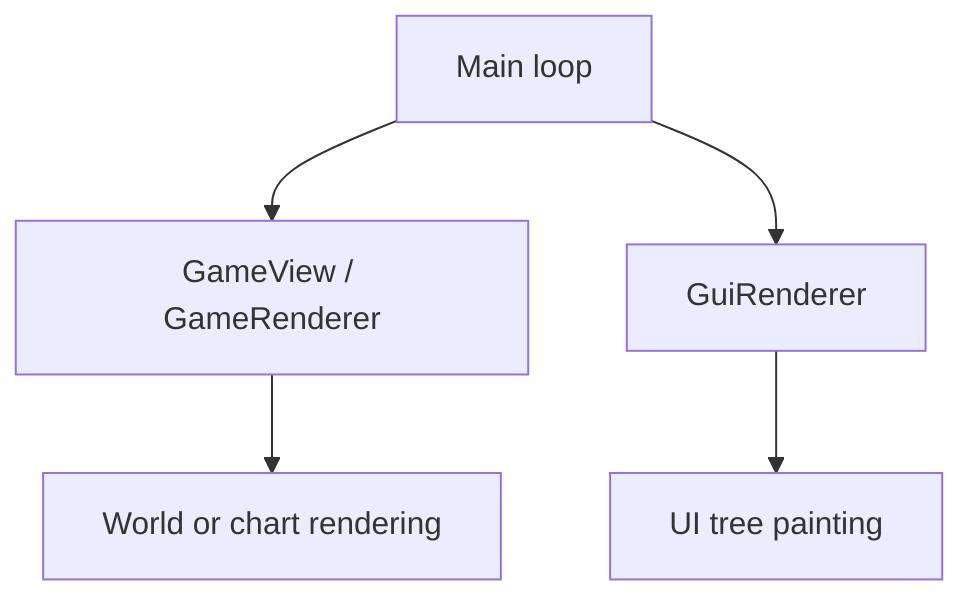

# Semantic input and UI observation research

Updated: 2026-09-24. Status: research and live experiments; not a description of new production MCP tools.

This document is kept in the project root at the user's explicit request. Executable experiments, snapshots, logs and
archives of previous drafts remain under Git-ignored `temp/`. This revision replaces the earlier snapshot-reference
recommendations with stateless current-tree selection. The README describes implemented product behavior.
All paths in commands are relative to the project root.

## Architectural decision

The basic interface should expose **current input bindings, finite physical-input sequences and structured observations
of the actual interface**. Direct UI operations continue to use the shared DOM selector model. Neither path requires a
new public tool or a hardcoded workflow for every recipe, machine, technology or mod feature.

The agent reads the running game's effective bindings, chooses keyboard/mouse inputs, and submits a finite sequence.
The selected input direction is event delivery through the game's in-process SDL path. Normal game code interprets
bindings, context, consumption, held state and synchronized actions. Shared bindings may activate multiple eligible
controls; isolating a named control such as `mine` or `build` is no longer the public promise. MCP must not contain a
`build -> processBuild` table or maintain gameplay state such as MiningState itself.

Minimal fixed hooks for safe execution, observation, IPC and lifetime management remain allowed. Overriding
`triggeredBy`, `isActive`, permissions or cursor getter results remains unacceptable. The binding-independent and
direct-handler investigations below are retained as historical evidence, not as requirements for the selected adapter.
The finite input sequence contract below supersedes their semantic-only input recommendations. This is a design
agreement, not a claim that the new production tools or all input shapes have been implemented and tested.

For output, discover the actual native UI tree and read its presentation, state and associated prototype metadata.
Custom interfaces should appear because the game created controls, not because MCP recognizes the mod or its workflow.
Control-family adapters are compatible with this direction: decoding a slider or checkbox is different from implementing
one special workflow for every machine.

The investigation establishes Linux tree traversal, a concrete JSON projection, state-transition and screenshot
comparisons, and a tested stateless document/path selection contract. A subsequent Windows experiment verifies
foreground-root acquisition across menus, connection/loading, gameplay and world exit, plus limited native button
dispatch using fresh current-tree selection. A scheduling follow-up verifies one foreground GUI logic-return boundary
for both reads and these actions, including minimized menus, saving and single-player pause. These are separate
observation, matching and input claims; they do not
establish a generic executor for every control family. This work does not replace the existing production tool catalog.
Noise reduction, pruning, paging policy and workflow automation are deliberately deferred.

## Current input contract: bindings and finite sequences

### Binding discovery and input vocabulary

Physical input may operate UI as well as the world. Direct UI selector operations are the preferred path in MCP server
instructions, not an exclusive route enforced by the adapter. The agent may choose a configured window-closing key or
mouse input without first attempting a direct widget action. Normal game context and bindings determine the effect.

An optional game-rendered screenshot complements physical UI input when structured observations are unclear or omit
embedded views/mod-drawn content. MCP forwards images; it does not implement image recognition. Retain this fallback
only through a verified game-owned rendering path without desktop capture or focus manipulation. Factorio's own graphics
context is still required. The existing `game.take_screenshot` path is not faithful to the current remote chart; expose
capture source and limitations rather than claiming universal current-screen fidelity. See
[the screenshot evidence](#screenshots-without-requesting-window-focus).

A discovery tool reports the running game's registered control names and current effective primary/alternative
bindings, including custom controls, modifiers, shared bindings and unbound controls. Read live values rather than
assuming default bindings or trusting a configuration file. The agent uses these observations to decide what to press;
MCP does not translate gameplay intent into a control-specific function call.

Control enumeration and the game's own binding text have been verified. Complete structured extraction into device,
key/button and modifier fields still needs validation. Do not claim an unverified parser is already available. A binding
is a relationship, not a promise that a control is eligible in the current context. The game retains its normal input
arbitration, including multiple actions associated with one physical input.

### Request and execution order

The following field names are proposed protocol names, not registered production tool names:

```json
{
  "operations": [
    {
      "controls": [
        {
          "device": "keyboard",
          "key": "W"
        }
      ]
    },
    {
      "controls": [
        {
          "device": "keyboard",
          "key": "D"
        },
        {
          "device": "keyboard",
          "key": "S"
        }
      ],
      "ticks": 60
    }
  ],
  "stop_previous": false
}
```

- `operations` is an ordered array. Each element describes one finite input step.
- `controls` describes the keyboard keys and/or mouse buttons held together during that step. These are physical-input
  descriptions, not semantic control IDs such as `mine`. Modifier keys can participate in the same combination.
- `ticks` defaults to 1 and, when supplied, is a positive integer. It measures client game input ticks, not elapsed
  wall-clock time or guaranteed authoritative movement/mining ticks. Repeated input-phase calls in the same tick do not
  consume additional duration. Pause/stall handling must retain a safe cancellation/release path.
- A step establishes its requested combination, holds it for its duration, and releases its inputs before the next step
  starts. Repeated keys in consecutive steps are released and pressed again; a longer uninterrupted hold is one step
  with a larger `ticks` value. SDL events themselves are sequential: the chord is a logical input combination, not a
  claim of atomic event delivery. Modifier ordering and transient combinations need acceptance tests.
- An empty `controls` array waits for that step's tick duration without holding bridge input.
- An empty `operations` array with `stop_previous` false returns immediately without waiting behind older sequences.
- The tool remains pending until its complete sequence, including final input release, finishes. Concurrent ordinary
  sequence requests are serialized in delivery order rather than interleaving held inputs.

The example holds W for one tick, releases it, then holds D and S together for 60 ticks and releases both. MCP does not
interpret this as a particular movement direction or distance; the running game's bindings and context decide that.

### Cancellation and replacement

`stop_previous` defaults to false. When true, cancel all older unfinished input sequences for the attached client,
including the running sequence and queued sequences. Release bridge-held inputs before starting this request's new
sequence. Older pending tool calls complete with cancellation details. Cancellation must be serviceable while an older
call is waiting; it cannot sit behind that sequence in the ordinary execution queue.

An empty replacement is a stop-only request:

```json
{
  "operations": [],
  "stop_previous": true
}
```

This request returns after cancellation and release have been processed, rather than taking the ordinary empty-array
shortcut. Order cancellation and admission at a defined boundary so the replacement does not cancel itself or newer
requests. Validate a request before applying its cancellation side effect.

Stopping means releasing inputs owned by the bridge. It does not undo completed steps, cancel a crafting queue, stop
an autonomous game/mod task, or force the whole character into an idle state. It must not release the user's own held
inputs. Correct handling of human and bridge input on the same key/button requires explicit validation; SDL does not
by itself establish separate ownership for them.

### Completion, failures and lifetime

Success means that the finite input sequence and its release completed. Queue admission or SDL event enqueue success
alone is insufficient. Success does not prove server acceptance or a gameplay effect. Missing materials, an invalid
build location or another normal game-rule no-op is not an input-tool error. The agent observes the resulting UI/world
separately; multiplayer acceptance tests still assert authoritative effects and force full CRC checks.

On an execution error, stop the remaining steps and release bridge-held input. Report the reason and the completed
prefix, with the failing operation index and within-operation progress where known. Use explicitly documented indexing
and distinguish completed ticks from the tick/phase in which failure was detected; do not fabricate exact timing when
only partial progress is known. Cancellation reports partial progress in the same way. Report cleanup failure or an
unknown final state explicitly. Already-produced game effects are not rolled back, and an uncertain sequence is never
automatically replayed. Exact result field names remain an implementation detail.

MCP owns protocol validation and work not yet admitted. The game resident receives each admitted finite sequence as a
complete task and autonomously advances/releases it without MCP sending intermediate steps or a later release message.
This small generic sequence executor does not perform gameplay planning. After MCP loss, admitted finite work still
finishes or safely releases; replies remain nonblocking and unknown task IDs are discarded after reconnect. Explicit
cancellation also reaches admitted work left by an earlier MCP session. World changes invalidate world-bound work and
release bridge input instead of replaying it into another world.

### Evidence and remaining validation

The ordinary SDL-input experiment in
[semantic-dispatch-access-research](temp/semantic-dispatch-access-research/findings.md) verified finite movement and
mining with normal input processing and matching full client/server CRC checks. It did not establish a complete
production sequence executor, simultaneous chords, cancellation ownership, or every device/input kind. Earlier tests
that overrode matching, active-state or cursor getters do not establish those capabilities for this adapter.

Next validation covers structured live bindings; ordered steps and modifiers; same-key step boundaries; finite holds;
empty waits/no-ops; queued and active cancellation; replacement and stop-only requests; user-input coexistence; MCP
loss;
world teardown; and release completion. Mouse target placement/cached cursor state must use a verified normal event or
game-method path. Wheel, analog/controller, pointer motion and text input need their own validated shapes; do not
pretend
all input kinds are holdable buttons. Direct UI selector operations remain separate and retain live eligibility checks.

## Current contract: one DOM and one selector model

Expose the current UI as a DOM-like tree. Use the same structured, XPath-like selector for observation and action
targeting;
there is no separate window-selection stage, `window.title`, `window.index`, public component `ref`, or persistent
handle.
Windows, layouts, HUD controls and remote-view containers are ordinary nodes. A window caption is a text predicate when
useful, not a mandatory namespace. No full XPath/XML engine or separate CSS/query dialect is required by this proposal.

The proposed public operations are:

| Operation                 | Selector | Result                                                                                          |
|---------------------------|----------|-------------------------------------------------------------------------------------------------|
| Read the full UI document | Omitted  | Current document and its complete sampled subtree, with explicit coverage.                      |
| Read selected UI content  | Present  | All matching nodes with their subtrees, in document order; zero matches is an empty list.       |
| Operate on a UI control   | Required | Exactly one final target, followed by live eligibility checks and the supported control action. |

These are a design for a shared `ui_read` / `ui_action` interface, not registered production tools. A read does not
perform an
action. An action carries the same selector shape as a read, plus its control-family operation and typed parameters.
A zero-match action returns `target_not_found`; multiple matches return `ambiguous_target`. Never select the first match
implicitly, silently fall back to another subtree, or automatically replay an action after an uncertain outcome.

### Document and execution lifetime

Use a synthetic `document` node as the public traversal boundary. Its children are the native roots of the current
active
presentation, in the adapter's verified order. Current captures contain one `agui::TopContainer` each. The wrapper
provides
one consistent selector origin without claiming that every game phase has exactly one native GUI or that the wrapper is
a
game object. It must never combine unrelated background-world roots with the active presentation merely because they
exist.

The DOM describes UI controls, not all pixels: terrain, entities and fog rendered in the world/chart are not child
widgets.
Unknown control roles remain generic; text, state and verified prototype metadata remain readable. Disabled controls
remain
visible in observations with their disabled state, so an agent can understand why an action is unavailable. Detached or
pending-destruction objects must not be advertised as actionable. Raw research captures preserve unknown fields
explicitly.

Every read samples the current presentation. Every action independently reacquires the active root and evaluates its
path
when it actually executes, including after a queue delay. Resolve, check current membership/lifetime and eligibility,
then
dispatch within one verified game-side GUI phase without yielding between selection and invocation. Do not resolve an
address at request admission and submit it later. Menu UI must work without a world or a world `on_tick` callback.

The intended UI scope begins after process attachment and covers menus, joining/loading, gameplay and world exit;
initial application startup loading is excluded. UI readiness is process/presentation readiness, independent of world
Lua readiness. The Windows follow-ups demonstrate this separation for the sampled states, including a main menu with
no world-update steps and UI interaction while the single-player simulation is paused. Production integration must
provide it explicitly; the current gameplay tools' world-bound `attach` requirements have not already changed.

No cross-call UI registry, window cache, snapshot lease or lifecycle-token history is needed. Temporary traversal data
is
discarded after the operation. Process attachment and in-flight request state are separate concerns. A selector
deliberately
may match a newly reconstructed control with the same semantics. It does not promise historical instance identity.

### Structured path semantics

A selector has one nonempty `path` array. Each step contains `axis` and `match`, with an optional `position`:

- `child` examines direct children of each current context. `descendant` examines all descendants, excluding the context
  itself, in preorder. Evaluation starts at the synthetic document node.
- `match` is a conjunction of exact predicates on exposed fields. The research matcher supports string predicates for
  `role`, `text`, `label`, `native_type`, `prototype.kind`, `prototype.name`, and `quality.name`, plus boolean
  predicates for
  `state.enabled`, `state.focused`, and `state.pending_destruction`. Missing/unknown values do not equal false. Empty
  `match`
  means any node. Use semantic fields when available; native types are diagnostic, build-specific selectors, not a
  portable
  public type guarantee. Do not infer icon names or labels that have not been verified.
- `position` is a positive, one-based integer applied **after filtering, separately for each input context**. It selects
  the current matching position, not a window number or component identity. After each step, deduplicate the same object
  and restore document order before evaluating the next step.
- Intermediate matches may be nonunique. Continue the path across them; only an action's final result must be unique.
  Thus two same-title windows can be distinguished by a later button predicate without first supplying a window ordinal.
- Reject unsupported axes/fields, invalid types and out-of-bound selectors. Bound steps, traversed nodes, work and
  output.
  If the relevant search is incomplete, do not claim target uniqueness. Reads must report truncation/coverage
  explicitly;
  never silently present a bounded capture as the complete interface.

For example, this selector finds the current unique button anywhere under the document:

```json
{
  "path": [
    {
      "axis": "descendant",
      "match": {
        "role": "button",
        "text": "Order A"
      }
    }
  ]
}
```

The same selector is accepted by a read or by an action target. If a broader tree contains more than one such button,
the
read returns all of them and the action reports ambiguity. To constrain it to a described ancestor, use an ordinary
path:

```json
{
  "path": [
    {
      "axis": "descendant",
      "match": {
        "role": "window",
        "text": "Duplicate title"
      }
    },
    {
      "axis": "descendant",
      "match": {
        "role": "button",
        "text": "Order A"
      }
    }
  ]
}
```

No special window matching happens here. This exact path was evaluated against two same-title fixture windows; the
button
predicate selected A. After raising A, the semantic path still found A. After closing A it found nothing, and after
recreating A it selected the replacement, as requested. A `position: 1` predicate instead selected the currently first
matching window; after reordering that position belonged to B. Positional selection is intentionally not stable
identity.

### Eligibility is separate from matching

The same matcher supplies both reads and actions. Action dispatch additionally checks current attachment, destruction
state of the target and relevant ancestors, enabled state, control-family capability and the game's necessary routing
conditions. A read may show a disabled button; matching it does not authorize clicking it. Unknown safety-critical state
must not count as successful validation. Occlusion or being outside the viewport alone is not rejection under the agreed
policy, but actual controller suppression/unloading is different. Callback-driven destruction still requires the game's
normal dispatch/lifetime protections. The current Python matcher is not a native action executor.

## Main world view is not a DOM-mounted canvas

The canvas analogy is useful for distinguishing rendered scene content from structured UI controls, but it does not
describe the main view's native rendering ownership. In the inspected Linux build, normal character view, remote chart
view, and zoomed-in remote view all render through `GameRenderer`, directly called by the main loop. They do not enter
scene drawing through an `agui::Widget` paint callback.



Developer-symbol disassembly shows separate game/UI preparation calls and a direct `GameRenderer::render()` call before
`GuiRenderer::render(...)`. Live debugger stacks confirm the direct scene-render caller in all three modes. The actual
InteractionArea vtable uses the empty base `Widget::paintComponent`; its background painter draws a style image layer.
RemoteControllerView::FrameAround also uses ordinary widget/layout painters. Neither is a canvas widget whose component
paint method draws the main map.

Those UI nodes still matter for layout and interaction. In the sampled remote view, InteractionArea is inset inside the
outer frame; in normal view it spans the presentation. Their bounds must not be treated as verified scene-render
clipping
bounds. GameView also reads presentation dimensions, so separate render dispatch does not mean the engine has no GUI
layout dependencies. We did not unmount or destroy required UI objects, and do not claim arbitrary UI deletion is safe.

Consequently, a selector can address the actual interaction region or frame but cannot descend into terrain/entities as
native widget children. Adding a scene node to a future combined document would be an explicit MCP projection, not an
existing native canvas hierarchy. Embedded minimap/camera widgets follow a different path, verified below.

The [rendering investigation](temp/ui-map-render-research/findings.md) retains static and live evidence;
[26 retained checks](temp/ui-map-render-research/results.json) cover the traces, vtables and restoration. The normal
controller/zoom were restored and a full client/server CRC passed. An earlier attempt to use production `status` on
another
client caused a crash; that failure was preserved and bypassed, not fixed. The successful rendering tests used passive
debugger observations and the existing research reader, not the failing production injection path.

## Embedded scene widgets: alert previews and mod cameras

Unlike the main world view, an embedded camera really is a widget whose paint callback renders a scene. In the installed
Linux build, developer-symbol inspection resolves this native alert path:

```text
AlertGroupTooltip::updateContent
  -> AlertGroupTooltip::createCamera
    -> AreaCamera construction
AreaCamera::paintComponent
  -> CameraBase::paint
    -> GameViewWidgetLogic::renderGameView
      -> GameRenderer::render
      -> DrawQueue::drawTexture
```

The helper configures an offscreen render target and draws its texture into the component. This does not imply every
camera owns an independent GameRenderer. The alert's area camera receives a surface and bounding box; it is not a
subtree
containing widgets for every train, rail and terrain tile.

The bundled 2.0.77 LuaGuiElement API also exposes `camera` and `minimap` elements for mods. A synchronized test fixture
created one of each. Native traversal found `CustomCameraWidget` and `CustomMinimapWidget`, both leaf nodes, and a
background window capture showed their scene and chart contents. Live stacks confirmed GUI traversal entering the
camera,
then the nested GameRenderer call. Minimap dispatch instead enters `MinimapBase::paint`, with GUI clipping and chart
draw
queues; do not describe it as the same full-scene framebuffer path.

An ancestor-visibility experiment counted eight GUI frames per sample: visible camera/minimap painted 8/8 times, hidden
camera/minimap painted 0/0 times, and restored camera/minimap painted 8/8 times. The hidden nodes remained in the raw
tree
with `visible_in_tree: false`. Existence in raw traversal therefore does not imply active presentation or action
eligibility.

### Observation contract

Keep these components in the same semantic document and address them with the same selector. Distinguish widget state
and geometry from scene metadata. The official API provides position, surface, zoom and optional associated entity for
cameras/minimaps, plus minimap-specific force/player selection. For example, the fixture's camera returned the following
actual logical-GUI observation (not a native-node enrichment already implemented by MCP):

```json
{
  "name": "camera",
  "type": "camera",
  "position": {
    "x": 8,
    "y": -12
  },
  "surface_index": 1,
  "zoom": 0.75,
  "visible": true
}
```

The logical/native join and a universal native camera-parameter reader remain unimplemented. A native alert AreaCamera
is not automatically a LuaGuiElement. Do not invent getters, offsets or parameters for it. Scene entities can eventually
be observed through a separate verified scene source, but must not be fabricated as native widget children. A preview
also does not establish permission to interact with every displayed entity, bypass chart visibility, or invoke map input
on a camera whose own widget/mod behavior does not support it.

### Alert validation boundary

The local server produced a real train with a missing destination and a train-no-path alert. The reader observed its
visible AlertGui, but the attempted hover did not yield a captured AlertGroupTooltip/AreaCamera. The alert construction
path above is static evidence; the camera paint and visibility tests are live evidence from the mod-style fixture.
They are not a screenshot comparison of an expanded train alert. Gui::addToolTip maintains tooltip references
separately;
the inspected method alone does not prove how every tooltip is mounted. Complete tooltip/popup root coverage remains a
reader gap, and absence from the sampled primary tree is not proof of absence from the presentation.

All temporary camera/train objects were removed and a full client/server CRC passed. No production tool changed. See
[the experiment record](temp/ui-embedded-view-research/findings.md),
[retained checks](temp/ui-embedded-view-research/results.json) and
[camera/minimap capture](temp/ui-embedded-view-research/mod-views.png).

## Map observation: spatial selection and API-shaped results

The agreed first-version scope does not require special tooltip layers or the contents of embedded scene previews.
Preserve ordinary observable UI nodes, but do not block the interface redesign on those gaps. Normal character view and
remote view remain the required map observation/interaction scenarios. The design below concerns reads; previous
rendering
traces do not establish that these queries or all map actions are implemented.

### Two read operations, with selection separate from projection

The proposed overview operation describes the whole map region corresponding to the current screen, without internal
machine details such as recipes, crafting progress or combinator settings. A requested region and observation scale may
produce a coarser overview without changing the actual camera. Region/scale are observation parameters, not authority to
inspect an otherwise unavailable area. Client camera-to-world bounds have since been sampled in normal and remote views;
see the Linux gap investigation below. Full observation eligibility remains separate from camera geometry.

The proposed detailed query has two independent parts:

- **Selection:** which surface, point, tile cell, area or existing game object to query; which object kinds and filters
  to include. A position may select several objects, not just the visually topmost one.
- **Projection:** which properties and bounded related objects to return for every match. Field names, values and object
  relationships should follow the official runtime API wherever possible. Selecting objects must not depend on which
  detail fields are requested.

Both operations should use compatible object representations: an overview supplies basic fields; a query adds requested
details. Do not introduce a separate tool for every machine prototype. Record surface, observation tick, effective
bounds,
coverage and any truncation/aggregation in the result envelope. An empty observed region differs from an unobserved
region.

### Confirmed model for overlapping content

The installed 2.0.77 API separates tiles from entities. A single invented stack such as ground -> floor -> rail -> train
would misrepresent that model:

| Content                                                               | Runtime API representation                                                  | Consequence for the result                                                                                                    |
|-----------------------------------------------------------------------|-----------------------------------------------------------------------------|-------------------------------------------------------------------------------------------------------------------------------|
| Current terrain or paving at a tile coordinate                        | LuaTile, with name, position, prototype and surface                         | Return the current tile as its own object. Paving is not a second generic entity layer.                                       |
| Tile material retained underneath                                     | LuaTile.hidden_tile and double_hidden_tile, optional prototype-name strings | Preserve the actual fields when requested; do not invent an unlimited stack or claim they reconstruct all historical terrain. |
| Rail, locomotive, wagon, machine, resource, ground item, entity ghost | Matching LuaEntity objects                                                  | Return all matches in an entity collection; multiple entities can occupy/overlap the queried location.                        |
| Tile ghosts                                                           | LuaTile.get_tile_ghosts returns LuaEntity objects                           | Keep their real object type; ordinary tile reads alone do not enumerate every ghost.                                          |
| A train containing several carriages                                  | LuaEntity.train references LuaTrain, whose carriages reference entities     | Express a related game object, not a spatial parent containing the rail or tile.                                              |

For example, querying a paved rail position may return a current tile with its hidden-tile metadata, a rail entity and a
rolling-stock entity. The entities are siblings in the query result. Their identities, geometry and relationships carry
the meaning; array order must not imply visual stacking or input priority. A locomotive is an entity belonging to a
train;
the train itself is not another object occupying a tile in this collection.

Decoratives are queried through a separate LuaSurface API. Their existence reinforces that a query must declare which
content categories it covers. An entity-only scan must never be labeled as every rendered object or pixel in the region.

### Point, cell and hit-testing semantics

The API distinguishes spatial queries in ways the public contract must preserve:

- LuaSurface.get_tile rounds non-integer coordinates down to the containing tile.
- find_entities_filtered with position alone matches entities whose collision boxes contain the point.
- With position and radius, it searches by entity center distance.
- With area, it searches entities whose collision boxes intersect that area.

Consequently, "at this coordinate" must have a documented spatial meaning. Support an explicit point versus
containing-cell
or area distinction rather than silently switching between these methods. The native mouse-selection target is a
separate
question: collision geometry, selection geometry and rendered sprite bounds are not interchangeable. LuaEntity exposes
bounding_box, selection_box and an optional secondary_selection_box; these fields do not prove that a collision query
finds every selectable or rendered object. Rails, zero-size/noncolliding objects and overlapping entities need focused
live
tests before claiming exhaustive point selection. No new cursor hit-test adapter was verified by this documentation
pass.

### Result projection aligned with the Mod API

Preserve established names such as object_name, name, type, position, direction, quality, health and status where
applicable.
Keep runtime objects separate from their prototypes. A LuaEntity is an instance; LuaEntity.prototype describes its type.
An unfamiliar mod prototype should remain readable through the entity's supported API class, without a name-specific
adapter. This does not expose arbitrary private state stored in a mod's scripts.

Details should follow their actual API ownership. For example, crafting_progress is an entity attribute, the current
recipe
comes from get_recipe (), an inventory from get_inventory (index), and combinator configuration from the appropriate
object
returned by get_control_behavior (). Methods with arguments need typed query parameters; do not pretend every detail is
a
zero-argument property or expose arbitrary Lua execution as a read tool. The final wire schema for method-derived values
has not been fixed.

Lua objects are not plain JSON tables. The adapter must make a deliberate, bounded projection:

- Keep scalars, enums, records and arrays faithful to the documented types; define consistent serialization of nil.
- Include the API object class when useful and preserve typed related-object identities rather than recursively
  expanding
  surface -> entities -> surface or train -> carriages -> train.
- Use game-supplied identities where available. LuaEntity.unit_number is optional: the installed documentation limits it
  to certain entity families and describes save-lifetime allocation without reuse until overflow. It is not a universal,
  process-global handle. Resolve identities against the current world and recheck validity, without an MCP object
  registry.
- Allow bounded explicit expansion or subsequent queries for related objects. For objects without a usable game
  identity,
  resolve a fresh spatial/semantic description and report ambiguous matches rather than choosing the first.
- Distinguish a supported nil value from an unsupported member, a failed read or an unobservable target. Do not fill
  every
  inapplicable field with a misleading null or guess a default.

The bundled machine-readable runtime-api.json can guide schemas, inheritance, member types and documented subclass
applicability. It does not make blind enumeration/calling safe: each exposed read path still needs applicable-type
checks,
bounds and verification that it has no simulation side effects. No generic native-object serializer has been
implemented.

### Overview compression and evidence boundary

Lossless encoding of repeated tiles is different from grouping resources or buildings into a coarse summary. A coarse
overview must state its aggregation and precision; it cannot masquerade as a complete exact object list. Prefer optional
MCP-side formatting/aggregation over adding game-side business logic. Exact reads must report their bounds and any
result
limit, and observations across separate calls are not promised to describe the same tick.

This section originally recorded an API-inspected design. The later Linux gap investigation adds live overlap/projection
and chart-cache evidence on the server, plus client camera-transform checks; it does not certify an exhaustive map
renderer or generic client query adapter. The excerpts are retained
in [bundled-api.json](temp/map-observation-research/bundled-api.json). Online
references:
[LuaSurface](https://lua-api.factorio.com/latest/classes/LuaSurface.html),
[LuaTile](https://lua-api.factorio.com/latest/classes/LuaTile.html), and
[LuaEntity](https://lua-api.factorio.com/latest/classes/LuaEntity.html). The current online release is newer; installed
documentation remains authoritative for implementation against this executable. No Factorio window interaction was
needed.

## World tools: shared contract, context-dependent execution

The recommended public API does **not** duplicate normal-view and remote-view tools. Both use the same spatial
selection, object projection and physical-input sequence vocabulary. The adapter must obtain valid current input and
presentation
context at execution time; this does not require branching on controller type for each control. The Windows live tests
below demonstrate one shared dispatcher for the sampled controls. Delegating gameplay rules to the game is compatible
with exposing context through observations. The action tool completes the finite input operation without interpreting
its gameplay effect; the agent observes the world or UI separately.

### What the Windows executable establishes

Inspection used the installed 2.0.77 executable and its matching developer PDB. These paths are more relevant to the
tool boundary than the visual resemblance between the scene and a canvas:

| Native path                                                         | Observed behavior                                                                                                                                       | Consequence for tools                                                                                                                          |
|---------------------------------------------------------------------|---------------------------------------------------------------------------------------------------------------------------------------------------------|------------------------------------------------------------------------------------------------------------------------------------------------|
| `MainLoop::render`                                                  | Calls `GameRenderer::render` before `GuiRenderer::render`.                                                                                              | The main scene is not an entity subtree of the native GUI DOM.                                                                                 |
| `LuaControl::luaReadPosition`, `LuaPlayer::luaReadPhysicalPosition` | Follow different members of `Player::controllerManager`; PDB fields identify `controller` and `physicalController`.                                     | Return active and physical positions separately; do not label both as an ambiguous player position.                                            |
| `CharacterController::canReachEntity`                               | Delegates to character reach logic, which checks surface and target bounding-box distance.                                                              | A center-to-center radius is not the general interaction predicate.                                                                            |
| `RemoteController::canReachEntity`                                  | Returns true in this build.                                                                                                                             | This particular reach gate differs; it does not establish universal permission to perform every action.                                        |
| `RemoteController::canBuildDistanceCheck`                           | May delegate through `getControllerForBuildChecks`; otherwise succeeds. The helper can return the physical controller depending on the open GUI target. | Even remote build distance cannot be modeled as an unconditional infinite radius. The exact GUI-target condition remains incompletely decoded. |
| `PlayerInputSource::processBuild`                                   | Obtains `Player::getSimpleBuildInput`, invokes `ClientManualBuilder::build`, and submits the resulting action.                                          | Keep the game's cursor, controller and build interpretation before synchronized submission.                                                    |
| `PlayerInputSource::processOpenGui`                                 | Has client eligibility logic and a `tryToOpenInChart` path.                                                                                             | A semantic open action has context-dependent routing before a GUI is opened.                                                                   |
| `GameActionHandler::actionPerformed`                                | Dispatches input actions through player/controller/common handlers; the controller branch obtains the current controller.                               | Remote behavior is part of game action execution, not merely an MCP-side camera convention.                                                    |
| `LuaSurface::luaFindEntitiesFiltered`                               | Constructs `EntitySearchFilters` and `DetailedEntitySearch` over a Surface.                                                                             | Spatial enumeration is a world-data query, not the current player's mouse selection or rendered map.                                           |
| `EntitySelector::deduceSelectedEntity`                              | Uses selection checks, world geometry and latency context.                                                                                              | Do not choose the first entity returned by a spatial query as the input target.                                                                |
| `Chart::getSelection`                                               | Considers chart tags, an open logistic-network GUI, scale and entity candidates; an entity branch checks `ForceData::isChunkCharted`.                   | Chart hit testing is another native selection path, not just the same entity search at a different zoom.                                       |

The controller manager explicitly retains active, physical, remote, stashed and paused controller state. This is also
why
the wire schema should preserve the game's `controller_type`, rather than reduce all possible states to a boolean
`remote`. The installed API lists character, remote, god, ghost, spectator, editor and cutscene controllers.
`render_mode` is a separate axis: game, chart or chart_zoomed_in. Remote chart and remote zoomed-in presentation must
not
be mistaken for different physical players.

Retained evidence is indexed in [the Windows world investigation](temp/world-controller-research/findings.md).
Recorded instruction addresses and PDB offsets are evidence for this build, never constants for a production adapter.

### A small tool surface with several observation granularities

Keep the two read operations proposed above, add live binding discovery, and share the finite input sequence tool
defined above. The following names are illustrative, not newly registered MCP tools:

| Tool             | Selection and parameters                                                                                     | Returned meaning                                                                                                                                                                                             |
|------------------|--------------------------------------------------------------------------------------------------------------|--------------------------------------------------------------------------------------------------------------------------------------------------------------------------------------------------------------|
| `world_overview` | Current viewport by default; optional bounded region, cell size and content categories.                      | Context plus a spatial summary: terrain regions, resource/entity groups and supported chart overlays. Aggregate cells state their area, resolution and coverage; counts are not entity identities.           |
| `world_query`    | Explicit point, tile cell, area, game identity or current selection; filters and requested field projection. | Exact typed objects and bounded related data, with geometry and identities sufficient for later targeting. A separate `hit_test` selection mode asks what the game would target in the current presentation. |
| `input_bindings` | Current registered controls and effective bindings.                                                          | Binding observations for the agent; no guarantee of current action eligibility.                                                                                                                              |
| `input`          | Ordered physical-input steps, finite tick durations and optional cancellation of older sequences.            | Completion after input release, or partial failure/cancellation details; no gameplay-effect verdict.                                                                                                         |

Granularity has **two independent dimensions**. Spatial resolution controls whether a region is summarized as cells or
enumerated as objects. Property projection controls whether an object contributes only identity/position or additional
supported fields. Increasing spatial detail must not automatically dump every inventory and machine setting. Requesting
more fields must not silently change the selected objects. Prototype identifiers, type and quality remain available for
unfamiliar mod entities; localized captions can supplement them, but must not become identity keys.

Use typed collections such as `tiles`, `entities`, and, when implemented, `chart_tags`. Preserve object relationships
such
as train/carriages or entity/inventory separately from spatial containment. A resource summary is explicitly an MCP
aggregation over observed resource entities; it is not a native factory object. Do not invent a native scene DOM with
factory, production-line or ore-patch nodes. Those groupings require interpretation and must remain optional summaries.

For an illustrative exact query, an agent can request an area with `kinds: ["entity"]`, filter by `type`, and request
`name`, `type`, `position`, `quality` and `selection_box`. Results use the same object schema in character and remote
views. A later details request can address a returned game identity; if no stable identity exists, it must use a fresh
spatial selector and handle ambiguity. A `hit_test` response instead returns the engine's resolved target kind and
target,
which can differ from the objects geometrically present at that position. Do not fabricate chart-tag identity as an
entity unit number.

Every read includes a bounded context envelope:

- Current world lifetime, observation tick, local player identity and force.
- `controller_type`; active `surface` and `position`; separate `physical_surface` and `physical_position`.
- Presentation `render_mode`, zoom and verified viewport bounds. Camera/render position is distinct from authoritative
  controller position; do not derive screen bounds from `player.position` alone.
- Effective query region, included categories, resolution, visibility/freshness source, completeness and truncation.
- Relevant cursor/held-tool and current selection state, either compactly or on request.

Do not require the agent to supply `mode: normal` or `mode: remote` on every call. Observe the actual context. An action
may supply expected controller/surface/world conditions as guards, so an intervening user action cannot silently
retarget
it. A requested surface is a target or guard, not implicit permission to enter remote view or switch worlds. View
changes
are explicit semantic actions or UI interactions.

### Player-equivalent observation needs more than Surface queries

UI occlusion is not an observation barrier for world-data queries. With a valid loaded world, a query addressed by
surface and map coordinates uses world objects rather than widget hit testing; opening the technology screen does not
by itself make those objects unavailable. The intended tools should work without closing an overlay, changing focus,
or requiring the world to be painted. In this section, visibility restrictions concern game information such as fog and
exploration, not whether an unrelated GUI window covers a screen pixel.

"Current screen area" still needs a precise contract: the underlying main world view's map-space footprint, ignoring
UI occlusion. Resolving that footprint is a separate step from querying its contents. Windows `GameView::getMapPosition`
uses current view state, scale, offsets and `getDisplaySize`; the inspected `getDisplaySize` itself has conditional
presentation-object and fallback paths. It is not proof of invariant dimensions during a full-screen UI transition.
The earlier technology-window research also reports controller-presentation unloading, which must not be confused with
unloading the simulated world. Exact viewport queries require verified current camera/layout acquisition. Explicit
coordinate/area queries do not depend on that viewport derivation.

The user accepts that some full-screen pages may make the current world viewport unavailable. Supporting viewport
queries in every such page is not a requirement: the agent can observe the current UI and decide what to do next.
Return an explicit `viewport_unavailable` result when a requested current viewport cannot be resolved; do not silently
reuse old bounds, invent a camera, close the UI or change the view. This result does not mean that the loaded world is
unavailable. Explicit surface/coordinate/area queries remain independently usable when their world and observation
prerequisites hold. This is an accepted capability boundary, not a claim that the technology page always disables
viewport acquisition.

World availability and safe scheduling remain prerequisites even for memory-backed reads. Loading, unloading or
replacing a world can invalidate the Surface and other objects; a main menu has no current playable world to query.
Pause alone does not remove a loaded world, but the query must run at a valid observation phase rather than wait for a
simulation tick that may never advance. No live technology-open viewport comparison was performed in this pass.

Keep **existence**, **visibility**, **selection eligibility**, and **action permission** separate. A remote target may
be
accessible despite being far from the physical character; an existing entity may be unavailable in the current view.
The installed API distinguishes explored chunks (`is_chunk_charted`) from currently visible chunks (`is_chunk_visible`).
These two predicates alone do not reconstruct all chart content, cached information, special map
icons or fields presented by an opened entity GUI.

For the intended player-equivalent contract, the adapter must not turn an unrestricted Surface query into an omniscient
observation. Chart overview needs chart-aware information and explicit freshness; currently visible scene detail can
use verified world readers with visibility filtering. Explored-but-fogged information must not be silently refreshed
from live simulation data. A detailed projection also needs field-level eligibility: seeing a machine does not by itself
prove that the player can inspect every inventory or private script state. Opening its actual GUI remains the generic
route for mod-specific configuration and information.

Thus the public schema can be shared while the observation source differs by presentation. If chart extraction or a
particular projection is unavailable, report an explicit gap instead of returning hidden live state. The exact
player-equivalent visibility/field policy, chart-cache reader and complete overlay coverage still need implementation
research and live comparisons. The current static investigation does not establish pixel-equivalent structured output
for every mod's arbitrary script-rendered graphics.

### Historical proposal: semantic controls, targets and finite gestures

Superseded by **Current input contract: bindings and finite sequences**. The following proposal and experiments explain
the explored alternatives; their semantic-only wire format and isolated-control requirements are no longer selected.

The vocabulary is grounded in the installed controls, not invented gameplay verbs. The installed English labels are
`build=Build` and `mine=Mine`; use these native IDs on the wire and the game's localized labels for presentation. Mine
must not be renamed to an unconditional destroy operation. The same rule preserves `open-character-gui` instead of
promising inventory-only behavior. The locale/config/PDB follow-up is recorded in
[native control semantics](temp/world-input-tests/control-semantics.md), with the extracted
[configuration and locale catalog](temp/world-input-tests/control-catalog.json).

The installed configuration contributes 205 base control names, not 205 verified capabilities. A subsequent live
investigation verified `ControlInput::getControlInputList()` as the common enumeration source for native and custom
controls, with 213 entries in its specific fixture. Use that current registry rather than a fixed list of locale strings
or visible keybinding rows. Registration, current binding metadata and adapter-supported input shapes remain separate;
see the unified discovery evidence below.

Useful semantic groups include movement/combat; construction/opening; held-item use; area selection; inventory slots;
recipe/crafting-queue controls; panels/confirmation; map/view controls; quickbar/clipboard tools; and custom inputs.
The PDB's own categories also distinguish editor, debug and nonmodifiable controls. These are discovery groups, not a
requirement to register a separate MCP tool for every control. Concrete examples and contextual meanings are in the
linked evidence. In particular:

- `build`, `build-ghost`, `super-forced-build` and `build-with-obstacle-avoidance` are distinct native controls.
  Preserve
  these variants rather than inventing Shift/Ctrl arguments; the last control is documented as rail-specific.
- `select-for-blueprint` is documented for blueprint, upgrade and deconstruction selection. Preserve the held selection
  tool and its native control instead of imposing a blueprint-only workflow.
- `craft`, `craft-5` and `craft-all` are recipe-GUI controls. `pick-item`, `cursor-split`, `stack-transfer` and related
  controls target inventory interactions. Their presence does not imply an arbitrary out-of-GUI mutation API.
- `open-character-gui`, `confirm-gui` and `confirm-message` retain separate meanings even where bindings overlap.
- The bundled base game defines `give-blueprint` and `give-deconstruction-planner` as custom-input prototypes. Discovery
  must cover that extension mechanism without assuming that custom always means third-party.

Control identity, target and finite input shape are independent dimensions. The agent should select a native control,
provide its world target or direct current-widget selector where applicable, and request one trigger, a bounded hold,
or a finite drag. The PDB records `ControlUsageType` values Normal, Continuous and NormalAndContinuous. It separately
records keyboard, mouse-button/wheel and controller-button/axis/stick binding types. Do not infer from these enums that
every control supports every gesture: drag, repetition, analog input and semantic combinations need their own adapter
validation. A wheel or axis is not automatically a down/hold/up input. The adapter owns any required combination and
release; the agent does not send modifier keycodes or promise to release a held input in a later request.

Preserve direct widget operations for the UI. Named controls complement widget activation/value editing and supported
slot interactions; they do not replace current-tree widget targeting with screen coordinates.

There is a precision limit to the earlier tested named-binding route. The installed left-button default is shared by
`build`,
`open-gui`, `select-for-blueprint`, `craft` and `pick-item`; E is shared by `open-character-gui` and `confirm-gui`, and
Q by
`pipette` and `clear-cursor`. `sendEvents` receives generated events, not an exclusive control identity, and the
inspected
dispatcher applies normal contextual consumption and handler ordering again. Consequently, invoking a named binding
does not guarantee that only its namesake handler runs. This is a limitation of that route, not the desired public
semantic-control contract. The subsequent binding-independent investigation below supersedes the recommendation to
preserve accidental shared-key arbitration. Preserve game context and simulation rules while isolating the requested
control. An unbound control is not inherently unavailable to a semantic adapter. Explicitly linked custom inputs remain
distinct from unrelated controls sharing a key and require separate verification.

Use the game's named control meaning, such as build, mine, rotate, open, directional movement or selecting an area with
the held tool. Targets are world coordinates on a surface, validated object selectors, or an area/drag endpoint as
appropriate. Agent-facing parameters never require keycodes, mouse buttons or a later release command. Area selection
must preserve the held selection tool and its normal/alternative/reverse selection semantics; it must not become a
hardcoded deconstruction-only tool.

The intended route is:

```text
world_action(intent, target, finite extent, context guards)
  -> resolve current local player, controller, cursor and presentation
  -> resolve target through the appropriate game selection/input path
  -> let the normal client input logic construct the action
  -> normal synchronized submission
  -> finish the finite input operation, release held input and clean up temporary context
  -> acknowledge input completion without a gameplay result
```

An object identity does not authorize directly invoking that object's mutation method. Re-resolve it, check that the
normal input route can address it, and fail explicitly when it cannot. Supplying map coordinates also does not remove
all input dependencies: the inspected selection-tool and custom-input paths consult widget-under-mouse or cached
cursor context. A reliable adapter must provide a verified operation-scoped game input context without moving the OS
pointer or stealing focus. That adapter is not established merely by finding a method symbol.

The same input can have different legitimate outcomes:

| Intent                        | Character context                                                       | Remote context                                                                  | Meaning for subsequent observation                                                                         |
|-------------------------------|-------------------------------------------------------------------------|---------------------------------------------------------------------------------|------------------------------------------------------------------------------------------------------------|
| Build with the current cursor | Can place a real entity or a ghost, depending on cursor and conditions. | Uses remote building semantics, commonly ghosts.                                | The agent can inspect the resulting entity/ghost; input completion does not promise physical construction. |
| Mine/remove                   | Can mine a target when applicable.                                      | Can mark an entity for deconstruction; some targets follow other removal paths. | An accepted deconstruction order is different from later robot removal.                                    |
| Open an entity                | Character reach logic includes distance and exceptions.                 | Remote access follows its controller and target rules.                          | The agent observes the resulting UI separately; the action tool does not classify the gameplay outcome.    |

The intended similarity of controls, remote entity configuration and remote deconstruction are also described in
[FFF #380](https://www.factorio.com/blog/post/fff-380). Those examples do not establish unconditional behavior for every
target or mod. Do not hardcode their outcomes as the public action implementation.

Do not expose one universal `interaction_radius` or an unqualified `can_interact` flag. The native checks vary by action
and target; some remote checks delegate to physical context. Optional eligibility results should identify the specific
action and whether the result is checked, rejected or unknown. A check is not a reservation and may become stale before
execution.

Likewise, distinguish moving the controlled subject from panning a view. If an action means the native directional
control, document it as controller-relative; do not promise physical-character movement in every controller. A future
explicit camera-pan action has a different postcondition. Exact directional routing across remote zoom levels remains
to be verified rather than inferred from appearance.

Custom inputs and selection tools matter for mod compatibility. `PlayerInputSource::processCustomInput` checks normal
control triggering, uses cursor context and constructs an InputAction. The installed CustomInputPrototype API includes
`name`, `enabled`, `linked_game_control`, `consuming`, and `include_selected_prototype`. Discover named controls and
held
tool semantics rather than maintaining a mod-name allowlist. A native-control adapter must also verify explicitly linked
custom inputs and their ordering; directly invoking a built-in handler can bypass a mod's linked input. Do not preserve
unrelated physical-key consumption merely because it existed in the earlier event-synthesis route. Native prototype
existence is not proof that a generic MCP executor supports its dispatch or completion. For arbitrary mod actions,
completion can confirm dispatch and input release without claiming to understand the mod's eventual business outcome.

The server and clients execute synchronized game actions with their game/controller state. MCP must preserve this path;
calling `CommonInputHandler` or `GameActionHandler` directly on one client is not synchronized submission. Menu/UI
access
at a safe presentation phase also does not automatically authorize arbitrary world mutation there. World actions need
their verified submission phase, game-owned release/cleanup, world-lifetime invalidation, and multiplayer acceptance.

### Direct-registration investigation: call-only semantic dispatch

The requirement during this investigation was to discover and invoke controls without interpreting their game meaning.
An implementation
that contains a `build -> PlayerInputSource::processBuild` association fails that requirement, even if the individual
call works. Method-level experiments below establish execution mechanisms only. Function and ABI adapters for generic
engine interfaces are distinct from hardcoded control-specific mappings.

The game does have a generic registration mechanism. In this Linux build, `PlayerInputSource::processEvent` iterates
`ActionsTriggeredByInputs` entries containing either a control-associated `std::function<bool()>` or a generic
`std::function<bool(Event const&)>`. It performs binding matching before calling the first category; the second category
can perform matching internally. Callback captures supply context such as the actual input-source receiver. A uniform
handler interface can take parameters; the engine need not know each handler's business meaning to invoke it.

The research adapter copies actual typed zero-argument callbacks at their registration boundary, groups them by the
actual owner and control object, and preserves their order. Requests resolve an ID with the game's `findControlInput`,
then invoke the associated chain at a verified input phase. There is no control-name-to-method table in this path.
The constructor's generic registration itself establishes each association. The final capture observes only actual
item construction; observing both vector expansion and item construction had initially duplicated some registrations.

The current catalog contains 208 reverse-verified control IDs; 138 have captured zero-argument handlers, totaling 175
callbacks. `build` has three, `open-gui` one, and `toggle-map` two. These are observed facts from this run, not a
compiled
allowlist. `move-right` has no captured callback of that kind and instead uses continuous input polling.

Using the same generic dispatcher and only changing the supplied control ID, a non-admin client successfully:

- Built a real chest at normal reach, consuming exactly one item.
- Opened that chest while still holding building items, without consuming them or mining the target.
- Entered remote view, then used the same `build` control to place an entity ghost, and returned to character control.
- Submitted build with a server permission group denying it; the game rejected the mutation and retained the items.

These cases generate no keyboard/mouse Event and do not override matching, active-state, inGui or cursor getter results.
The fixture requested several identical physical bindings, but a later configuration readback found that spaced INI
delimiters did not apply requested settings in this installation. Those additional bindings were not verified in this
run and are not certified collision coverage. Authoritative server observations still confirm the sampled
effects; the final corrected run passes a forced full CRC. Across this investigation, seven full-CRC markers match both
peer logs. Three native fixtures pass separately. The callback's handled boolean is not a business-success result:
permission rejection and invalid placement may still return handled.

For call-chain understanding, the first build callback calls `processBuild`, which uses the game's builder and normal
`PlayerInputSource::process(InputAction&&)` submission. The open-GUI callback uses `OpenGuiLogic::canOpenEntityGui` and
normal submission. Those names describe inspected game behavior, not how MCP selects a handler.

There are four unresolved production requirements:

1. **Late handler discovery.** The catalog can be read after startup, but the handler associations in this experiment
   were captured during construction. No callable collection accessor or complete game type definition was found for
   the existing ActionsTriggeredByInputs collection. Private offsets visible in disassembly were not encoded. A
   constructor-only solution does not satisfy attachment to an already-running world.
2. **All dispatch families.** Generic Event handlers, outer context checks and registration eligibility flags are not
   fully represented by the copied zero-argument chains. One inspected generic handler loops through custom controls,
   performs matching, gathers context and creates a shared custom-input action. Thus mods need no individually known
   native business handler. However, this routine still needs a matching Event; no post-match call-only entry for an
   arbitrary custom control has been established. Explicit mod links and consumption must survive the replacement.
3. **Continuous input.** A common registration interface does not imply that movement/hold behavior is an edge callback.
   No new call-only finite hold/release mechanism is proven; overriding isActive remains excluded.
4. **Target and context preparation.** These direct calls use the unmodified current cursor. Synchronized test setup
   adjusts zoom to bring it within reach. No arbitrary-coordinate target setter, all-context eligibility or complete
   client-state equivalence is claimed. CRC covers synchronized state, not every client-only interaction rule.

The detailed [findings](temp/direct-control-call-research/findings.md) distinguish the accepted direction, native
fixtures, successful generic cases, rejected approaches and missing access paths. This is a working subset and a
verified engine mechanism, not a finished generic input executor or a change to the production MCP catalog.

#### Follow-up: existing registrations and continuous-input access

The next investigation traced all 187 PlayerInputSource constructor callback invocation symbols after attaching to an
already-running world, without modifying input decisions. Ordinary test input was used only to measure the unmodified
engine pipeline, not as the proposed semantic backend.

- Idle observation across 333 ticks produced 333 sendStateChanges calls, 15,984 active-state predicate calls and no
  events or registered callback invocations.
- Holding D for 300 client input ticks produced exactly 300 authoritative walking ticks. Only two input events occurred;
  the twelve generic Event handlers each ran twice. No zero-argument callback ran. The 335-tick observation window,
  including final observation delay, contained 335 sendStateChanges calls and 15,784 active-state queries.
- After verifying the configured mine binding, holding F8 for 180 client input ticks invoked the mine callback once,
  with two input events and repeated polling. The server observed 179 active mining ticks and one mined item. The
  admission interval is not relabeled as exact server execution duration.

Thus **the engine does not execute every registered control callback every tick**. The inspected movement code reads
active key/button/stick state directly; mining combines an edge callback with continued polling. This is compatible
with arbitrary mod custom-input events being handled by a separate common Event callback. Mod extensibility does not
establish a uniform callable row for every native control.

Two promising named-control entry points were inspected: InputEventSender::tapControl and LuaSimulation::luaControlDown.
Both eventually call ControlInputValue::eventsToTriggerThis and send the resulting physical-binding events. They do not
provide the required independent post-binding activation. Located ControlInputValue setters configure bindings rather
than providing a verified held-state setter by control ID. Repeating callbacks, temporarily rebinding controls or
reintroducing isActive overrides is not an accepted resolution.

For existing callback access, this installed Linux binary exposes method symbols but no verified collection accessor.
Its 565 enumerated DWARF units contain no game-named source units, and GDB cannot resolve complete PlayerInputSource,
ActionsTriggeredByInputs, Item, ControlInputValue, InputState or Event definitions. Reconstructing another input source
is not reading the existing one; its connection operation allocates state and can submit actions. No fake object,
borrowed Windows layout or private-offset reader was used. These are concrete limitations of the investigated paths,
not proof that every possible entry point has been exhausted.

This pass also identified a fixture defect: spaced ConfigParser INI delimiters did not apply the requested settings.
Original game getters reported the default mine binding. Compact delimiters plus a client restart produced the intended
F8 binding and verified shared left-button bindings for build/rotate/open-gui. Previous changed-binding claims based
only on spaced files are therefore qualified; their observed gameplay effects remain evidence. The first failed mining
stimulus is retained as a negative configuration test.

The [follow-up findings](temp/semantic-dispatch-access-research/findings.md) retain the inspected candidates, four live
observations, configuration readback, native release fixture and two full client/server CRC checks. No complete
late-table reader, generic post-match mod input entry or binding-independent finite hold setter was established. The
production MCP is unchanged; the general semantic-input backend remains unresolved under the current constraints.

### Binding-independent semantic activation: Linux live evidence

Historical experiment: the active-state/getter substitution in this section is superseded by the call-only constraint.
Its synchronization observations remain evidence for those exact experiments, not approval of that adapter design.
The later INI readback finding also qualifies the intended collision/unbound configurations described here: without
runtime binding confirmation, those labels do not establish changed-binding coverage. Positive game effects remain
observations; do not infer that build was actually unbound from the generated configuration alone.

The user identified a mismatch in intent -> current binding -> event synthesis: `build` becomes a physical key/button,
and event dispatch then interprets that key again, possibly as several other controls. The adapter should retain the
control identity instead. This changes the input contract; it does not require changing game rules or bypassing normal
multiplayer submission.

Two routes were investigated against the installed Linux 2.0.77 developer symbols:

| Route                                                                                              | Result                                                                                                                     | Limitation                                                                                                                                                                                |
|----------------------------------------------------------------------------------------------------|----------------------------------------------------------------------------------------------------------------------------|-------------------------------------------------------------------------------------------------------------------------------------------------------------------------------------------|
| Call PlayerInputSource::processBuild at the input phase                                            | A near chest was built and synchronized without sending a key/button event, with both colliding and absent build bindings. | The method still reads active control values for transient drag state. Calling it directly also skips checks/arbitration in its caller; it is not the preferred universal input boundary. |
| Supply the requested control's active state only during normal PlayerInputSource::sendStateChanges | Build followed the game's ordinary polling branches, builder and synchronized submission; finite move-right also worked.   | Verified for these polling controls. Event-driven controls, analog inputs, linked custom inputs and all controller modes remain separate work.                                            |

The candidate selected at that stage was the second route; it is no longer accepted:

```text
native control ID + target + finite extent
  -> resolve the current registered ControlInput by ID
  -> acquire its actual input-value receivers through the game's own methods
  -> for this operation's game input phase and thread, supply semantic activation
     for the requested control and no activation for unrelated controls
  -> let normal PlayerInputSource processing construct and submit InputActions
  -> remove the override and let the normal release phase execute
  -> acknowledge finite input completion
```

The optimized Linux sendStateChanges body inlines many ControlInput-level tests and directly calls
ControlInputValue::isActive. Hooking only ControlInput::isActive would therefore miss them. The experiment resolved
findControlInput and called the game's isActive method while recording its actual lower-level receivers. This obtains
the selected control's own primary/alternative value objects without private field offsets. Two controls with identical
key settings still had separate receivers, so only build's receivers were activated. An empty binding still supplied
receivers and did not prevent semantic activation in the tested polling branch.

The native wrappers scope both activation and the game cursor-position getter to the executing thread and input phase.
MapPosition values are produced by the game's Lua position parser in a private test VM, rather than hand-encoded fixed
point fields. The experiment neither constructs InputAction payloads nor calls CommonInputHandler/GameActionHandler to
mutate the client world. It does not inject keyboard/mouse events or alter the running game's bindings. The alternative
configuration files used to establish colliding/unbound test conditions are fixture inputs, not part of the adapter.

#### Actual checks

One non-admin client at a time connected to the same isolated local server. The collision configuration bound build,
mine and open-character-gui to mouse-button-1. The second launch left build unbound while retaining those other
bindings.
The client used the ordinary installation, mod set and asset paths; temporary launcher instrumentation kept its window
unmapped from startup. No OS pointer motion, focus activation or restoration was performed. This launcher behavior is
test infrastructure, not a product requirement.

| Case                                               | Authoritative observation                                                                                                                         |
|----------------------------------------------------|---------------------------------------------------------------------------------------------------------------------------------------------------|
| Near build with shared binding                     | One iron chest built; one cursor item consumed; inventory GUI stayed closed.                                                                      |
| Near build with no build binding                   | Same result, through both direct-method comparison and normal polling.                                                                            |
| Too-distant real build                             | No construction or item consumption.                                                                                                              |
| Occupied build location                            | No extra construction or item consumption.                                                                                                        |
| Build permission denied                            | No construction or item consumption.                                                                                                              |
| Empty cursor                                       | No construction; the polling path did not enter processBuild.                                                                                     |
| Finite move-right through the same polling adapter | Authoritative x advanced from 0 to 0.1484375; y stayed 0. A later sample confirmed no continued movement. No build or inventory opening occurred. |

Native observations recorded PlayerInputSource::process and NetworkInputListener::actionPerformed on accepted paths.
Those call counts include supporting input actions and are not a one-to-one completion correlation. Server assertions
and forced full client/server CRC checks independently passed. A native fixture separately checked scoped overrides,
admission exclusion, restoration and completion after the release phase. The final thread-scoped build variant also
passed a focused live check and full CRC. These are research results, not production MCP acceptance.

#### Boundaries of the initial polling experiment

The following limits describe the first experiment. The context/duration follow-up below adds live evidence for several
of these cases; remaining production gaps are listed separately there.

- The registered control catalog is broader than the verified polling adapter. No universal public `execute(control)`
  binary API was established. Event-driven registered callbacks need a separate semantic dispatch adapter; invoking
  arbitrary captured closures or assuming their ABI would be unsafe.
- The one-phase experiment suppresses unrelated polling inputs within its scope and restores normal evaluation outside
  it. Concurrent human input, world teardown, longer finite gestures and crash/reconnect behavior need production
  validation. The temporary single-slot research request mechanism is not a production scheduler.
- Explicit linked_game_control extensions are not accidental key collisions. The official custom-input model links
  those controls intentionally and also defines consumption/enablement. This polling experiment does not establish that
  their Lua events fire or that their ordering is preserved. Do not silently advertise full mod input compatibility.
- The new route does not inherit the earlier Windows event-route acceptance matrix. Remote/chart modes, held selection
  tools, editor/cutscene contexts and mod-defined actions require their own tests on the new route. Its implementation
  is internal and build-sensitive; symbols and optimized ABIs must be resolved and validated per executable.
- Correct dispatch still allows a legitimate game no-op. Keep the existing finite-input completion contract: do not
  interpret a local handler bool or the adapter's completion as a successful build or server acknowledgement.

See [the experiment record](temp/exclusive-input-research/findings.md),
[live results](temp/exclusive-input-research/live-results.json),
[movement observations](temp/exclusive-input-research/movement.json), and
[retained verification](temp/exclusive-input-research/verified-results.json).

### Context, ordered handlers and finite duration: Linux follow-up

Historical experiment: target/active-state overrides used here are not part of the current accepted design. See the
later direct-registration investigation for calls without those substitutions.

A further non-admin Linux client/local-server experiment simulated control discovery and semantic submission through a
temporary native probe. It did not add production MCP tools. Shared fixture bindings assigned build, mine, open-gui and
open-character-gui to the same mouse button; the tested submissions never converted the requested control back into that
button.

The live registry contained **208 controls: 194 native and 14 bundled custom inputs**. All captured IDs resolved to
actual
current registry entries. Linux exposes the named function-local registry vector, while its getter body is inlined in
this executable. The experiment used typed standard-library operations and actual constructor arguments, not private
ControlInput field offsets. Constructor capture demonstrates the vocabulary, but is not yet a complete late-attach
acquisition solution. Discovery does not imply every listed control has a verified executor.

#### Context remains part of the game's control semantics

| Semantic request and context                                          | Independently observed result                                                                                                                               |
|-----------------------------------------------------------------------|-------------------------------------------------------------------------------------------------------------------------------------------------------------|
| `build`, character view, real building in cursor, empty location      | Real building placed and cursor item consumed.                                                                                                              |
| `build`, character view, building in cursor, existing chest at target | No extra building, item consumption or chest opening.                                                                                                       |
| `open-gui`, same occupied target, 20 iron chests still in cursor      | Chest GUI opened; all 20 cursor items remained; no build handler ran. Repeated successfully with the final ordered callback adapter.                        |
| `build`, remote view, iron-chest cursor ghost                         | An iron-chest entity ghost was placed, including a visible target 40 tiles from the character. The adapter did not translate the control to build-ghost.    |
| `open-gui`, remote view, cursor ghost still held                      | Existing chest GUI opened and the cursor ghost remained.                                                                                                    |
| `build`, character view, actual blueprint in cursor                   | Blueprint's chest ghost placed; blueprint remained in the cursor.                                                                                           |
| `build-ghost`, character view, real iron chest in cursor              | Chest ghost placed without consuming the held chest. This is a separate explicit control.                                                                   |
| `mine` held 180 ticks, nearby chest in character view                 | Chest dismantled and item recovered. Mining itself ended after 25 server ticks because the target was gone. The finite input interval still ended normally. |
| `mine` held 180 ticks, chest in remote view                           | Existing chest marked for deconstruction rather than dismantled by the character.                                                                           |
| `mine` held 180 ticks, reachable ore in character view                | Exactly 180 server mining ticks; one ore obtained, deposit 1000 -> 999, mining released afterward.                                                          |
| `move-right` held 300 ticks                                           | Exactly 300 server walking ticks; x 0 -> 44.53125, y unchanged; stopped without another input request.                                                      |

Thus an agent may use the same `build` control in ordinary and remote views. It still needs observations of the current
view/controller and cursor to predict the result. Remote-view cursor-ghost placement is not synonymous with using a
blueprint item. The adapter forwards the selected control; it does not promise to construct a real building in every
context or silently change control IDs to obtain a desired gameplay outcome.

The held-building/open-chest result directly answers the shared-key concern: the semantic open action can be selected
independently even when a physical click would be interpreted as building. Other game eligibility checks remain intact.
For example, the test character had entity reach 10 but resource reach 2.7. Mining at (2.5, 2.5) did nothing; mining at
(1.5, 0.5) succeeded. The adapter did not encode or override those distances.

#### One control may have several handlers

The observed PlayerInputSource registration contained three ordered callbacks for build, two for rotate, eleven for
confirm-gui and eighteen for toggle-menu. A control-ID -> single callback map is incorrect. An intermediate adapter
retained only the last callback and failed to rotate a held belt. Preserving the matching callback chain in registration
order, stopping when handled, made the subsequently built belt rotate from direction 0 to direction 4. Callback lookup
also needs the actual PlayerInputSource owner; the last constructed source for an ID need not be the active client
source.
The native C++ fixture verifies typed callback copying, ordered fallback and stop-on-handled independently of the game.

Additional live checks verified quick-bar selection, clear-cursor, pipette, drop-cursor and a 60-tick pick-items hold.
Opening inventory with open-character-gui for a finite 180-tick hold produced one open operation, not a toggle every
tick.
A second open-character-gui did not close inventory; confirm-gui did close it, and also closed the chest GUI. Semantic
controls preserve these distinctions even when human key bindings make them appear to be one key's context-sensitive
use.
The event callback is an activation edge; holding state and repeat behavior must not be implemented by blindly calling
every callback once per tick.

#### World targeting and tick measurement

A world target must establish world input context as well as a position. The first remote-view trials were no-ops
because
the existing UI hover context still affected InputState::inGui. The successful probe captures the actual GUI root from
Gui::logic -> Gui::recursiveDoLogic and scopes getWidgetUnderMouse to that root during world-target processing. Map
positions are supplied through the verified game getters. Other inGui logic remains game code; no global always-false
inGui hook or OS pointer motion is used. Complete modal and widget-target handling is still a production concern.

The working finite scheduler observes MapTick at InputSource::flushActions, supplies activation over the finite tick
interval, and processes release before the corresponding flush. The 300-tick movement trial contained 600 polling calls;
counting polls would have produced the wrong duration. The initial InputSource::nextTick hook did not enclose the
relevant
calls in this optimized build and was discarded. Server on_tick auditing independently checks effective durations, so a
local input timestamp is not confused with the later server application tick.

The final test admitted move-right for 300 ticks, made the temporary resident independent of its instrumentation
session,
and **disconnected the research IPC**. With game speed 0.5, the character still walked exactly 300 server ticks, moved
44.53125 tiles, and stopped after approximately 10.5 seconds of observed elapsed time. A later sample remained stopped.
No subsequent control or release message was sent. Full CRC passed afterward. This demonstrates finite execution without
the external submitter; it is not a production MCP crash/reconnect or world-teardown acceptance test.

The intended common request remains a semantic control, finite tick duration, and optional target, for example:

```json
{
  "control": "mine",
  "ticks": 180,
  "target": {
    "kind": "world",
    "position": {
      "x": 1.5,
      "y": 0.5
    }
  }
}
```

The backend's polling/ordered-callback distinction is not an agent-facing mode. Do not reject a duration merely because
MCP believes a control should be instant. Conversely, a held control is not a promise of one completed gameplay action
per tick. A completion acknowledges the finite input and release, not a successful build or a server-side task result.

#### Verification and remaining gaps

Forced full client/server CRC checks passed for the context group, ordered callback group and detached finite-input
test.
Two native fixtures separately passed. These are research validations; the production MCP was not rebuilt or refactored.

The discarded early callback variant crashed one client on clear-cursor after probe reloads with a control-only callback
lookup. Owner association and probe lifetime both changed afterward, so the precise cause was not independently
isolated.
A diagnostic also stalled a client by symbolizing addresses inside a hot hook and caused a disconnect; it was removed.
Both failures are retained in the evidence and are not hidden by the later successful cases.

This earlier callback adapter is not an all-control executor. The later Linux gap investigation avoided constructor
capture by overriding matching in the original dispatcher; that substitution is now rejected. Its custom/linked input
and lifecycle evidence does not solve late attachment under the current call-only constraint. Analog/repeat coverage
and production queue/thread/lifetime safety remain incomplete. Target-sensitive tests used a preparation interval; that
must not
become a production assumption that a fixed delay establishes selection or synchronization. Technology opening was
submitted but its local UI effect was not independently inspected in this pass and is not counted as newly validated.

See [the detailed findings](temp/semantic-control-context-research/findings.md),
[control discovery](temp/semantic-control-context-research/controls.json),
[live cases](temp/semantic-control-context-research/results.json),
[ordered callback chains](temp/semantic-control-context-research/callback-chains.json),
[disconnected finite execution](temp/semantic-control-context-research/detached-movement.json), and
[evidence verification](temp/semantic-control-context-research/verified-results.json).

### Mixed entity GUI and world input: Linux follow-up

A non-admin client on the local 2.0.77 server opened an iron chest through semantic `open-gui`, then submitted
world-targeted `mine` for 180 ticks without first closing the window. The experiment reused the finite native input
adapter above. It did not implement new production MCP tools or mutate the target through a server command.

| Open UI and semantic world target                                | Authoritative world result                                      | Client UI result                                                                               |
|------------------------------------------------------------------|-----------------------------------------------------------------|------------------------------------------------------------------------------------------------|
| Character view: chest open; mine a separate nearby stone furnace | Furnace removed; one entity mined, with 25 actual mining ticks. | The same chest remained open throughout every audited tick; its 17 iron plates were unchanged. |
| Character view: chest open; mine that chest itself               | Chest and its contents recovered by the character.              | `player.opened` cleared and the visible ContainerGui disappeared automatically.                |
| Remote view: chest open; mine a separate assembling machine      | Machine remained and was marked for deconstruction.             | The same chest remained open throughout every audited tick.                                    |
| Remote view: chest open; mine that chest itself                  | Chest remained and was marked for deconstruction.               | Its window remained open; marking is not removal.                                              |
| Explicit `confirm-gui` afterward                                 | Marked chest remained in the world.                             | Chest UI closed; a normal on_gui_closed event was recorded.                                    |

The ordinary open-chest snapshot contained ContainerGui, InventoryGui and InventoryWithBarGui. The visible tree had
288 widgets both before and after mining the separate furnace. After mining the opened chest, it returned to 142 widgets
and no ContainerGui. Remote snapshots contained both RemoteControllerView::FrameAround and ContainerGui; all 261 visible
widgets remained after either deconstruction-marking test. These are current-tree snapshots through the game's
`Widget::getWidgetRecursively` at the captured GUI traversal phase, not stale object references or screenshot guesses.
The helper only uses standard ABI RTTI to name widget types; it does not reconstruct game fields.

The server scenario recorded opened-GUI state on every tick, GUI open/close events, mining ticks and mining events. For
all three cases that preserved the chest window, the increase in opened ticks exactly equaled elapsed server ticks,
and there were no intervening open/close events. Thus the retained window is not merely a matching before/after snapshot
of a close/reopen sequence. Entity identity and final GUI state were also checked independently.

One lifecycle caveat was directly observed: mining away the opened chest cleared opened state and removed the visible
window **without an on_gui_closed event** in this run. The same handler did receive the later explicit confirm-gui
close.
Do not use that event as the sole UI-validity oracle. Resolve selectors in the current tree and re-check current widget
eligibility at the operation's safe phase; this experiment does not change the stateless selector design.

This demonstrates that an ordinary entity GUI and a semantic world-targeted operation can coexist. The adapter
establishes
world hover context only during its input scope, as described above; it does not close the GUI, globally disable inGui,
or move the OS pointer. This result does not imply arbitrary modal dialogs, text-entry focus or every mod GUI permit
world input. It also does not claim that a physical click over a chest slot is a world action. GUI selector targets and
world positions remain distinct input targets, with game rules deciding the consequences.

Two native fixtures passed before launch, including the typed visible-tree callback boundary. Seven live cases passed
34 saved-evidence assertions and a forced full client/server CRC check. The client remained non-admin. The temporary
probe was used instead of the unreworked production MCP; server commands only prepared and inspected fixtures and
requested CRC. All experiment-owned processes were stopped afterward.

See [mixed-test findings](temp/ui-world-input-mixed-research/findings.md),
[live cases](temp/ui-world-input-mixed-research/results.json),
[visible chest snapshot after mining](temp/ui-world-input-mixed-research/ui-after-other-machine-mining.json),
[verification](temp/ui-world-input-mixed-research/verified-results.json), and
[full CRC](temp/ui-world-input-mixed-research/crc.json).

### Unified discovery of registered controls

The installed executable provides a common root for the control vocabulary:

```text
resolve ControlInput::getControlInputList from the current executable's developer information
  -> invoke it at the valid foreground presentation phase after settings/prototype setup
  -> obtain fresh vector bounds and enumerate current ControlInput objects
  -> copy native IDs, localized labels/descriptions, categories, usage and binding/link metadata
  -> return a structured discovery snapshot
```

This is supported by registration and consumer code, not only a method name. Both built-in and custom ControlInput
constructors append their receiver to the same function-local static vector. ControlSettings constructs native controls
and loops over the custom-input prototypes; postSetup resolves linked controls. The game's own keybinding-settings UI
reads this list before filtering it. `findControlInput` searches the same list by the configuration key used as the
native control ID. The registry itself has no Map/player/Lua dependency. The callable getter and field extraction
described here are Windows evidence; the later Linux gap investigation uses the symbol-resolved static vector and
verified localization lookup arguments because this Linux build has no separately callable getter.

Two sequential Windows launches verified main-menu and loaded-save discovery using the normal user configuration and
caches, with a temporary mod directory. There was one graphical client at a time, with foreground activation suppressed
before resume. No production project was built and no user save or installed mod list was replaced. The temporary mod
registered bound, unbound, hidden, disabled and linked-to-built-in controls.

Both states yielded **213 unique controls: 194 native and 19 prototype-backed custom inputs**, of which 14 were bundled
and five came from the fixture. Every observed constructor registration appeared in the registry, including all five
special cases. Native localized names/descriptions were read successfully. In the loaded world, all **213 IDs** were
passed back through the game's own `findControlInput` and resolved to their exact enumerated objects. The offline
verifier passed **44 assertions**. Final samples took 3 ms in the menu and 4 ms in the world; these are observations,
not a performance guarantee. Both clients were stopped after testing.

Important metadata distinctions are established by these samples and the dispatcher:

| Entry                              | Registered | Own usable binding | Relevant additional information                                              |
|------------------------------------|------------|--------------------|------------------------------------------------------------------------------|
| Bound custom input                 | Yes        | Yes                | Native ID, localized label and description are available.                    |
| Unbound custom input               | Yes        | No                 | No linked binding source in this fixture.                                    |
| Hidden custom input                | Yes        | Yes                | Visible settings rows are not a complete registry.                           |
| Disabled custom input              | Yes        | Yes                | Its custom prototype has enabled=false. A binding does not imply enablement. |
| Custom input linked to confirm-gui | Yes        | No                 | linkedGameControl resolves to confirm-gui, whose binding is usable.          |

`hasValidValue()` checks the entry's own current-input-method bindings; it does not follow linkedGameControl and does
not check custom-input enablement. The native `triggeredBy` and `isActive` paths do follow linkedGameControl. Therefore,
retain each custom control's ID and meaning, while separately resolving and reporting its binding source. An empty own
binding is not necessarily an unavailable input. This corrects any earlier implication that checking one binding getter
alone suffices. In the earlier event-synthesis route, following the linked source preserves shared dispatch and does not
create an exclusive call to the mod function. The binding-independent route must handle this explicit semantic link
separately; the registry observation alone does not implement that dispatch.

The discovery contract should expose the registered vocabulary and relevant observed metadata, not a blanket
can_execute promise. Actual gameplay eligibility remains with the game. Return IDs even when labels/descriptions are
absent, and distinguish unbound, disabled and adapter-unsupported cases. Native category/usage flags help discovery but
do not prove that every finite gesture has been implemented. Category/search/projection/pagination can keep the agent's
context small without losing the ability to enumerate the complete registry.

For lifetime safety, call the getter anew and copy objects only within the valid phase; reacquire controls by ID when
executing rather than retain native pointers, indices, vector storage or old bindings. Defer discovery while settings
and linked-control setup are incomplete, and invalidate observations when the loaded prototype/control set changes.
The vector object has process lifetime, but that is not a promise that its entries survive reconstruction or shutdown.
The live menu/world cases were separate launches, not an exhaustive in-process reload/joining-server lifecycle test.

This entry point covers **registered controls**, including those added by mods. Arbitrary GUI callbacks, shortcut-only
buttons and text/value editing are not all named ControlInputs; retain structured UI discovery alongside this catalog.
The internal C++ entry point is verified against this build, not an official version-stable binary API. The result is
sufficient to implement a discovery tool, with production ABI/lifecycle/transport validation still required.

See [the registry investigation](temp/control-registry-research/findings.md),
[the loaded-world snapshot](temp/control-registry-research/world-snapshot.json) and
[the verification report](temp/control-registry-research/verified-results.json). This read-side experiment used a
temporary
native probe; it did not register a new production MCP tool or claim to execute every discovered control.

### Live Windows verification of the shared input path

On 2026-09-24, a temporary MCP adapter exercised the installed Steam Factorio 2.0.77 Windows client against an isolated
localhost server. The client was non-admin, with bundled DLC enabled. The production project was not built or extended.
Calls used the SDK's standard Streamable HTTP transport. Server-console access was confined to fixture preparation,
authoritative assertions and explicit full-CRC requests; it did not execute the tested player operations.

The tested dispatcher contains no controller-type or render-mode branch:

```text
named control + optional world target + bounded duration
  -> ControlInput::findControlInput
  -> current game binding
  -> ControlInputValue::eventsToTriggerThis / upEventsToTriggerThis
  -> InputEventSender::sendEvents
  -> normal client input processing and synchronized game action
```

Game-owned coordinate conversion and temporary internal pointer/window-enter context were necessary for background
world input. Finding the binding and sending events alone had initially produced no world effect. The final experiment
released held input and restored its temporary context through the game callback. It did not move the OS pointer or
deliberately activate the window. This is evidence for a bounded input route, not a production teardown/reconnect test.

With the physical character at (0, 0), near targets were at (3.5, 0.5) and far targets at (20.5, 0.5):

| Same control and target category               | Character                                                                  | Remote, zoomed-in                                             |
|------------------------------------------------|----------------------------------------------------------------------------|---------------------------------------------------------------|
| `build`, appropriate item/ghost cursor         | Near real chest built and one item consumed; far real build has no effect. | Genuine ghost cursor places a chest ghost at either distance. |
| `build`, empty cursor                          | No effect.                                                                 | No effect.                                                    |
| `build`, collision or denied build permission  | No new chest or item consumption; obstacle remains.                        | Genuine ghost cursor creates no ghost; obstacle remains.      |
| `build`, held blueprint                        | Chest ghost at either distance.                                            | Chest ghost at either distance.                               |
| `build-ghost`, blueprint over a tree           | Tree marked for deconstruction and chest ghost placed.                     | Same observed result.                                         |
| `super-forced-build`, blueprint over a furnace | Furnace marked for deconstruction and chest ghost placed.                  | Same observed result.                                         |
| `mine`, near chest, bounded hold               | Chest removed, with a mined-entity event.                                  | Chest remains and is marked for deconstruction.               |
| `mine`, far chest, bounded hold                | Chest remains unmarked.                                                    | Chest remains and is marked for deconstruction.               |
| `open-character-gui`                           | Inventory and crafting UI.                                                 | Ghost picker UI.                                              |

Normal `build-ghost` with a real cursor also placed a far ghost without consuming the item. Attempts to prepare a real
cursor stack in remote mode did not retain that stack until the input; those samples are excluded as evidence of a
remote real-item build. Remote conclusions above use verified ghost or blueprint cursors. Both inventory and ghost
picker reported the same Lua `opened_gui_type` value, while native structured UI distinguished their actual content.

In the remote zoomed-out chart, blueprint placement and super-force blueprint placement worked; sampled single-ghost
placement and single-entity mining had no observed effect. Repeating with a normalized, verified ghost cursor reproduced
the placement difference. The user identifies single-building placement in that presentation as disallowed by game
rules. The exact internal gate was not decoded by this experiment. A no-op is compatible with correct input delivery
and is not, by itself, an adapter coverage failure. Preserve these observations without silently switching presentation
or trying to force an effect. The accepted action contract does not require decoding this game rule.

Unknown control names, excessive coordinates and negative durations were rejected at the adapter boundary. The
well-formed but unavailable distance, cursor, collision and permission cases passed through the normal input pipeline
without forbidden effects or observed desynchronization. A void input-submission return does not identify the rejecting
game gate, and the test does not establish that the server independently revalidates every possible forged action.
Malformed InputActions, invalid native pointers/ABIs, stale receivers and direct client-only mutations remain outside
this safety claim; they were not deliberately executed.

The retained evidence has **37 explicit full-CRC checkpoints**. Passive observations on both peers captured full-map
serialization and completed non-heuristic CRC checks with matching checked tick/CRC pairs. Subsequent same-tick state
snapshots also agreed, with no desync diagnostic in either log. The offline verifier passes **187 assertions**,
including
effects, non-admin status, release, peer agreement and CRC evidence. These counts include unavailable actions and
excluded fixture attempts; they are not counts of distinct supported capabilities.

See [the live experiment and its limitations](temp/world-input-tests/findings.md) and
[the offline verifier](temp/world-input-tests/verify.py). Raw observations, exact executed fixture, corrected future
fixture, PDB identity, disassembly and negative evidence are retained there. Both game processes and the temporary
bridge were stopped after testing.

### Historical semantic-input decision and remaining verification

The named-intent input contract in this section is superseded by the current finite physical-input sequence contract.
The distinction between input completion and gameplay effects remains applicable.

Unify tools by **operation semantics**, not by controller class. Keep current input-context acquisition and native
target routing inside the adapter; let the game choose controller-specific behavior. Expose context and actual state
through independent observations. The sampled controls have live evidence for a common executor without controller
branches. This
avoids per-mod machine workflows, but does not eliminate engine object types, observation limits or input lifetimes.

The accepted public promise is "invoke build/mine/open-character-gui in the current context", with completion of the
finite input operation. It does not include verification of construction, entity removal or a particular opened UI.
The agent observes the resulting world/UI and chooses its next operation. MCP must not add built-in gameplay success
predicates, require an expected world event, or wait for a world change: a valid input can legitimately be ignored, and
mods can change its meaning. Optional expected-context guards protect against intervening user changes without teaching
MCP gameplay rules.

#### Verified return types and the action result contract

The installed Windows PDB was read again for this decision. InputEventSender's method field list maps `sendEvents` to
type record `0x14D387`, `sendEvent` to `0x14D389`, and `tapControl` to `0x14D382`. All three LF_MFUNCTION records
explicitly
declare `return type = 0x0003 (void)`. These record indices identify retained evidence for this build, not production
lookup constants. See [the extracted records](temp/world-input-tests/input-return-types.txt) and the InputEventSender
field list in [the original type extraction](temp/ui-static-research/selected-types.txt).

Consequently, this input boundary supplies no native gameplay-result value to forward. Use an empty successful MCP
tool result, or only a completion acknowledgement required by the transport/UI; do not invent `effective`, `built`,
`rejected_by_game`, or a gameplay success boolean. A protocol response still completes the MCP request even though
there is no application result value. This contract is specific to these void input methods; other native readers or
control methods with meaningful return values must be assessed on their own semantics.

Completion means that the admitted finite input sequence ran at its valid game phase, including its final release and
cleanup. Queue admission alone is not completion, and a held control is not complete merely because its press call
returned. Completion does not acknowledge server acceptance or guarantee that all later simulation effects are already
visible. Invalid parameters, unavailable input context, world replacement before execution, and failure to execute or
clean up remain tool errors. A no-op caused by game rules is not a tool error. Tests still inspect authoritative effects
and full CRC to validate the adapter; those test assertions are not per-call product completion predicates.

Before advertising a production shared interface, extend coverage to overlapping selections, different active/physical
surfaces, fog, changes during an action, mod-linked custom inputs and a mod selection tool. Validate chart input routing
without requiring disallowed actions to have effects, and validate game-owned cleanup across teardown and MCP loss.
Verify movement/panning separately. Pure hit testing
must be distinguished from selection updates that raise events. Continue server-side assertions and full CRC for new
mutation paths. The earlier Windows static-analysis pass did not start a game; the dated follow-up above did, and its
scope must not be generalized to every controller, mod or parameter combination.

## Low-level gap investigation: Linux results

The follow-up under [interaction-gap-research](temp/interaction-gap-research/findings.md) tests the gaps in observation,
fresh UI input and semantic world input. It used two sequential non-admin clients and local headless servers, with one
client at a time. No OS input or foreground activation was used. This section supersedes earlier statements that these
specific paths have only been designed; it does not declare the production MCP refactored or all control families ready.

### Fresh UI input and the unsafe-setter distinction

Fresh game-internal SDL events successfully edited text, clicked a text button, toggled a checkbox, opened a dropdown,
selected an option, dragged a slider and scrolled it. The game constructed its own Event/agui event objects and handled
normal routing. Server GUI values and events confirmed the effects. The slider changed 50 -> 77 on drag and 77 -> 78 on
wheel input. No historical MouseEvent had to be retained. This establishes a fresh-event route for these families.

Direct method invocation is not automatically an equivalent route. TextBox::editText accepted nonnumeric text in a
numeric field and modified a read-only field; those changes even synchronized successfully. Through fresh text events,
the same constraints were respected. DropDown::setSelectedIndex alone did not submit an authoritative selection.
Therefore, neither a setter's name nor a successful CRC is sufficient evidence of player-equivalent UI semantics.
The valid eight-character text entry generated eight GUI text-change events: request/event correlation is not
universally
one-to-one.

The tested event route follows normal geometry. It does not yet implement intent-directed activation of every clipped or
covered widget. It also resolves the target before queued dispatch; a production selector must be resolved and checked
again at the actual safe execution boundary, because focus, layout or widget lifetime can change. Complete modifier,
selection/IME, long-text, right-click, inventory-slot and drag ownership coverage is not established by the sample set.
Disabled/unloaded targets must still be rejected; these structural checks are not game-business policy.

The native checked/switch/progress, full modal-stack bootstrap and native/logical identity gaps in the extended reader
table remain unresolved under the no-private-offset requirement. Prior complete DWARF-unit inspection and
symbol/painting
analysis remain the evidence for those negative results. Normal game event routing can enforce the modal rules during
an action without providing a pure modal-state reader. It does not make unknown snapshot fields known. Special tooltip
and embedded-preview decoding remains outside the agreed first-version requirement.

### Original semantic dispatch, including mod controls

Historical experiment: this route modifies input matching and is explicitly excluded by the latest design constraint.
Retain its findings about linked controls and generic handlers when evaluating a replacement; do not ship its overrides.

A probe installed after the world already existed now executes the original PlayerInputSource::processEvent. It resolves
the requested ControlInput, observes which actual ControlInputValue receivers its original triggeredBy consults, then
scopes matching to those receivers during the original dispatcher call. This preserves generic Event handlers, ordering,
explicit linked controls and consumption. It avoids the earlier requirement to capture zero-argument callbacks during
construction. No requested control is translated into its configured physical binding.

A temporary mod verified the important distinctions:

| Input                                               | Server-observed result                                                                                               |
|-----------------------------------------------------|----------------------------------------------------------------------------------------------------------------------|
| Custom input with no key binding                    | Its custom event fired once.                                                                                         |
| Two custom inputs bound to the same key combination | Requesting either triggered only that input.                                                                         |
| Native rotate with a linked custom input            | Both the native rotation and linked mod event occurred.                                                              |
| Reverse-rotate consumed by linked custom input      | Mod event occurred; native rotation did not. Subsequent construction retained the prior direction.                   |
| The linked custom control requested directly        | It also activated the associated native rotation. This is the game's explicit link, not an accidental key collision. |

Native give-blueprint, clear-cursor, inventory and technology open/close were also exercised. The native consumption
boolean can be false even when a custom event reached the server. It must not be presented as a universal operation
success result. Dispatch completion, finite input release and synchronized effects are separate observations.

The test carrier remains experimental: it identifies a pending keyboard event and scopes matching at the player
handler. Exact correlation in the presence of simultaneous real input, effects in other/global input chains, full
cleanup and target preparation still need a production adapter. The proof is that original semantic dispatch is viable,
not that this particular temporary carrier is ready to ship.

### Linux discovery after startup

The late-installed Linux reader recovered and reverse-verified all **213 current controls** in the fixture: 194 native
and 19 custom. It reads the symbol-resolved registry through the standard std::vector ABI and calls the game's own
getLocalisedNameResult. A thread-scoped native wrapper observes the real localization lookup key; an extracted ID is
accepted only when findControlInput returns the same registry object. Translated labels come from the original getter.
This needs neither constructor history nor private ControlInput field offsets. The same 213 controls were recovered
again after world exit in the main menu.

The original metadata-only fallback was incomplete: the bundled LinkedGameControl enum omits look, move and
normal-button-click. The verified registry reader includes them. An unknown translation is harmless when the ID still
passes reverse lookup. This does not justify interpreting arbitrary translated labels or enumerating locale files as a
control registry.

A custom input with its own explicit successfully translated localised_name can bypass that fallback lookup branch;
use official custom-input prototype names plus game reverse lookup for those entries. That branch was not exercised by
this fixture. Category/usage metadata and reconstruction during prototype/settings reload remain separate coverage
items. Windows registry evidence above uses its own PDB/ABI path; it is not a Linux layout description.

### Holds, concurrent input and lifecycle

A 180-tick polling-only hold of a custom input generated no new custom event. Held state alone does not generate a press
edge, and a duration must not be translated into one synthetic press per tick. The intended finite gesture combines the
relevant press/held/release phases and leaves repeat semantics to the game. Do not reject long durations based on the
unmodified game's business rules. Analog move/look also read a vector; a boolean plus duration is not a universal
representation for those controls. Analog submission was inspected but not live-tested.

With ordinary W input held through the game's internal input path, an exclusive 120-tick rightward task suppressed
northward movement; northward movement resumed when the finite task ended. W release then stopped it. This confirms
restoration, but the tested coexistence policy is exclusive during the task, not additive human/MCP input.

A 3000-tick movement interrupted by a server kick exposed a real cleanup gap in the old probe. The client initially
retained its world/HUD under the disconnect dialog. Clicking its localized Leave game button through the fresh UI route
then reached MainMenuGui. The native finite task remained pending even after that actual world unload. Production must
invalidate world/source-bound native tasks and release bridge-owned state explicitly; VM destruction alone is not
sufficient. Disconnect, world unload and ordinary MCP connection loss are distinct events. This was a negative lifecycle
test, not a successful cleanup implementation.

### Map transforms, chart memory and API-shaped reads

Actual client GameView conversions round-tripped all four display corners and the center at 3840x2160:

| Context                             | Map rectangle                |
|-------------------------------------|------------------------------|
| Character centered at (0,0), zoom 1 | (-60,-33.75) to (60,33.75)   |
| Character centered at (0,0), zoom 2 | (-30,-16.875) to (30,16.875) |
| Remote centered at (20,10), zoom 1  | (-40,-23.75) to (80,43.75)   |

The same underlying transform remained callable with the technology screen open, even though its native tree replaced
the ordinary HUD. A mathematical camera conversion therefore does not establish that the world is visibly presented.
Report presentation context separately from world-query availability. General display/UI scaling is not certified by
this single-resolution test.

The installed official LuaForce.get_chunk_chart returns actual cached RGB565 data, or nil for an uncharted chunk. In a
corrected fogged-chunk test, unseen terrain changed in the live world while those cached bytes stayed unchanged. This is
a useful stable chart-read path. It is raster information, not semantic historical entity identities/settings or all
chart overlays. Never report a live hidden-world query as the player's remembered chart contents.

At a paved rail coordinate, a query returned a concrete tile with hidden_tile=grass-1 plus a rail and a locomotive as
sibling entities. A bounded attribute projector preserved API object classes/references and distinguished a supported
nil from a failed inapplicable attribute read. These queries were checked on the authoritative server; client viewport
calls were checked separately. They are evidence for the observation model, not a newly implemented universal client
serializer. Native cursor selection, collision queries and complete rendering coverage remain different contracts.

### Evidence and remaining boundary

The detailed findings link the scripts, positive and negative cases, snapshots and peer logs under
[temp/interaction-gap-research](temp/interaction-gap-research/findings.md). Eight native ABI/event fixtures passed
separately from real-game acceptance. The retained evidence verifier passes 57 assertions and matches eight full-CRC
markers in both client and server logs, covering the tested groups. No new screenshot
comparison or Windows rerun was performed; earlier screenshot/Windows evidence retains its original scope.

The remaining issues are now concrete: unsupported exact native widget properties; a generic native/logical identity
join; complete existing modal/clipping observation; final-phase target-directed UI input and carrier ownership; analog
and all-family input coverage; world/input lifetime cleanup; and honest separation of live objects from cached chart
imagery. These must not be replaced with guessed values, private offsets, business-specific workarounds or claims that
all low-level interaction is already complete.

## Evidence and scope

### This Linux experiment

The installed Steam executable identifies itself as Factorio 2.0.77, build 84539, Linux x86-64 with Space Age. The
matching
runtime API documentation is bundled under the installation's `doc-html/runtime-api.json`. Function addresses and
relevant RTTI/vtable symbols were resolved from this executable's developer-provided ELF/DWARF and symbol table.
No game addresses, field offsets, vtable slot numbers or instruction signatures were stored as version lookup tables.

One graphical client was run at a time, using the ordinary Steam installation, configuration and loading caches. A local
headless server supplied a temporary scenario. The controlled player was verified to be a non-admin. The scenario
creates
custom GUI elements using the same official API available to mods. The later validation also exercises installed
Factory Planner and Factory Search interfaces; it is not a test of every third-party mod.

The experiment reused the project's tracer and protected-call infrastructure. A temporary shared library calls game
readers at a verified GUI phase. The initial tree collector installs no additional detours. A later, separate lifecycle
experiment installed temporary observers and restored them after validation; the window-order experiment used the
original
collector and added no detours. Existing production MCP tools were used through the
standard HTTP transport to prepare machine/research screens. A separate temporary client used the existing resident's
typed IPC to collect read-only logical GUI metadata. Server-console operations were confined to fixture setup and full
CRC assertions, not product functionality.

Before game calls, an isolated native fixture passed 2,000 iterations covering compiler-created callbacks, postorder
subtree accounting, string/reference and rectangle returns, multiple-inheritance RTTI conversion and prototype-label
string returns. These ABI fixtures are distinct from actual-game validation.

### Windows investigations

Earlier Windows PDB-based experiments cover native traversal, custom controls, generated mod settings, item/quality
selection, menu navigation and synchronized inputs. Their 24/48-assertion reports remain prior evidence, not additional
Linux acceptance results. The Linux investigation did not have those artifacts available for independent replay.

The subsequent Windows foreground-root experiment reread the installed 2.0.77 build 84539 executable and matching PDB,
regenerated its symbol manifest, and reran the independent MSVC callback fixture for 1,000 iterations. One ordinary
graphical client and a local headless scenario server exercised menus, joining/loading, gameplay, multiple windows and
world exit. The client was non-admin; the normal mod list was unchanged. Its 66 evidence checks include nine native
button submissions with confirmed later observations, current-state rejection and matching peer records after forced
full-CRC requests. No MCP project build or execution was performed. The results and limitations are retained in
[the Windows root-state record](temp/ui-root-state-windows/findings.md).

The common widget architecture is consistent across the inspected builds. Different ABIs and optimized symbol
availability
require platform adapters; they do not imply that Linux lacks a UI tree. Linux traversal and metadata reads are now
independently demonstrated below.

### Platform and build differences

Shared findings are described once in this document: native widget traversal, the distinction between native and logical
GUI, semantic JSON, prototype-backed labels and lifetime requirements. The table below records only differences in the
binary interface or the experimental access path. Windows entries include the foreground-root follow-up; Linux entries
come from the Linux executable and live probes. Neither column establishes a contract for every release on that
platform.

| Area                                          | Windows investigation                                                                                                                                                                                                                              | Linux investigation                                                                                                                                                                               | Interpretation                                                                                                                                                                                    |
|-----------------------------------------------|----------------------------------------------------------------------------------------------------------------------------------------------------------------------------------------------------------------------------------------------------|---------------------------------------------------------------------------------------------------------------------------------------------------------------------------------------------------|---------------------------------------------------------------------------------------------------------------------------------------------------------------------------------------------------|
| Developer debug information                   | Matching executable and developer PDB; the record includes class/type information.                                                                                                                                                                 | ELF symbol table and DWARF embedded in the executable. The supplied debug information did not expose usable complete `agui::Widget`/`agui::Gui` types to the tested GDB lookup.                   | Debug readers and available metadata differ. Incomplete types are a property of the inspected build's debug information, not an inherent Linux or DWARF limitation.                               |
| Native C++ boundary                           | Microsoft MSVC/STL callback fixture and Windows calling conventions.                                                                                                                                                                               | Linux x86-64 System V calls, Itanium C++ ABI and a compiler-created libstdc++ callback.                                                                                                           | Resolve and verify arguments, returns, virtual dispatch and runtime-library compatibility per target. Do not copy callback, string or RTTI representations between platforms.                     |
| Multiple-inheritance receiver conversion      | Game runtime `__RTDynamicCast` with PDB-resolved type descriptors.                                                                                                                                                                                 | C++ runtime `__dynamic_cast` with ELF-resolved type information.                                                                                                                                  | The required conversion is shared; the ABI and runtime entry point differ.                                                                                                                        |
| Root acquisition and selection                | Both reads and limited button actions now use the foreground `Gui::logic` return inside `MainLoop::prepare -> GlobalContext::updateGui`; the current root receiver is captured during that invocation and ownership checked with `Widget::getGui`. | The probe captures the root argument passed from `Gui::logic` to `Gui::recursiveDoLogic`. Equivalent foreground selection across all tested Windows transitions remains to be validated on Linux. | Ownership checks alone do not exclude a background simulation: it temporarily selects its own GUI. Scope acquisition to the foreground call, then capture its current root.                       |
| Parent reconstruction and helper availability | `Widget::getParentPathString` supplied path depth for postorder reconstruction.                                                                                                                                                                    | Repeated `callRecursively` traversal supplies subtree spans. The inspected ELF symbol table contains no separately named callable `Widget::getGui` or `Widget::getParentPathString` entry.        | The Windows helper route cannot be copied directly from the available Linux symbols. Missing standalone symbols do not prove missing source methods; they may be inlined or omitted in the build. |

Two apparent contradictions are experimental differences, not established platform behavior differences:

- The Windows record rejected **passively observing recursive logic calls** as a complete tree collector. The Linux
  probe uses a logic call only to obtain a root, then explicitly invokes `callRecursively` to enumerate descendants.
  It does not claim that logic callbacks themselves visit every control.
- Windows reported native quality-tooltip observation, selection gestures and menu transitions that this Linux task
  did not test. Linux currently reads some custom-control properties through Lua. These are coverage differences;
  they do not establish that the corresponding native readers or interactions are unavailable on Linux. Conversely,
  a successful Linux reader is not Windows ABI validation.

No difference in the shared widget-tree semantics has been established by these records. Node counts, timings, localized
labels and fixture coverage are not platform comparisons: the experiments used different screens, fixtures and probes.
Future findings should distinguish a reproduced behavior difference from a different implementation choice or an
unverified path, and add a platform-specific rule only when supported by the evidence.

## How the native tree is obtained

### Linux traversal path

The following sequence is the verified Linux probe path. Foreground selection and the Windows phase-scoped path are
separate from the common descendant traversal.

1. Resolve and validate `agui::Gui::logic(bool)` and `agui::Gui::recursiveDoLogic(agui::Widget*)` against the target
   image.
2. Rendezvous at the former, then capture the actual widget argument at a call to the latter from that GUI logic
   function.
   Check the caller against the dynamically resolved function range. This supplies the root argument without
   reconstructing
   a GUI object or reading a private root-field offset.
3. Call `agui::Widget::callRecursively(const std::function<void(agui::Widget*)>&)` with a real compiler-created
   callback.
   The inspected implementation traverses private and ordinary children, followed by the current widget. It does not use
   painting as a discovery filter.
4. Read runtime class identity, text, bounds and supported properties while the relevant main-thread phase is stopped.
5. Reconstruct parent relationships from postorder subtree spans. The temporary probe obtains each span by calling the
   same game traversal for that node; it does not interpret `std::vector` or parent-pointer layouts.
6. Return typed records to the external experiment and serialize/format them with Python's JSON library.

This captures controls that already existed before attachment. No constructor history, screenshot coordinates or pointer
movement is required. Repeated subtree traversal is an intentionally simple research method with worst-case quadratic
work; it is not a proposed optimized production collector.

The sampled root's traversal is complete within the explicit node bound. This does not enumerate every independently
managed GUI, detached control or not-yet-created popup. Background simulations should not be merged into the foreground
document. Windows now has the phase-scoped acquisition path below; Linux still needs equivalent foreground selection
validation. Both need production integration and control-specific eligibility checks. Stateless selectors do not
require a persistent public widget-lifetime registry.

### Windows foreground-root acquisition

The executable's `Gui` constructor creates a `TopContainer` and associates it with that GUI.
`Gui::add` attaches controls to the top container; `Gui::logic` and `GuiRenderer::prepare` pass the current root to
`TopContainer::processTriggersToResize`. `Gui::render` passes it to `Widget::recursivePaintChildren`. These actual call
arguments provide a root without reading a private field offset or reconstructing a GUI object.

The essential qualification is **foreground phase**, not root address stability. The first broad Windows collector
captured a menu background simulation's `InteractionArea` instead of the main menu. That simulation has its own GUI and
temporarily changes `Gui::instance`. Even a correct `Widget::getGui` ownership check inside an arbitrary render call can
therefore select the wrong presentation. The first corrected reader captured the root inside the foreground
`Gui::render` call nested in `MainLoop::prepare`. The scheduling follow-up supersedes that split read/action arrangement
with a single verified boundary:

```text
Current MainLoop::prepare invocation
  -> capture this invocation's foreground Gui::instance
  -> enter its GlobalContext::updateGui invocation on the same thread
  -> identify its actual foreground Gui::logic call
  -> capture the TopContainer receiver passed to processTriggersToResize in this call
  -> check ownership with Widget::getGui
  -> at this Gui::logic return, traverse the current root with callRecursively
  -> read metadata, or uniquely match and validate the current action target
  -> finish traversal before dispatch; do not yield between selection and invocation
  -> discard pointers and confirm changes through a later observation
```

Neither painting nor the engine's recursive control-logic visits filter which descendants are enumerated. The compiled
callback traverses
private and ordinary children, including unpainted controls. The tested Windows parent helper is
`Widget::getParentPathString`; it is not an object-layout reconstruction.

The root and candidate pointers used for traversal/selection are local to that execution. They are reacquired for each
request; no component registry, fixed root address, cached window list or per-screen name table is required. Debug
symbols are resolved from the installed executable. An asynchronous read of `Gui::instance`, outside the verified
phase, is not a substitute for this path. A missing eligible phase produces a bounded not-ready/timeout result rather
than reuse of a prior root.

The foreground root happened to retain its address through this run's transitions. This neither proves a permanent root
lifetime nor limits the algorithm: the adapter obtains the actual current receiver every time. Background roots did
vary. Reattaching the observer after entering a world also rediscovered already-existing windows without constructor
history. No `Map` receiver, Lua VM, world tick, console command or administrator right was needed for these UI paths.

This verifies acquisition and limited same-phase dispatch for the sampled Windows states. The scheduling analysis
below explains why this boundary is preferable to arbitrary render or IPC callbacks. It does not establish
interchangeable Linux/Windows ABIs or a complete executor for every control family.

### Why this is a safe UI phase, including the main menu

The main menu has a continuously serviced application/UI loop; it does not need a gameplay `on_tick` event. The
installed
Windows executable's graphical `MainLoop::run` branch repeatedly calls `MainLoop::mainLoopStep`. Its ordering is:

```text
Wait for the previous update worker to finish
  -> prePrepare: process application state transitions and input
  -> prepare, when the frontend update flag is set
       -> update UI/layout and frontend progress boxes
       -> GlobalContext::updateGui -> foreground Gui::logic
            -> normal event dispatch, control logic and deferred destruction
            -> VERIFIED UI OBSERVATION / LIMITED ACTION BOUNDARY
       -> prepare GUI draw data
  -> submit the next update worker
  -> render and present
```

The wait is an actual condition-variable/mutex boundary using `MainLoop::updateThreadConditionMutex` and
`MainLoop::updateThreadFinished`. `WorkerThread::run` is called after `prepare` returns. The observation/action callback
therefore executes on the frontend thread after the preceding game update and outside the GUI's own traversals. The
earlier render-root experiment was also scoped inside `prepare`; this must not be confused with arbitrary
`MainLoop::render`, which follows the next worker submission.

Not every outer loop iteration calls `prepare`. However, `gameUpdateLoop` reaches its common `didGameUpdate` flag
update even when there is no scenario, and while loading skips selected world work. The flag's name does not mean
that a gameplay tick advanced. The `GlobalContext::updateGui` early-out examined here is for `headlessMode`, not for
being in the main menu. The normal waiting states of parallel loading/saving return to the application loop. Thus the
frontend mechanism is shared across these states; a per-menu or per-world-tick scheduler is unnecessary.

The follow-up monitored 32,497 foreground logic returns in two observer sessions in one graphical client, with no
reported overlap with `gameUpdateLoop`. The UI and game-update threads were distinct. All 55 retained tree snapshots
and 20 limited native text-button submissions used the same scoped logic-return boundary. The root was reacquired
for each operation. This is measured coverage plus executable control-flow evidence, not a proof that every other
engine worker or arbitrary native API is safe.

| Additional live check                            | Result                                                                                                                                                         |
|--------------------------------------------------|----------------------------------------------------------------------------------------------------------------------------------------------------------------|
| Main menu                                        | UI phases advanced while the `gameUpdateStep` count remained zero.                                                                                             |
| Minimized window                                 | The tree remained readable; a native About-button action was confirmed by the resulting page.                                                                  |
| Connecting, transfer and multiplayer map loading | The same boundary exposed progress UI, an intermediate nearly empty window, and the eventual HUD.                                                              |
| Saving and single-player map loading             | Progress boxes were read through the same boundary; native Save and Load submissions produced the research save and loaded world.                              |
| Single-player pause                              | World-tick logging stayed unchanged for eight seconds while 490 UI phases executed; native Settings, Back and Continue worked, and world-tick logging resumed. |
| World exit and confirmation windows              | The same document mechanism exposed the confirmation and subsequent main menu; ambiguous identical Exit labels were rejected.                                  |

The ordinary client used the installed DLCs and a scenario with script-created UI. The multiplayer client was not an
administrator. Both custom screen windows remained children of the same foreground root as native content. Full CRC
requests and corresponding peer records continued through tick 11100 without a reported desynchronization. The
independent MSVC callback fixture passed 1,000 iterations before game attachment; that fixture result is separate
from real-game validation.

For production, IPC should only admit bounded work. The frontend callback acquires the current root, evaluates the
stateless selector and performs the verified operation; it must not wait for MCP or invoke a click from inside a tree
visitor. Reading UI while a loader runs is not permission to access the partly loaded simulation. Actions that affect
the world still require their normal synchronized submission path and later completion evidence.

The supported architectural conclusion is **one process-level frontend mechanism for ordinary Factorio-owned UI
states**, independent of world readiness. It is not a promise of a callback at every instant: synchronous transition
work, OS message handling or a stalled update worker can delay the next boundary. Requests must report pending,
not-ready or timeout without using a stale root, forcing a GUI tick or moving access to another thread. A progress
page can legitimately expose no actionable controls; the sampled connecting box had no cancel button. Steam overlays
and operating-system dialogs are outside the established `agui` tree.

Complete tree traversal also does not mean every semantic property is already decoded. This run found that the
minimal exact-type text reader reported an empty save-name field for `TextFieldWithChatIconSelector`. An actual RTTI
cast to its `TextBox` base, followed by the verified getter, recovered the existing text. Type-family readers and
input adapters remain necessary; no per-mod workflow is implied.

The scheduling disassembly, snapshots, experiment limits and 43 evidence checks are retained in
[the safe-phase findings](temp/ui-safe-phase-windows/findings.md) and
[the verification report](temp/ui-safe-phase-windows/verified-results.json). The existing state-coverage section below
retains the earlier complementary root/lifecycle evidence.

## What can actually be read

| Information                | Linux evidence                                                                                                                                                       | Boundary                                                                                                                                |
|----------------------------|----------------------------------------------------------------------------------------------------------------------------------------------------------------------|-----------------------------------------------------------------------------------------------------------------------------------------|
| Hierarchy                  | Native root, ordered descendants, parent relationships, runtime control classes                                                                                      | Current projection has no public component refs or special window indices; every node uses the same path grammar.                       |
| Displayed text             | Titles, labels, buttons, tabs, input fields, multiline content, localized Chinese text                                                                               | Preserve rich-text tags and observed escaping; do not treat all text as plain English.                                                  |
| Geometry                   | Absolute x/y/width/height through `Widget::getAbsoluteRectangle`                                                                                                     | A rectangle does not establish visibility, clipping or modal eligibility.                                                               |
| Common state               | Native enabled, focused, visible-subtree membership, button toggled, tab selected and dropdown expanded getters                                                      | Geometric hit testing and modal routing are separate; generic native checked/switch/progress values remain incomplete.                  |
| Selections                 | Native dropdown text/index and list selected index; list entries also appear as child controls                                                                       | Native indices are zero-based; Lua GUI selection indices are one-based. Closed dropdown options need another source or an opened popup. |
| Numeric values             | Native slider value 37; verified `NumberInputGui::getValue` ABI                                                                                                      | No claim that all specialized numeric controls or ranges are decoded.                                                                   |
| Prototype semantics        | Item, recipe, entity and technology tags plus localized labels; shortcut labels; native quality prototypes and number-provider counts                                | Quantity semantics depend on the control; this is not every specialized slot property.                                                  |
| Custom GUI state           | Six Lua roots; names, indices, captions, text, checked state, items, selection, slider, switch, progress, sprites, tooltips, anchors and item-with-quality selection | Logical custom GUI is not the complete built-in interface. These fields were read on the controlled client.                             |
| Hidden/offscreen structure | Hidden fixture label and all 20 overflowing buttons remain discoverable natively                                                                                     | Discovery is not permission or proof that direct activation is currently appropriate.                                                   |
| Mixed windows              | Native assembling-machine window and the fixture's relative extension appear in one tree                                                                             | Logical existence can precede attachment to an open native window.                                                                      |

### Text requires virtual dispatch

Calling `Widget::getText` directly returned empty text for labels and text boxes whose subclasses override it. The Linux
image also contains callable symbols for `Label::getText` and `TextBox::getText`. The successful generic reader locates
the base getter's slot in the current executable's Widget vtable, then dispatches through each actual object's vtable.

The slot is discovered from symbols each time; it is not a hardcoded game offset. The only structural interpretation is
the platform's standard Itanium C++ ABI. Return conventions were checked against the executable and fixture. This
recovers both base-button text and subclass text without a hand-maintained class-to-text-getter list.

A long startup changelog exceeded the probe's per-node text buffer and is explicitly marked `text_truncated`. This is a
research transport bound, not noise filtering. No native nodes were removed by the semantic formatter.

### Icon controls carry semantic data

A widget pointer is not necessarily the correct receiver for its prototype interface. The successful reader uses the
platform C++ runtime's `__dynamic_cast` with the game's actual RTTI for `agui::Widget` and `PrototypeProvider`. This
yields
the adjusted provider subobject pointer, including multiple inheritance.

The provider's `getBasePrototype` virtual slot is discovered from the current TechnologySlot vtable and its named thunk,
then used through the actual provider vtable. `PrototypeBase::getRichTextTagWithLocalisedName` supplies a game-generated
label. This works across the tested recipe, item, entity, technology and shortcut controls without anticipating their
content names. Missing provider/prototype metadata remains absent rather than being guessed.

Examples actually read from the client include:

- `[recipe=iron-gear-wheel] 铁齿轮`
- `[entity=assembling-machine-1] 组装机1型`
- `[technology=automation] 自动化`
- `[item=transport-belt] 基础传送带`
- Native shortcut labels such as `撤销` and `蓝图（建设规划）`.

The external formatter separates recognized rich-text prototype tags into a kind/name identity and retains the original
caption. It does not infer mod ownership, recipe feasibility or gameplay behavior from those labels. No client-only
`request_translation` call is used.

## Current formatted output: no public component refs

The revised research formatter emits `ui-tree-research/3`: a single synthetic `root` with role `document`, containing
the
sampled native root (s) and their complete nested children. There is no window summary, window index, public component
`ref`,
pointer, lifecycle token, or per-node traversal ID. All source nodes are preserved; there is no noise pruning. Unknown
roles
remain `component`, and unsupported state remains null. The capture name is research provenance, not an action
credential.

The following is one complete fixture window subtree, with geometry and diagnostics omitted for readability. It is an
excerpt, not a fabricated whole-screen root. The current frame contains a layout, its button, the caption label and a
filler.

```json
{
  "window_subtree_excerpt": {
    "role": "window",
    "text": "Duplicate title",
    "state": {
      "enabled": true,
      "in_visible_tree": true,
      "pending_destruction": null
    },
    "children": [
      {
        "role": "group",
        "text": "",
        "state": {
          "enabled": true,
          "in_visible_tree": true,
          "pending_destruction": null
        },
        "children": [
          {
            "role": "button",
            "text": "Order A",
            "state": {
              "enabled": true,
              "in_visible_tree": true,
              "pending_destruction": null
            },
            "children": []
          }
        ]
      },
      {
        "role": "group",
        "text": "",
        "state": {
          "enabled": true,
          "in_visible_tree": true,
          "pending_destruction": null
        },
        "children": [
          {
            "role": "label",
            "text": "Duplicate title",
            "state": {
              "enabled": true,
              "in_visible_tree": true,
              "pending_destruction": null
            },
            "children": []
          },
          {
            "role": "spacer",
            "text": "",
            "state": {
              "enabled": true,
              "in_visible_tree": true,
              "pending_destruction": null
            },
            "children": []
          }
        ]
      }
    ]
  }
}
```

The `pending_destruction: null` values above mean that this older generic collector did not collect that field. The
separate lifecycle experiment established the getter. Production must check it at action execution; null must never be
interpreted as evidence of safety.

Machine content remains semantic without refs. The full machine projection retains the observed dropdown selection
`Beta` at native index 1, slider value 37, and `[recipe=iron-gear-wheel]` prototype metadata. Inventory projection
retains
quality and quantity readers. No component address or snapshot number is required to express those attributes in a
selector.

Current complete projections and executable experiments:

- [Machine interface: all 713 nodes](temp/ui-path-research/machine-prototype-semantics.dom.json).
- [Inventory: all 968 nodes](temp/ui-path-research/inventory.dom.json).
- [Remote view: all 911 nodes](temp/ui-path-research/remote-view.dom.json).
- [Train schedule: all 1,099 nodes](temp/ui-path-research/train-schedule-final.dom.json).
- [Two-window fixture: all 712 nodes](temp/ui-path-research/initial.dom.json).
- [Unified formatter and selector](temp/ui-path-research/selector.py).
- [Unified read/target checks](temp/ui-path-research/results.json).

The earlier `.semantic.json` artifacts retain their original snapshot-local refs, and `ui-window-order/*.dom.json`
retains
superseded window descriptors, as historical evidence. Neither is the current proposed public schema. Their source
observations are preserved, not overwritten to resemble newer tests.

The independent logical custom GUI observation still supplies names, official player-scoped indices,
checked/switch/progress
values, dropdown items, sprites, tooltips and selected item quality. Its indices are API metadata, not universal native
window IDs or new public action handles. A reliable native/logical identity join remains unverified, so keep the two
sources
explicitly separate. Never join them by caption or coordinates.

## Live coverage and validation

| Screen/fixture                           | Recorded result                                                                                  | Evidence                                 |
|------------------------------------------|--------------------------------------------------------------------------------------------------|------------------------------------------|
| Startup presentation                     | 111 nodes, including changelog tabs, dropdowns, labels and modal notice controls                 | `startup-dialogs.json`                   |
| Scenario error dialog                    | 24 nodes; localized title and leave/save/reconnect controls                                      | `scenario-error-dialog.json`             |
| HUD plus custom GUI                      | 601 nodes; hidden label and all 20 overflow rows included                                        | `custom-gui-and-hud.json`                |
| Machine recipe selector                  | 642 nodes, including `AssemblingMachineSelectRecipeGui`                                          | `machine-and-custom-extension.json`      |
| Machine settings plus relative extension | 713 nodes; both `AssemblingMachineGui` and custom machine controls                               | `machine-settings-and-relative-gui.json` |
| Machine prototype semantics              | 42 prototype/shortcut captions within the 713-node snapshot                                      | `machine-prototype-semantics.json`       |
| Open technology tree                     | 548 nodes, including 219 `TechnologySlot` nodes and 217 prototype captions across the whole tree | `technology-tree.json`                   |
| Logical custom GUI                       | 45 elements across six roots; 18 distinct element types including root types                     | `logical-custom-gui.json`                |

All filenames in this table are relative to `temp/ui-tree-linux/`. Some technology slots are empty/placeholder controls;
219 structural slots does not mean 219 populated technologies. `technology-prototype-semantics.json` is an earlier
research-HUD snapshot taken before the technology window was explicitly opened; it must not be mistaken for the final
technology-tree snapshot.

The retained verifier passes 48 assertions and checks hierarchy, metadata, absence of node pruning, fixture values,
non-admin identity, and matching
full-CRC request markers in both peer logs. The server independently confirmed the sampled checked state, selection,
slider value and item/quality; see `authoritative-ui-state.json`. Repeated full CRC requests were followed by continued
execution without a
reported desynchronization. This supports the sampled readers and setup operations, not all possible UI getters.
Native ABI fixtures and retained-evidence assertions are different kinds of validation.

The isolated probe reparses debug information and performs expensive symbol lookup for each snapshot. Observed
end-to-end
calls took roughly 7–19 seconds, including symbol lookup and debug parsing. Collection time was not isolated. These are
not per-frame timings or a
production performance claim. Optimization was not the current objective.

## Extended Linux state and screenshot validation

The second investigation is retained under `temp/ui-state-validation/`. It used a non-admin client connected to the same
local headless server throughout, with one client restart after a failed temporary observer experiment. It enabled the
installed Factory Planner 2.0.20, flib 0.16.3 and Factory Search 1.13.3 mods, in addition to Space Age. The original
normal
mod-list configuration was backed up for restoration. These are real mod interfaces, not only scenario lookalikes.

### Visibility, clipping and input eligibility

The native probe now runs two game-owned traversals:

- `Widget::callRecursively` discovers the complete sampled structure, including hidden content.
- `Widget::getWidgetRecursively` with an always-false predicate collects the reachable visible subtree. The inspected
  implementation skips children hidden by their visibility flag or by search, and therefore also skips their
  descendants.
  It visits its starting root unconditionally; the observation uses the actual GUI root, not an arbitrary hidden
  element.

A hidden leaf and a visible child under a hidden parent were absent from the second traversal but present in the first.
Calling the game's `hideBySearch`/`showBySearch` on a fixture row similarly changed native visible-tree membership while
its logical Lua `visible` property remained true. These are different visibility concepts.

All twelve scroll rows remained in the visible subtree, although the screenshot showed only rows 1–3. Calling
`Widget::getWidgetUnderMouse` at their centers used the game's own clipping and stacking logic: rows 1–3 hit themselves,
while row 8 did not. After official scrolling to the bottom, row 12 became hittable and row 1 ceased to hit itself.
The hit-test argument/rectangle ABI was checked against the actual GUI caller and an independent native fixture.
This is a **point hit test**, not a reconstructed complete visible region or proof that the entire widget is painted.
A failed center hit can mean clipping, another control, or interaction transparency; it must not automatically be
labeled
"hidden". A partly exposed control might still have another valid interaction point.

`Widget::isEnabled` reports the widget's own flag. In the fixture, a disabled container and its enabled child had
different
values. The probe preserves those facts rather than inventing an inherited-enabled rule. Disabled controls can still be
returned by geometric hit testing. The input-ignored copper sprite remains in the logical/native structure and has
`ignored_by_interaction=true` through Lua; presence does not mean it is an input target.

### Modal focus is a separate routing system

The actual dropdown expansion calls `FocusManager::requestModalFocus`. A scoped observer captured its real widget
argument, priority and boolean argument. That widget matched the popup `agui::ListBox` in the subsequently collected
native tree. Closing the dropdown called `FocusManager::releaseModalFocus` for the same widget. Acquisition priority was
200 in this observation; it is evidence, not a version-independent constant for an adapter. Only the receiver/widget
arguments apply to the release function; other raw argument registers in its diagnostic are not release parameters.

The open popup exposed Alpha/Beta/Gamma, selected index 1, and `DropDown::isDropDownShowing=true`. Closing it returned
false and removed its option subtree from the active tree. Controls outside the popup still passed geometric center hit
tests. Inspection of `Gui::logic` also found separate modal mouse-down dispatch, followed by checks of whether modal
focus
changed. Thus a hit-test result cannot stand in for modal routing or whether an outside click is consumed/dismisses a
popup.

The lifecycle observation path is verified. **Bootstrapping the full already-existing modal stack on late attachment is
not solved through a stable reader in this build.** There is no separately callable getter in the inspected symbols and
no usable complete FocusManager layout in the tested debug-type lookup. A direct enumeration of all 565 DWARF
compilation units found no Widget/FocusManager/CheckBox/Switch/Gui implementation unit; the retained unit-name inventory
and GDB lookups are in `debug-type-evidence.json` and `debug-type-lookup.log`. Embedded DWARF presence alone does not
establish game-class field metadata. `checkThatModalFocusedWigetIsOnTop` mutates the
stack/ordering and can bring a widget forward; it is not a query. Creating a temporary window to provoke reordering was
rejected as an observation strategy. Request/release events alone do not reconstruct events missed before attachment,
nested priorities, all destruction paths or their routing flags. The formatted snapshot therefore keeps
`modal_eligible=null`; it does not optimistically advertise every visible control as actionable.

Setting `LuaPlayer.opened` to a custom frame did not produce a modal-acquisition event in the sampled path. An opened
custom frame is not automatically a modal dialog. A separate attempt to use `show_message_dialog` was rejected by its
one-player precondition in this multiplayer fixture and supplies no modal evidence.

### Quantities, quality, toggles, tabs and render-only text

Two more shared native interfaces substantially improve icon semantics:

- `PrototypeProvider::getQualityPrototype`, dispatched through the actual provider vtable, supplies a quality prototype;
  the same rich-text/localized-name reader returns tags such as `[quality=rare] 稀有`.
- A runtime cast to `ButtonNumber` supplies the correctly adjusted receiver for its virtual count reader. The slot is
  derived from the current QuickBarItemSlot vtable and its named thunk. Counts are returned as doubles, not integers.
  This reads inventory, quickbar and real mod `IconButtonWithNumber` values without knowing the content names.

The formatter calls the generic result `number_provider_value`: its meaning depends on the control. A badge containing
4 can mean four result groups/entities, not four iron plates. A prototype-backed slot can have no actual item, and a
zero number-provider result is not a universal value for a specialized control.

Additional verified native readers are `Button::isToggled`, `Tab::isSelectedTab`, and
`DropDown::isDropDownShowing`. The Widget `asButton` slot is derived from the executable and invoked on the actual
object
before calling the Button reader. Checkbox checked state is not Button toggled state; the probe does not substitute one
for the other. The train schedule tab reported selected=true and the fuel tab false.

The train item-count condition exposed a useful counterexample: its `ChooseSignalOrNumberButton` displayed **100**, but
`getText` was empty and its generic number-provider value was zero. The control formats and draws its constant directly.
A temporary hardware-breakpoint observer captured entry into its real `paintComponent`, then the actual call to
`StringUtil::shortNumberFormat`, checked that the return address belonged to that paint method, and read the double
argument from the platform ABI. It observed **100.0**. This is a demonstrated render-observation path, not OCR, a
private
field offset or a complete generic render collector. Correlation must retain the paint receiver, frame and lifetime;
never attach an unrelated global formatter call to the current UI node. A render-only value cannot be promised when no
relevant frame is rendered, and the present JSON stores this observation separately from the tree snapshot.

### Screenshots without requesting window focus

The game-side `game.take_screenshot` path with `show_gui=true`, the current viewed position/zoom and `force_render=true`
produced usable GUI screenshots while the X11 window was iconified (`WM_STATE=IconicState`). Native tree collection also
continued. No OS mouse/keyboard events or focus requests were used. Resolution changed from 3840×2160 to 1920×1080
during
that window-state transition, so each observation must read the current geometry instead of assuming one display size.

However, **that API is not a faithful screen capture in remote map mode**. At viewed position (160,0), physical position
(0,0), zoom 0.15 and `render_mode=chart`, the API image rendered terrain across the screenshot. An independent X11
Composite client-pixmap capture showed the actual chart, charted region, black unexplored area and map icons. It
preserved
the pre-existing non-game focus. Inspection of `RenderUtil::takeScreenshots` confirms a separately constructed
GameRenderer
plus GUI rendering; it is not a read of the application's current presented frame. The API also omitted the on-screen
FPS/time debug overlay in this comparison. The ordinary and remote images are therefore labeled by capture source.

The X11 helper names the window pixmap, temporarily requests automatic Composite redirection if necessary, and releases
its resources. It does not activate, raise or send input to the game window. This tested path requires a mapped window;
it deliberately rejects an unmapped one rather than presenting a stale image as current. The experiment has **not**
established a faithful, fresh map-mode screenshot while the window is minimized. The game API remains suitable for the
sampled GUI comparisons, but its terrain image must never establish fog visibility or what the player can currently see.
Neither the screenshot workaround nor window manipulation was added to product code.

### Requested examples and comparison results

Files below are relative to `temp/ui-state-validation/`; screenshots and native JSON share each listed stem unless
noted.
The images were actually inspected, in addition to machine checks of the captured fields.

| Example                                                             | Expected and observed                                                                                                                                                                                                                                | Remaining boundary                                                                                                                                                                                                                                                    |
|---------------------------------------------------------------------|------------------------------------------------------------------------------------------------------------------------------------------------------------------------------------------------------------------------------------------------------|-----------------------------------------------------------------------------------------------------------------------------------------------------------------------------------------------------------------------------------------------------------------------|
| `hud-counts`, `hud-minimized`                                       | Twenty displayed quickbar slots; stone furnace 2 and transport belt 4, normal quality; empty slots retained; real Factory Planner top-left entry visible.                                                                                            | Hidden quickbar page controls also exist and must not be counted as displayed slots. The top-left mod button's sprite/name/tooltip come from logical GUI.                                                                                                             |
| `inventory`                                                         | Sixteen occupied visible InventoryGuiSlot controls; 37 rare iron plates distinguished from 20 normal iron plates, plus all other shown stacks. Counts/quality matched the inventory query and screenshot.                                            | Equipment contents, durability bars and every overlay are not implied by a stack count.                                                                                                                                                                               |
| `train-schedule`, `train-schedule-final`                            | Iron Mine and Smelter, 30 s, OR, full-cargo condition, iron-ore signal, `<` comparator; schedule selected and fuel not selected.                                                                                                                     | The native automatic/manual switch state remains unknown in the generic tree. The screenshot shows manual; the fixture sets manual. A separate train API read is possible but is not a UI-state reader. Constant 100 needs the separately verified paint observation. |
| `remote-view`, `remote-map`                                         | Remote-view frame, controls and UI changes; separate viewed/physical positions and render modes from LuaPlayer.                                                                                                                                      | Terrain, entities, chart tiles and fog are not child widgets. `remote-map-window.png` is the actual chart comparison; the game-API image is not fog evidence.                                                                                                         |
| `factory-search`, `factory-search-complete`                         | Real Factory Search title, item chooser, checkboxes, raw tooltip/localization data and result summary 251. Character/chest result badges were 4/1 through both native number readers and logical GUI; sprite names identify their meaning logically. | The earlier `factory-search-results.png` caught "searching" before its JSON caught completed results; it is retained as asynchronous-state evidence, not a matching pair. The final complete snapshot is bracketed by matching observations.                          |
| `control-states`, `control-states-changed`                          | Native enabled/focus/text/selection/slider; logical checked/unchecked, right→left switch and 0.42→0.75 progress; toggled button true→false, slider 37→80, Beta→Gamma; scroll rows 1–3→10–12.                                                         | Labels intentionally stay unchanged while values flip, demonstrating why state must not be inferred from caption text. Native checkbox/switch/progress value gaps remain distinct from complete logical values.                                                       |
| `dropdown-modal-captured`, `modal-final-open`, `modal-final-closed` | Popup option subtree, expanded flag and selected index; actual modal request/release refer to the same ListBox.                                                                                                                                      | This establishes the sampled lifecycle, not full late-attach modal-stack reconstruction.                                                                                                                                                                              |

### Concrete updated JSON projection

The full formatter preserves all source nodes. For example, this actual inventory node has no caption of its own, yet
its item identity, quality, quantity and native state are recoverable:

```json
{
  "role": "inventory_slot",
  "text": "",
  "state": {
    "enabled": true,
    "focused": false,
    "in_visible_tree": true,
    "pending_destruction": null,
    "modal_eligible": null
  },
  "center_hit_is_self": true,
  "prototype": {
    "kind": "item",
    "name": "iron-plate"
  },
  "quality": {
    "kind": "quality",
    "name": "rare",
    "label": "稀有"
  },
  "number_provider_value": 37.0
}
```

The complete files also contain geometry and children. Logical GUI remains a separate tree with official indices,
properties, localization expressions and `logical_ancestor_visible`. That computed property describes logical ancestors,
not renderer clipping or controller-dependent native mounting. Native/logical identity is still not joined by caption or
coordinates. Some raw research files include native addresses solely for within-process experimental correlation; the
current formatter removes them. Historical snapshot refs remain only in archived projections; the current interface uses
one document-rooted path grammar with structural and semantic predicates for every control.

### Exhausted or still unsafe generic reader paths

| Gap                                             | Investigated alternatives and current conclusion                                                                                                                                                                                                                                                                                                                                                                                                                                                                          |
|-------------------------------------------------|---------------------------------------------------------------------------------------------------------------------------------------------------------------------------------------------------------------------------------------------------------------------------------------------------------------------------------------------------------------------------------------------------------------------------------------------------------------------------------------------------------------------------|
| Native checkbox/radio state and switch position | No standalone state getter was found in this build. The checked/switch state is read inline by painting/style code. Checkbox graphical-set selection depends on enabled/hover/pressed state as well as checked state; arbitrary mod styles can reuse graphics. LabeledSwitch refresh changes label styles and reads private state, so it is not a pure getter. Do not decode by fixed field offsets, force a toggle/restore, or infer truth from a color. Official Lua GUI provides exact state for mod-created controls. |
| Native progress value                           | Logical progress is exact. Native painting/`getBarRectangle` does not establish a general original numeric value/range; pixel-width inference would be quantized presentation, not an exact value reader.                                                                                                                                                                                                                                                                                                                 |
| Full clipping/occlusion region                  | The game's point hit test works. `recalculateClippingRect` mutates a cached child-bounds calculation and is not a viewport rectangle getter. Painting has a clipping stack and special container paths. Bounds intersection alone is not proven equivalent. Do not label a center sample as complete paint visibility.                                                                                                                                                                                                    |
| Existing modal stack                            | Acquire/release observation works; a complete late-attach bootstrap and all lifecycle/routing semantics do not. Keep eligibility unknown until established, or route future inputs through the game's own GUI dispatcher.                                                                                                                                                                                                                                                                                                 |
| Every icon's tooltip                            | Native base `createToolTip` returns null; specialized tooltip creation can allocate transient UI. The train numeric button's tooltip does not expose its constant. Logical GUI supplies declared sprite paths/tooltips; not every native icon has a verified pure metadata getter.                                                                                                                                                                                                                                        |
| Native/logical identity join                    | `CustomGuiElement::fillBaseProperties` receives the native widget during construction, but that event may predate attachment. `LuaGuiElement::getRegistrationTarget` returns a registration descriptor, not a native-widget getter. Neither establishes a complete join for existing arbitrary controls without a verified lifetime/layout contract.                                                                                                                                                                      |
| Arbitrary drawing and complete map observation  | A canvas, minimap, camera, chart and rendered world are not an accessibility subtree. Standard widgets do not encode every painted mark's meaning. These need a separate verified observation source, not invented widget children.                                                                                                                                                                                                                                                                                       |

These are limits of the verified access paths in the inspected build, not claims of mathematical impossibility or of a
Linux-wide limitation. They are explicitly unknown in output rather than silently omitted or filled from guesses.

### Validation and failed experiment record

The extended ABI fixture passed 2,000 callback/RTTI/string/rectangle/point-hit/quantity iterations. A separate fixture
passed 20 protected nested observations while another target thread allocated memory. Real-game screenshots, native
snapshots, logical reads and server assertions are checked by `temp/ui-state-validation/verify.py`. Full CRC requests
were followed by continued client/server operation; the final retained peer logs contain matching successful markers.
The final retained run passed 81 assertions and contains 7 matching full-CRC markers after the client restart.
These counts describe evidence coverage, not proof that every game widget/property is supported.

One early nested-observer attempt incorrectly resumed helper threads before calling a tracer method that requires them
stopped. A ptrace error triggered the protected-call safety stop. The test client was restarted; the server remained
running. The fix changed only the temporary observer's sequencing, was validated with the concurrent fixture, and then
passed actual dropdown acquire/release plus full multiplayer CRC checks. No corresponding production code was changed.
This failed experiment must not be counted as a passing injection/no-interruption test. The earlier client's stdout was
replaced by the fixture restart; its regular Factorio log is retained separately, and final CRC evidence uses the
current
client log. Server-rejected setup commands are likewise not successful GUI observations.

Warm snapshots with symbol metadata already cached in Python took about 0.64–0.70 seconds end to end in this fixture.
That excludes the initial ELF/RTTI scans and is not isolated collector time or a per-frame production performance
promise.
The temporary probe still has explicit bounds and synchronous game-thread work; production integration remains separate.

## Limits and important distinctions

- **Native widgets and deterministic logical GUI are different layers.** Wube describes custom GUI's saved logical state
  separately from the actual client widgets. Built-in interfaces are not all represented by `LuaPlayer.gui`.
  See [FFF-305](https://www.factorio.com/blog/post/fff-305).
- **Structure is not complete meaning.** Standard controls expose useful semantics; arbitrary pictures, graphs, maps,
  cameras, world rendering and custom canvases can contain content with no separate widget or declared action meaning.
  A map entity is not an `agui::Widget` merely because its configuration window is one.
- **A prototype is not a complete slot value.** Native quantities and quality now have verified shared readers.
  Progress,
  filters, ranges and other specialized states still require separate evidence. Logical and native item/quality sources
  are explicitly distinguished.
- **Presence, local visibility, effective visibility and input eligibility differ.** Hidden descendants and detached
  relative content can exist. Bounds and `enabled` do not resolve clipping, focus routing or modal restrictions.
- **Lazy content does not exist yet.** A closed popup may have no instantiated option subtree. A later observation after
  expansion can expose it without a new gameplay-specific tool.
- **Descriptions and identities differ.** The current interface resolves descriptions afresh and permits reconstructed
  targets. It does not retain raw addresses as public handles. Native window ordinals are current positions; logical GUI
  indices are scoped to a player/world/element lifetime and may include zero.
- **An observation is a snapshot.** The main-thread sampling phase provides the tested consistency boundary; this
  experiment is not a proof of all renderer/thread interactions. Production reads need explicit ownership and bounds.
- **Read-like APIs can still mutate state.** Avoid helper calls that create roots/widgets, automatic reconstruction,
  synthetic numbered items and client-only translation requests. Use verified readers and full multiplayer CRC checks.

## Useful prior input findings, with evidence boundaries

These are preserved from the earlier Windows investigation and existing project research. They were not newly validated
as a Linux semantic-input implementation in this task.

### Named controls and bindings: earlier event route

`LuaSimulation::luaControlDown` was investigated as an example of the game's own route from a named `ControlInput` to
active-input-method values, `eventsToTriggerThis`, and `InputEventSender::sendEvents`. `LuaSimulation` itself is not an
ordinary-world mod API and must not be instantiated by guessing an object layout.

The retained principle is to preserve the game's input context and synchronized path. Under the current contract, the
agent explicitly chooses physical inputs after reading bindings; shared-key arbitration is intended game behavior.
MCP no longer promises isolated semantic activation or access to an unbound control through this input tool. Explicit
linked custom inputs still need validation. A shortcut's associated input does not by itself prove that dispatching the
shortcut and dispatching that input have identical mod-event semantics.

### Widget dispatch is not a generic click recipe

Prior tests reported that native widget dispatch could deliver synchronized custom GUI events, but also bypassed
ordinary
screen hit testing: hidden, offscreen, covered and non-modal-subtree controls could be activated. Disabled controls were
rejected in the tested path. Successful bypass is not proof that every such operation respects all GUI assumptions.

Checkboxes required an appropriate enter/down/up/leave sequence in that experiment. Dropdowns reacted to down/up rather
than click alone. Some controls generate click during down, so blindly adding a second click can duplicate an operation.
Inventory slots and quickbar controls may read current game input state beyond fields in a supplied event.

The earlier probe copied a real event using `MouseEvent::copyWithNewSource`. The later Linux gap investigation
establishes fresh game-internal SDL events for text, button, checkbox, dropdown, slider drag and wheel input; it does
not establish a universal target-directed executor. Modifier handling, control-local coordinates, ownership, finite
input release and teardown
must be verified. Calling a registered closure directly or raising an arbitrary Lua GUI event is not equivalent to
normal game input.

The reported later Windows quality-selection flow superseded its earlier incomplete chooser test: selecting an item
could leave the picker open, and a separate confirmation control completed it. An observer should expose those controls
and changed states rather than hardcode an item-picker workflow. Linux item/quality *input* remains unverified by this
task.

### Tooltip observation is an operation

The prior investigation found that a generic base `createToolTip` was not a universal metadata getter. The normal
tooltip
path could create transient widgets, which then needed explicit removal and subsequent cleanup verification. Those
experiments reportedly identified icon-only quality choices. This Linux task did not implement tooltip creation or claim
that every icon's tooltip is available through a pure read.

### Presentation and world lifetimes

Foreground UI selection must not be inferred from `AppManager::isAppInMenu` or a Map destruction event alone: an
in-game menu is also a menu, and background simulations have their own maps. The Windows foreground-phase experiment
now directly verifies menu/world-transition observation independently of world ticks; the acquisition route is specified
above. World replacement must still invalidate world-owned work even when the foreground GUI survives it.

Address reuse previously caused stale type metadata to select an incorrect getter. Actual receiver conversion and
current
RTTI checks fix one failure mode, but same-type address reuse invalidates pointer-based historical identity. The later
Linux experiment demonstrated independent
lifecycle tokens, while the current public design intentionally avoids retaining component identity between calls.
Current-root resolution and action-phase validation remain necessary.

## Later window-state and identity findings

The technology window uses shared full-viewport layout machinery and separately suppresses controller presentation.
Opening it unloads the ordinary controller/inventory window; closing it rebuilds that presentation from the retained
logical open target. Independent custom screen windows can remain attached underneath. Thus technology is not merely an
opaque layer, and not every covered window has been unloaded. Effective suppression is not completely described by the
public `show_controller_gui` setting. See [window mechanism evidence](temp/ui-window-mechanism/findings.md).

In the real remote item/quality picker, empty item selection with default normal quality disables confirmation;
selecting
an item enables the same confirmation object. Normal quality can already be selected, so the adapter must not invent a
requirement to click a quality explicitly. Generic semantic labels for every plain quality icon remain unverified.

`Widget::isFlaggedForDestruction()` supplies an explicit native pending-deletion state. A real pending IconButton was
still
enabled, proving that enabled state alone is insufficient. The game also uses invalidating GenericTargeter references;
its dispatch helper checks whether a receiver survived its own callback. Current tree membership, self/ancestor deletion
state, and operation eligibility must be checked independently of how the target was described.

The lifetime experiment distinguished 304 reused addresses across one inventory/technology/inventory cycle. A separate
same-window comparison kept the same ancestor chain, address, type, caption and position while replacing the button.
These invalidate historical pointer/ordinal identity claims, not the chosen semantics of fresh description matching.
See [lifecycle evidence](temp/ui-lifetime-research/findings.md)
and [descriptor comparison](temp/ui-descriptor-research/findings.md).

## UI compatibility across menus, connection and gameplay

The Linux captures establish the shared widget system for the startup main menu and in-game multiplayer menu: 51 and
502 nodes respectively, with text and disabled state matching XComposite screenshots. Both use the same document/path
matcher. The Linux submenu setup attempts did not establish generic native action dispatch; that negative result remains
in [the Linux menu record](temp/ui-path-research/findings.md).

The later Windows experiment extends state coverage using the same graphical process and the foreground acquisition
path described above. The following are actual observations, not a claim that every possible screen was tested:

| Windows state                                       | Observed structure                                                                                            | Evidence under `temp/ui-root-state-windows/`                                |
|-----------------------------------------------------|---------------------------------------------------------------------------------------------------------------|-----------------------------------------------------------------------------|
| Main menu, multiplayer menu, direct connection      | 51, 40 and 38 nodes under the current foreground top container                                                | `main-menu-foreground.json`, `multiplayer-menu.json`, `direct-connect.json` |
| Connecting, waiting for server save, downloading    | Ordinary activity/progress windows; the current status text changes within the same tree mechanism            | `auto-246.json`, `joining.json`, `download.json`                            |
| Loading multiplayer map and intermediate transition | Loading UI, followed by a partially populated window; the reader does not fabricate the previous or next page | `auto-248.json`, `auto-249.json`                                            |
| Gameplay with two independent custom windows        | 484 nodes; HUD and both windows share the root                                                                | `gameplay-retry.json`                                                       |
| In-game menu and settings                           | 508 and 510 nodes; native menu/settings and both retained custom windows share the root                       | `pause-multiple-windows.json`, `native-open-settings.json`                  |
| Connection failure                                  | Native leave/save/reconnect dialog                                                                            | `connection-lost.json`                                                      |
| World exit and load-save dialog                     | Main menu returns; former world windows disappear; save list and load/back controls remain discoverable       | `after-world-exit.json`, `native-load-confirmed.json`                       |
| Reattachment after entering a world                 | Existing windows rediscovered without construction history                                                    | `reattached-world.json`                                                     |

The sampled connecting/downloading/loading states also executed GUI logic. A process-level UI adapter can therefore
observe them without a world Lua binding. Some progress pages expose no action button, and a transition may temporarily
have little content. Supporting that state means reporting its actual tree and current capabilities, not promising an
action that the game does not offer or dispatching during an unavailable phase.

### Multiple windows share the document

The Windows verifier checks actual parent relationships: both custom `gui.screen` windows are children of the
foreground `TopContainer`, as are the subsequently opened `MultiplayerMenuGui` and `SettingsMenuGui`. Their controls are
ordinary descendants. For example, the in-game menu observation contains:

```text
document                         proposed public wrapper
└── agui::TopContainer            current native foreground root
    ├── InteractionArea          HUD and ordinary game interface
    ├── agui::Window              custom window 1
    │   └── ... button 1
    ├── agui::Window              custom window 2
    │   └── ... button 2
    └── MultiplayerMenuGui        native game menu
```

This supports treating windows as subtrees, without a second window-selection API. It does not require all window types
to be direct children of the root. The menu's `SimulationWidget` is a foreground node, but its separately processed
background GUI must not be merged into that document as additional actionable controls. Special tooltip layers and
scene contents retain the coverage boundaries documented above.

### Native button actions and failures

Nine Windows native button submissions have matching later observations. They navigate through main/multiplayer/direct
connection menus, connect to the local server, open/close settings and leave the world. Additional retained submissions
open Single player and the load-save dialog. Each target is resolved from the current root at execution time. A disabled
Pause button and a Graphics button absent from the new page are rejected. These tests use a unique current text-button
predicate; they do not rerun the full Linux structured-path matcher inside a native action executor.

The actions use `Widget::dispatchClick` and a game event copied from a real setup click. This is the same research
event-template limitation described in the input section, not verified fresh-event construction. The final fixture also
requires a successful game point hit test at the button's game-reported center. That is a restriction on these
particular
tests, not a change to the agreed policy for suitable offscreen/covered controls, and not proof of universal modal
eligibility. As the Linux popup tests demonstrate, geometric hit testing alone does not establish modal routing.

The Windows probe initially treated `widgetIsModalChild == false` as rejection. Disassembly and live menu testing showed
why that is incorrect: the method also returns false when no modal target exists. After correcting the research check,
a non-modal main-menu button opened its next page. A complete modal/eligibility adapter remains separate work.

Two additional failures are retained rather than counted as game safety successes. The first scenario attempted to
create an already-existing character and stopped its server; it was corrected before successful world tests. A later
Windows response-file sharing violation interrupted the research observer after the native Connect action had succeeded.
Reattachment confirmed the existing connected world; the mutation was not replayed. Only response-file replacement was
retried in the corrected transport. This temporary file RPC is not a proposed production transport.

The non-admin client and local server agreed on fixture roots and recorded subsequent forced full-CRC requests without
a reported desynchronization. The isolated callback fixture and these real-game results are distinct validation claims.
See [the Windows findings](temp/ui-root-state-windows/findings.md),
[the 66-check report](temp/ui-root-state-windows/verified-results.json) and
[confirmed button actions](temp/ui-root-state-windows/native-menu-results.json).

## Validation of the unified document/path proposal

- Windows scheduling verification: 43 evidence checks over 55 snapshots, 32,497 monitored foreground GUI phases and
  20 limited native button submissions. This adds a unified read/action boundary, no-world menu evidence, minimized
  operation, saving/loading and single-player pause/resume. It does not establish every control-family action.
- Windows foreground/state verification: 66 evidence checks, including shared roots, current-phase acquisition,
  connection/loading and world transitions, observer reattachment, nine confirmed native button actions, rejection of
  disabled/absent targets, and peer evidence. This is separate from full path-matcher coverage. The independent MSVC
  callback fixture was rerun for 1,000 iterations before game attachment.
- Current contract verification: 55 checks using real captures. These cover complete document reads, filtered reads with
  zero/multiple matches, unique action targets, intermediate ambiguity, current positions per context, deduplication,
  subtree containment, reordering/reconstruction, remote non-window controls, main/in-game menus, disabled-state
  queries,
  invalid selectors and incomplete-search rejection. These are matcher tests, not native action acceptance tests.

- Live window-order experiment: six native snapshots, same-title windows raised/closed/reopened, 10 evidence checks,
  and one full client/server CRC after synchronized fixture cleanup. It reused the existing non-admin client and local
  server. No native click test is implied by changing order through authorized server-side fixture setup.
- Superseded window-contract/projection verification: 33 checks against real-game captures, covering title-only
  uniqueness, ambiguity,
  absent windows, title/index disagreement, invalid indices, no cross-window fallback, distinct child/descendant axes,
  component-level rejection after window reordering, subclass classification, and preservation of every source node.
- Earlier selector evaluation: 14 checks; earlier window-qualified identity comparison: 12 checks. These are offline
  evaluations of actual captured trees, not additional live action acceptance runs.
- Earlier lifecycle/native validation: 41 evidence checks, 2,000 fixture lifetimes, native register/relocation fixtures,
  and three additional full CRC checks. The temporary lifecycle hooks were restored; the product resident was retained.

Matching, observation, and actual input dispatch are separate validation claims. The unified path scheme is verified as
a
current-tree matcher on the sampled roots. A complete generic production UI action executor still requires the
control-family
input, synchronization and safe-phase validation listed below. No new MCP tool is advertised by this document.

## Remaining work before production integration

1. Integrate the verified UI phases and current-root traversal across menu, pause, loading and world transitions.
   Re-resolve selectors and validate target lifetime/state at final dispatch, including deferred events. UI readiness
   remains independent of world readiness.
2. Integrate full/filtered DOM projections while explicitly reporting unsupported native checked/switch/progress,
   native/logical identity and existing modal/clipping information. Do not reintroduce excluded special-layer work as
   a blocker, and do not invent values for unreadable state.
3. Implement live binding discovery and the finite physical-input sequence contract through the normal in-process SDL
   path. Verify holds, combinations, ordered release/repress, cancellation/replacement, empty sequences and partial
   failure reporting. Validate bridge/user input ownership and cursor targeting without predicate/getter overrides.
   Late access to private control-handler tables is no longer a prerequisite for this direction.
4. Implement and test explicit native world/source invalidation. The research scheduler's stale pending task after
   world exit is a confirmed failure. A compatible MCP reconnect must not clear valid admitted work in the same world.
5. Package native control discovery and fresh UI input with verified ABI boundaries. Extend catalog metadata and
   prototype reload coverage; implement final-phase target-directed input for supported clipped/covered widgets rather
   than assuming geometric SDL routing satisfies that contract.
6. Implement bounded API-shaped spatial queries with explicit live/charted/unknown coverage, typed object references,
   applicable fields and method side-effect checks. Cached RGB565 chart data is not cached semantic entity history.
7. Keep formatting/protocol work portable and the resident small. The temporary probes are evidence, not a resident
   implementation: they retain research buffers and include synchronous helper calls. Optimize observation size only
   after correctness; no pruning policy is imposed by this raw-tree investigation.

## Reproduction and evidence

Check the latest access/polling follow-up without launching Factorio:

```sh
python3 temp/semantic-dispatch-access-research/verify.py
```

Check the latest call-only registration evidence without launching Factorio:

```sh
python3 temp/direct-control-call-research/verify.py
```

This verifies dynamic catalog observations, corrected generic callback tests and peer CRC markers. Earlier
matching/active-state override experiments remain historical and are not the current implementation direction.

Recheck the latest Linux gap evidence without launching Factorio:

```sh
python3 temp/interaction-gap-research/verify.py
```

Its [findings](temp/interaction-gap-research/findings.md) distinguish native fixtures, actual client input/server
effects,
server-side map queries, failed approaches and remaining coverage. The production MCP catalog was not changed.

Check the Windows scheduling and root/state evidence without launching the game:

```powershell
python -B -X utf8 temp/ui-safe-phase-windows/verify.py
python -B -X utf8 temp/ui-root-state-windows/verify.py
```

The directory retains the PDB/executable identity check, disassembly, phase-scoped reader, limited button executor,
snapshots, peer logs and failed-experiment evidence. Its `findings.md` describes the exact access paths and limitations.
The pre-merge version of this document is preserved as
`temp/ui-root-state-windows/interaction-architecture-research-before-merge.md`.

Check the current projections and unified contract with:

```sh
PYTHONDONTWRITEBYTECODE=1 python3 temp/ui-window-order/native_ancestry.py
PYTHONDONTWRITEBYTECODE=1 python3 temp/ui-path-research/selector.py
PYTHONDONTWRITEBYTECODE=1 python3 temp/ui-path-research/verify.py
```

The earlier `temp/ui-window-order/verify.py` and `verify_contract.py` retain the ordering evidence and superseded window
contract tests. They are historical comparisons, not the current public targeting rules.

`native_ancestry.py` reads the installed executable's RTTI inheritance using the standard platform ABI. The derived
class
map is research output for that executable, not a production version/offset allowlist. `live.py` in that directory is a
command fragment for the already-authorized fixture parent; it does not start another client. Runtime libraries,
callback
layouts, debug formats and hook mechanics still require platform-specific verification.

The extended project and evidence are under `temp/ui-state-validation/`. Run its retained checks with:

```sh
python3 temp/ui-state-validation/semantic.py
python3 temp/ui-state-validation/verify.py
ctest --test-dir temp/ui-state-validation/build --output-on-failure
```

`semantic-examples.json`, complete `.semantic.json` snapshots, PNG files and `verified-results.json` preserve the
extended
results. `native-evidence/` contains the inspected methods. `live.py` owns the single client and local server and
restores
the backed-up normal mod-list when closed; `states.lua` and `train.lua` contain fixture setup. GUI setup mutations and
the
scoped popup experiments are research operations, not part of the read-only collector or new MCP tools.

The following paths describe the original baseline:

The temporary CMake project is `temp/ui-tree-linux/CMakeLists.txt`. `probe.cpp` contains typed native readers;
`inject.cpp`
reuses the repository tracer; `symbols.py` resolves vtable/RTTI metadata from the actual image. `fixture.cpp` checks ABI
assumptions independently. `live.py`, `start-world.py`, `controls.lua` and `logical.lua` describe the local live
fixture.
The production native build's generated payload header and formatting headers are prerequisites of this research build.

The currently retained final observations can be checked with:

```sh
python3 temp/ui-tree-linux/semantic.py
python3 temp/ui-tree-linux/verify.py
```

`verified-results.json` records the checks and matching CRC markers. `live/client/launch.log` and
`live/server/launch.log` contain actual game evidence. The original longer document is archived in
`temp/ui-tree-linux/interaction-architecture-research-before-linux.md`; overlapping claims have been consolidated here.

The startup fixture initially used a reserved custom-element name, which the official API rejected. It was corrected to
namespaced fixture names. The resulting error-dialog snapshot is valid UI evidence, not an injection crash. The initial
base-only text snapshot is retained as `main-menu.json` for the negative getter result; that filename does not mean it
is
a clean, unobstructed main-menu catalog.

Use the installed 2.0.77 runtime JSON as the API authority for this machine. Current online
[LuaGui](https://lua-api.factorio.com/latest/classes/LuaGui.html) and
[LuaGuiElement](https://lua-api.factorio.com/latest/classes/LuaGuiElement.html) documentation may describe a newer
release.
The [Wube GUI/input testing discussion](https://www.factorio.com/blog/post/fff-366) is supporting architectural context,
not binary ABI evidence for these native calls.
