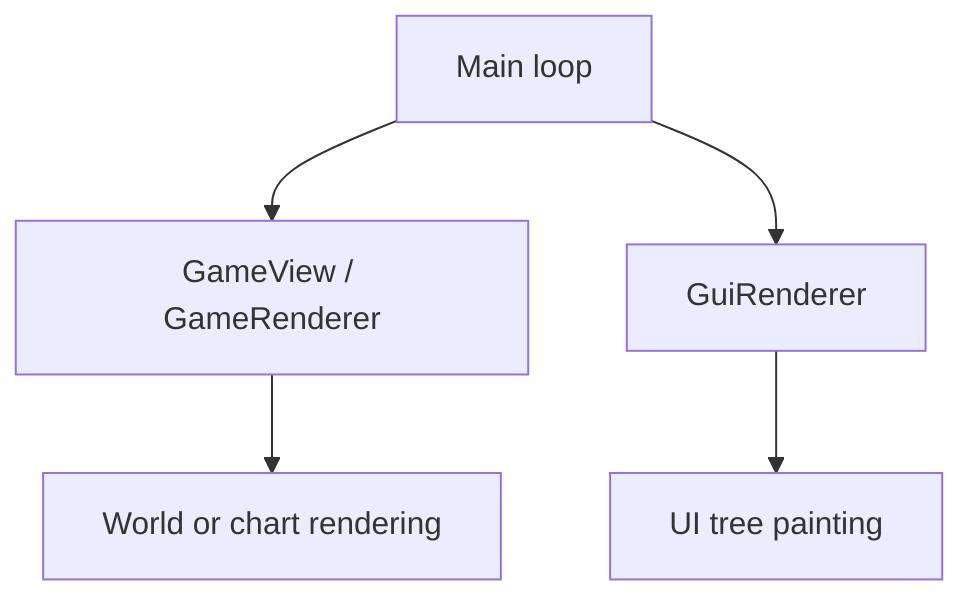

# Semantic input and UI observation research

Updated: 2026-09-23. Status: research and live experiments; not a description of new production MCP tools.

This document is kept in the project root at the user's explicit request. Executable experiments, snapshots, logs and
archives of previous drafts remain under Git-ignored `temp/`. This revision replaces the earlier snapshot-reference
recommendations with stateless current-tree selection. The README describes implemented product behavior.
All paths in commands are relative to the project root.

## Architectural decision

The basic interface should expose **semantic input and structured observations of the actual interface**. It should not
require a new public tool or a hardcoded workflow for each recipe, machine, technology or mod feature.

For input, an agent identifies a control or a named game input such as movement to the right. The adapter resolves the
current game binding and normal game input path. A semantic input is not an arbitrary simulation mutation, an OS
keycode,
or an assumption that a particular physical key still has its default binding.

For output, discover the actual native UI tree and read its presentation, state and associated prototype metadata.
Custom interfaces should appear because the game created controls, not because MCP recognizes the mod or its workflow.
Control-family adapters are compatible with this direction: decoding a slider or checkbox is different from implementing
one special workflow for every machine.

The investigation establishes real Linux tree traversal, a concrete JSON projection, state-transition and screenshot
comparisons, and a tested stateless document/path selection contract. Matching and projection tests do not establish
generic native click dispatch. This work does not replace the existing production tool catalog. Noise reduction,
pruning,
paging policy and workflow automation are deliberately deferred.

## Current contract: one DOM and one selector model

Expose the current UI as a DOM-like tree. Use the same structured, XPath-like selector for observation and action
targeting;
there is no separate window-selection stage, `window.title`, `window.index`, public component `ref`, or persistent
handle.
Windows, layouts, HUD controls and remote-view containers are ordinary nodes. A window caption is a text predicate when
useful, not a mandatory namespace. No full XPath/XML engine or separate CSS/query dialect is required by this proposal.

The proposed public operations are:

| Operation                 | Selector | Result                                                                                          |
|---------------------------|----------|-------------------------------------------------------------------------------------------------|
| Read the full UI document | Omitted  | Current document and its complete sampled subtree, with explicit coverage.                      |
| Read selected UI content  | Present  | All matching nodes with their subtrees, in document order; zero matches is an empty list.       |
| Operate on a UI control   | Required | Exactly one final target, followed by live eligibility checks and the supported control action. |

These are a design for a shared `ui_read` / `ui_action` interface, not registered production tools. A read does not
perform an
action. An action carries the same selector shape as a read, plus its control-family operation and typed parameters.
A zero-match action returns `target_not_found`; multiple matches return `ambiguous_target`. Never select the first match
implicitly, silently fall back to another subtree, or automatically replay an action after an uncertain outcome.

### Document and execution lifetime

Use a synthetic `document` node as the public traversal boundary. Its children are the native roots of the current
active
presentation, in the adapter's verified order. Current captures contain one `agui::TopContainer` each. The wrapper
provides
one consistent selector origin without claiming that every game phase has exactly one native GUI or that the wrapper is
a
game object. It must never combine unrelated background-world roots with the active presentation merely because they
exist.

The DOM describes UI controls, not all pixels: terrain, entities and fog rendered in the world/chart are not child
widgets.
Unknown control roles remain generic; text, state and verified prototype metadata remain readable. Disabled controls
remain
visible in observations with their disabled state, so an agent can understand why an action is unavailable. Detached or
pending-destruction objects must not be advertised as actionable. Raw research captures preserve unknown fields
explicitly.

Every read samples the current presentation. Every action independently reacquires the active root and evaluates its
path
when it actually executes, including after a queue delay. Resolve, check current membership/lifetime and eligibility,
then
dispatch within one verified game-side GUI phase without yielding between selection and invocation. Do not resolve an
address at request admission and submit it later. Menu UI must work without a world or a world `on_tick` callback.

No cross-call UI registry, window cache, snapshot lease or lifecycle-token history is needed. Temporary traversal data
is
discarded after the operation. Process attachment and in-flight request state are separate concerns. A selector
deliberately
may match a newly reconstructed control with the same semantics. It does not promise historical instance identity.

### Structured path semantics

A selector has one nonempty `path` array. Each step contains `axis` and `match`, with an optional `position`:

- `child` examines direct children of each current context. `descendant` examines all descendants, excluding the context
  itself, in preorder. Evaluation starts at the synthetic document node.
- `match` is a conjunction of exact predicates on exposed fields. The research matcher supports string predicates for
  `role`, `text`, `label`, `native_type`, `prototype.kind`, `prototype.name`, and `quality.name`, plus boolean
  predicates for
  `state.enabled`, `state.focused`, and `state.pending_destruction`. Missing/unknown values do not equal false. Empty
  `match`
  means any node. Use semantic fields when available; native types are diagnostic, build-specific selectors, not a
  portable
  public type guarantee. Do not infer icon names or labels that have not been verified.
- `position` is a positive, one-based integer applied **after filtering, separately for each input context**. It selects
  the current matching position, not a window number or component identity. After each step, deduplicate the same object
  and restore document order before evaluating the next step.
- Intermediate matches may be nonunique. Continue the path across them; only an action's final result must be unique.
  Thus two same-title windows can be distinguished by a later button predicate without first supplying a window ordinal.
- Reject unsupported axes/fields, invalid types and out-of-bound selectors. Bound steps, traversed nodes, work and
  output.
  If the relevant search is incomplete, do not claim target uniqueness. Reads must report truncation/coverage
  explicitly;
  never silently present a bounded capture as the complete interface.

For example, this selector finds the current unique button anywhere under the document:

```json
{
  "path": [
    {
      "axis": "descendant",
      "match": {
        "role": "button",
        "text": "Order A"
      }
    }
  ]
}
```

The same selector is accepted by a read or by an action target. If a broader tree contains more than one such button,
the
read returns all of them and the action reports ambiguity. To constrain it to a described ancestor, use an ordinary
path:

```json
{
  "path": [
    {
      "axis": "descendant",
      "match": {
        "role": "window",
        "text": "Duplicate title"
      }
    },
    {
      "axis": "descendant",
      "match": {
        "role": "button",
        "text": "Order A"
      }
    }
  ]
}
```

No special window matching happens here. This exact path was evaluated against two same-title fixture windows; the
button
predicate selected A. After raising A, the semantic path still found A. After closing A it found nothing, and after
recreating A it selected the replacement, as requested. A `position: 1` predicate instead selected the currently first
matching window; after reordering that position belonged to B. Positional selection is intentionally not stable
identity.

### Eligibility is separate from matching

The same matcher supplies both reads and actions. Action dispatch additionally checks current attachment, destruction
state of the target and relevant ancestors, enabled state, control-family capability and the game's necessary routing
conditions. A read may show a disabled button; matching it does not authorize clicking it. Unknown safety-critical state
must not count as successful validation. Occlusion or being outside the viewport alone is not rejection under the agreed
policy, but actual controller suppression/unloading is different. Callback-driven destruction still requires the game's
normal dispatch/lifetime protections. The current Python matcher is not a native action executor.

## Main world view is not a DOM-mounted canvas

The canvas analogy is useful for distinguishing rendered scene content from structured UI controls, but it does not
describe the main view's native rendering ownership. In the inspected Linux build, normal character view, remote chart
view, and zoomed-in remote view all render through `GameRenderer`, directly called by the main loop. They do not enter
scene drawing through an `agui::Widget` paint callback.



Developer-symbol disassembly shows separate game/UI preparation calls and a direct `GameRenderer::render()` call before
`GuiRenderer::render(...)`. Live debugger stacks confirm the direct scene-render caller in all three modes. The actual
InteractionArea vtable uses the empty base `Widget::paintComponent`; its background painter draws a style image layer.
RemoteControllerView::FrameAround also uses ordinary widget/layout painters. Neither is a canvas widget whose component
paint method draws the main map.

Those UI nodes still matter for layout and interaction. In the sampled remote view, InteractionArea is inset inside the
outer frame; in normal view it spans the presentation. Their bounds must not be treated as verified scene-render
clipping
bounds. GameView also reads presentation dimensions, so separate render dispatch does not mean the engine has no GUI
layout dependencies. We did not unmount or destroy required UI objects, and do not claim arbitrary UI deletion is safe.

Consequently, a selector can address the actual interaction region or frame but cannot descend into terrain/entities as
native widget children. Adding a scene node to a future combined document would be an explicit MCP projection, not an
existing native canvas hierarchy. Embedded minimap/camera widgets follow a different path, verified below.

The [rendering investigation](temp/ui-map-render-research/findings.md) retains static and live evidence;
[26 retained checks](temp/ui-map-render-research/results.json) cover the traces, vtables and restoration. The normal
controller/zoom were restored and a full client/server CRC passed. An earlier attempt to use production `status` on
another
client caused a crash; that failure was preserved and bypassed, not fixed. The successful rendering tests used passive
debugger observations and the existing research reader, not the failing production injection path.

## Embedded scene widgets: alert previews and mod cameras

Unlike the main world view, an embedded camera really is a widget whose paint callback renders a scene. In the installed
Linux build, developer-symbol inspection resolves this native alert path:

```text
AlertGroupTooltip::updateContent
  -> AlertGroupTooltip::createCamera
    -> AreaCamera construction
AreaCamera::paintComponent
  -> CameraBase::paint
    -> GameViewWidgetLogic::renderGameView
      -> GameRenderer::render
      -> DrawQueue::drawTexture
```

The helper configures an offscreen render target and draws its texture into the component. This does not imply every
camera owns an independent GameRenderer. The alert's area camera receives a surface and bounding box; it is not a
subtree
containing widgets for every train, rail and terrain tile.

The bundled 2.0.77 LuaGuiElement API also exposes `camera` and `minimap` elements for mods. A synchronized test fixture
created one of each. Native traversal found `CustomCameraWidget` and `CustomMinimapWidget`, both leaf nodes, and a
background window capture showed their scene and chart contents. Live stacks confirmed GUI traversal entering the
camera,
then the nested GameRenderer call. Minimap dispatch instead enters `MinimapBase::paint`, with GUI clipping and chart
draw
queues; do not describe it as the same full-scene framebuffer path.

An ancestor-visibility experiment counted eight GUI frames per sample: visible camera/minimap painted 8/8 times, hidden
camera/minimap painted 0/0 times, and restored camera/minimap painted 8/8 times. The hidden nodes remained in the raw
tree
with `visible_in_tree: false`. Existence in raw traversal therefore does not imply active presentation or action
eligibility.

### Observation contract

Keep these components in the same semantic document and address them with the same selector. Distinguish widget state
and geometry from scene metadata. The official API provides position, surface, zoom and optional associated entity for
cameras/minimaps, plus minimap-specific force/player selection. For example, the fixture's camera returned the following
actual logical-GUI observation (not a native-node enrichment already implemented by MCP):

```json
{
  "name": "camera",
  "type": "camera",
  "position": {
    "x": 8,
    "y": -12
  },
  "surface_index": 1,
  "zoom": 0.75,
  "visible": true
}
```

The logical/native join and a universal native camera-parameter reader remain unimplemented. A native alert AreaCamera
is not automatically a LuaGuiElement. Do not invent getters, offsets or parameters for it. Scene entities can eventually
be observed through a separate verified scene source, but must not be fabricated as native widget children. A preview
also does not establish permission to interact with every displayed entity, bypass chart visibility, or invoke map input
on a camera whose own widget/mod behavior does not support it.

### Alert validation boundary

The local server produced a real train with a missing destination and a train-no-path alert. The reader observed its
visible AlertGui, but the attempted hover did not yield a captured AlertGroupTooltip/AreaCamera. The alert construction
path above is static evidence; the camera paint and visibility tests are live evidence from the mod-style fixture.
They are not a screenshot comparison of an expanded train alert. Gui::addToolTip maintains tooltip references
separately;
the inspected method alone does not prove how every tooltip is mounted. Complete tooltip/popup root coverage remains a
reader gap, and absence from the sampled primary tree is not proof of absence from the presentation.

All temporary camera/train objects were removed and a full client/server CRC passed. No production tool changed. See
[the experiment record](temp/ui-embedded-view-research/findings.md),
[retained checks](temp/ui-embedded-view-research/results.json) and
[camera/minimap capture](temp/ui-embedded-view-research/mod-views.png).

## Map observation: spatial selection and API-shaped results

The agreed first-version scope does not require special tooltip layers or the contents of embedded scene previews.
Preserve ordinary observable UI nodes, but do not block the interface redesign on those gaps. Normal character view and
remote view remain the required map observation/interaction scenarios. The design below concerns reads; previous
rendering
traces do not establish that these queries or all map actions are implemented.

### Two read operations, with selection separate from projection

The proposed overview operation describes the whole map region corresponding to the current screen, without internal
machine details such as recipes, crafting progress or combinator settings. A requested region and observation scale may
produce a coarser overview without changing the actual camera. Region/scale are observation parameters, not authority to
inspect an otherwise unavailable area. Exact camera-to-world bounds and the visibility policy still need validation.

The proposed detailed query has two independent parts:

- **Selection:** which surface, point, tile cell, area or existing game object to query; which object kinds and filters
  to include. A position may select several objects, not just the visually topmost one.
- **Projection:** which properties and bounded related objects to return for every match. Field names, values and object
  relationships should follow the official runtime API wherever possible. Selecting objects must not depend on which
  detail fields are requested.

Both operations should use compatible object representations: an overview supplies basic fields; a query adds requested
details. Do not introduce a separate tool for every machine prototype. Record surface, observation tick, effective
bounds,
coverage and any truncation/aggregation in the result envelope. An empty observed region differs from an unobserved
region.

### Confirmed model for overlapping content

The installed 2.0.77 API separates tiles from entities. A single invented stack such as ground -> floor -> rail -> train
would misrepresent that model:

| Content                                                               | Runtime API representation                                                  | Consequence for the result                                                                                                    |
|-----------------------------------------------------------------------|-----------------------------------------------------------------------------|-------------------------------------------------------------------------------------------------------------------------------|
| Current terrain or paving at a tile coordinate                        | LuaTile, with name, position, prototype and surface                         | Return the current tile as its own object. Paving is not a second generic entity layer.                                       |
| Tile material retained underneath                                     | LuaTile.hidden_tile and double_hidden_tile, optional prototype-name strings | Preserve the actual fields when requested; do not invent an unlimited stack or claim they reconstruct all historical terrain. |
| Rail, locomotive, wagon, machine, resource, ground item, entity ghost | Matching LuaEntity objects                                                  | Return all matches in an entity collection; multiple entities can occupy/overlap the queried location.                        |
| Tile ghosts                                                           | LuaTile.get_tile_ghosts returns LuaEntity objects                           | Keep their real object type; ordinary tile reads alone do not enumerate every ghost.                                          |
| A train containing several carriages                                  | LuaEntity.train references LuaTrain, whose carriages reference entities     | Express a related game object, not a spatial parent containing the rail or tile.                                              |

For example, querying a paved rail position may return a current tile with its hidden-tile metadata, a rail entity and a
rolling-stock entity. The entities are siblings in the query result. Their identities, geometry and relationships carry
the meaning; array order must not imply visual stacking or input priority. A locomotive is an entity belonging to a
train;
the train itself is not another object occupying a tile in this collection.

Decoratives are queried through a separate LuaSurface API. Their existence reinforces that a query must declare which
content categories it covers. An entity-only scan must never be labeled as every rendered object or pixel in the region.

### Point, cell and hit-testing semantics

The API distinguishes spatial queries in ways the public contract must preserve:

- LuaSurface.get_tile rounds non-integer coordinates down to the containing tile.
- find_entities_filtered with position alone matches entities whose collision boxes contain the point.
- With position and radius, it searches by entity center distance.
- With area, it searches entities whose collision boxes intersect that area.

Consequently, "at this coordinate" must have a documented spatial meaning. Support an explicit point versus
containing-cell
or area distinction rather than silently switching between these methods. The native mouse-selection target is a
separate
question: collision geometry, selection geometry and rendered sprite bounds are not interchangeable. LuaEntity exposes
bounding_box, selection_box and an optional secondary_selection_box; these fields do not prove that a collision query
finds every selectable or rendered object. Rails, zero-size/noncolliding objects and overlapping entities need focused
live
tests before claiming exhaustive point selection. No new cursor hit-test adapter was verified by this documentation
pass.

### Result projection aligned with the Mod API

Preserve established names such as object_name, name, type, position, direction, quality, health and status where
applicable.
Keep runtime objects separate from their prototypes. A LuaEntity is an instance; LuaEntity.prototype describes its type.
An unfamiliar mod prototype should remain readable through the entity's supported API class, without a name-specific
adapter. This does not expose arbitrary private state stored in a mod's scripts.

Details should follow their actual API ownership. For example, crafting_progress is an entity attribute, the current
recipe
comes from get_recipe (), an inventory from get_inventory (index), and combinator configuration from the appropriate
object
returned by get_control_behavior (). Methods with arguments need typed query parameters; do not pretend every detail is
a
zero-argument property or expose arbitrary Lua execution as a read tool. The final wire schema for method-derived values
has not been fixed.

Lua objects are not plain JSON tables. The adapter must make a deliberate, bounded projection:

- Keep scalars, enums, records and arrays faithful to the documented types; define consistent serialization of nil.
- Include the API object class when useful and preserve typed related-object identities rather than recursively
  expanding
  surface -> entities -> surface or train -> carriages -> train.
- Use game-supplied identities where available. LuaEntity.unit_number is optional: the installed documentation limits it
  to certain entity families and describes save-lifetime allocation without reuse until overflow. It is not a universal,
  process-global handle. Resolve identities against the current world and recheck validity, without an MCP object
  registry.
- Allow bounded explicit expansion or subsequent queries for related objects. For objects without a usable game
  identity,
  resolve a fresh spatial/semantic description and report ambiguous matches rather than choosing the first.
- Distinguish a supported nil value from an unsupported member, a failed read or an unobservable target. Do not fill
  every
  inapplicable field with a misleading null or guess a default.

The bundled machine-readable runtime-api.json can guide schemas, inheritance, member types and documented subclass
applicability. It does not make blind enumeration/calling safe: each exposed read path still needs applicable-type
checks,
bounds and verification that it has no simulation side effects. No generic native-object serializer has been
implemented.

### Overview compression and evidence boundary

Lossless encoding of repeated tiles is different from grouping resources or buildings into a coarse summary. A coarse
overview must state its aggregation and precision; it cannot masquerade as a complete exact object list. Prefer optional
MCP-side formatting/aggregation over adding game-side business logic. Exact reads must report their bounds and any
result
limit, and observations across separate calls are not promised to describe the same tick.

This section records a design supported by inspection of the installed 2.0.77 runtime API, not new live map-query
acceptance
tests. The excerpts are retained in [bundled-api.json](temp/map-observation-research/bundled-api.json). Online
references:
[LuaSurface](https://lua-api.factorio.com/latest/classes/LuaSurface.html),
[LuaTile](https://lua-api.factorio.com/latest/classes/LuaTile.html), and
[LuaEntity](https://lua-api.factorio.com/latest/classes/LuaEntity.html). The current online release is newer; installed
documentation remains authoritative for implementation against this executable. No Factorio window interaction was
needed.

## Evidence and scope

### This Linux experiment

The installed Steam executable identifies itself as Factorio 2.0.77, build 84539, Linux x86-64 with Space Age. The
matching
runtime API documentation is bundled under the installation's `doc-html/runtime-api.json`. Function addresses and
relevant RTTI/vtable symbols were resolved from this executable's developer-provided ELF/DWARF and symbol table.
No game addresses, field offsets, vtable slot numbers or instruction signatures were stored as version lookup tables.

One graphical client was run at a time, using the ordinary Steam installation, configuration and loading caches. A local
headless server supplied a temporary scenario. The controlled player was verified to be a non-admin. The scenario
creates
custom GUI elements using the same official API available to mods. The later validation also exercises installed
Factory Planner and Factory Search interfaces; it is not a test of every third-party mod.

The experiment reused the project's tracer and protected-call infrastructure. A temporary shared library calls game
readers at a verified GUI phase. The initial tree collector installs no additional detours. A later, separate lifecycle
experiment installed temporary observers and restored them after validation; the window-order experiment used the
original
collector and added no detours. Existing production MCP tools were used through the
standard HTTP transport to prepare machine/research screens. A separate temporary client used the existing resident's
typed IPC to collect read-only logical GUI metadata. Server-console operations were confined to fixture setup and full
CRC assertions, not product functionality.

Before game calls, an isolated native fixture passed 2,000 iterations covering compiler-created callbacks, postorder
subtree accounting, string/reference and rectangle returns, multiple-inheritance RTTI conversion and prototype-label
string returns. These ABI fixtures are distinct from actual-game validation.

### Earlier Windows investigation

The previous document records Windows PDB-based experiments with native GUI traversal, custom controls, generated mod
settings, item/quality selection, menu navigation and synchronized inputs. Those results are useful prior research, not
new Linux acceptance results. The referenced Windows raw artifact directories are not present in this Linux checkout.
Their reported 24/48-assertion runs and timings were therefore not rerun or independently checked here.

The common widget architecture is consistent across the inspected builds. Different ABIs and optimized symbol
availability
require platform adapters; they do not imply that Linux lacks a UI tree. Linux traversal and metadata reads are now
independently demonstrated below.

### Platform and build differences

Shared findings are described once in this document: native widget traversal, the distinction between native and logical
GUI, semantic JSON, prototype-backed labels and lifetime requirements. The table below records only differences in the
binary interface or the experimental access path. Windows entries come from the earlier record; Linux entries come from
the current executable and live probe. Neither column establishes a contract for every release on that platform.

| Area                                          | Windows investigation                                                                                               | Linux investigation                                                                                                                                                                        | Interpretation                                                                                                                                                                                    |
|-----------------------------------------------|---------------------------------------------------------------------------------------------------------------------|--------------------------------------------------------------------------------------------------------------------------------------------------------------------------------------------|---------------------------------------------------------------------------------------------------------------------------------------------------------------------------------------------------|
| Developer debug information                   | Matching executable and developer PDB; the record includes class/type information.                                  | ELF symbol table and DWARF embedded in the executable. The supplied debug information did not expose usable complete `agui::Widget`/`agui::Gui` types to the tested GDB lookup.            | Debug readers and available metadata differ. Incomplete types are a property of the inspected build's debug information, not an inherent Linux or DWARF limitation.                               |
| Native C++ boundary                           | Microsoft MSVC/STL callback fixture and Windows calling conventions.                                                | Linux x86-64 System V calls, Itanium C++ ABI and a compiler-created libstdc++ callback.                                                                                                    | Resolve and verify arguments, returns, virtual dispatch and runtime-library compatibility per target. Do not copy callback, string or RTTI representations between platforms.                     |
| Multiple-inheritance receiver conversion      | Game runtime `__RTDynamicCast` with PDB-resolved type descriptors.                                                  | C++ runtime `__dynamic_cast` with ELF-resolved type information.                                                                                                                           | The required conversion is shared; the ABI and runtime entry point differ.                                                                                                                        |
| Root acquisition and selection                | Actual `TopContainer` calls supplied roots; `Widget::getGui` distinguished menu GUI from background simulation GUI. | The probe captures the root argument passed from `Gui::logic` to `Gui::recursiveDoLogic`. Complete active-root selection remains unverified.                                               | These are different tested access paths, not evidence that the game uses a different UI architecture.                                                                                             |
| Parent reconstruction and helper availability | `Widget::getParentPathString` supplied path depth for postorder reconstruction.                                     | Repeated `callRecursively` traversal supplies subtree spans. The inspected ELF symbol table contains no separately named callable `Widget::getGui` or `Widget::getParentPathString` entry. | The Windows helper route cannot be copied directly from the available Linux symbols. Missing standalone symbols do not prove missing source methods; they may be inlined or omitted in the build. |

Two apparent contradictions are experimental differences, not established platform behavior differences:

- The Windows record rejected **passively observing recursive logic calls** as a complete tree collector. The Linux
  probe uses a logic call only to obtain a root, then explicitly invokes `callRecursively` to enumerate descendants.
  It does not claim that logic callbacks themselves visit every control.
- Windows reported native quality-tooltip observation, selection gestures and menu transitions that this Linux task
  did not test. Linux currently reads some custom-control properties through Lua. These are coverage differences;
  they do not establish that the corresponding native readers or interactions are unavailable on Linux. Conversely,
  a successful Linux reader is not Windows ABI validation.

No difference in the shared widget-tree semantics has been established by these records. Node counts, timings, localized
labels and fixture coverage are not platform comparisons: the experiments used different screens, fixtures and probes.
Future findings should distinguish a reproduced behavior difference from a different implementation choice or an
unverified path, and add a platform-specific rule only when supported by the evidence.

## How the native tree is obtained

The following sequence is the verified Linux probe path; the differing Windows root and parent helpers are listed above.

1. Resolve and validate `agui::Gui::logic(bool)` and `agui::Gui::recursiveDoLogic(agui::Widget*)` against the target
   image.
2. Rendezvous at the former, then capture the actual widget argument at a call to the latter from that GUI logic
   function.
   Check the caller against the dynamically resolved function range. This supplies the root argument without
   reconstructing
   a GUI object or reading a private root-field offset.
3. Call `agui::Widget::callRecursively(const std::function<void(agui::Widget*)>&)` with a real compiler-created
   callback.
   The inspected implementation traverses private and ordinary children, followed by the current widget. It does not use
   painting as a discovery filter.
4. Read runtime class identity, text, bounds and supported properties while the relevant main-thread phase is stopped.
5. Reconstruct parent relationships from postorder subtree spans. The temporary probe obtains each span by calling the
   same game traversal for that node; it does not interpret `std::vector` or parent-pointer layouts.
6. Return typed records to the external experiment and serialize/format them with Python's JSON library.

This captures controls that already existed before attachment. No constructor history, screenshot coordinates or pointer
movement is required. Repeated subtree traversal is an intentionally simple research method with worst-case quadratic
work; it is not a proposed optimized production collector.

The sampled root's traversal is complete within the explicit node bound. This is not proof that every independently
managed GUI root, background simulation, detached control or lazily created popup has been enumerated. Production still
needs explicit active-presentation/root selection and same-phase target validation. Stateless selectors do not require a
persistent public widget-lifetime registry.

## What can actually be read

| Information                | Linux evidence                                                                                                                                                       | Boundary                                                                                                                                |
|----------------------------|----------------------------------------------------------------------------------------------------------------------------------------------------------------------|-----------------------------------------------------------------------------------------------------------------------------------------|
| Hierarchy                  | Native root, ordered descendants, parent relationships, runtime control classes                                                                                      | Current projection has no public component refs or special window indices; every node uses the same path grammar.                       |
| Displayed text             | Titles, labels, buttons, tabs, input fields, multiline content, localized Chinese text                                                                               | Preserve rich-text tags and observed escaping; do not treat all text as plain English.                                                  |
| Geometry                   | Absolute x/y/width/height through `Widget::getAbsoluteRectangle`                                                                                                     | A rectangle does not establish visibility, clipping or modal eligibility.                                                               |
| Common state               | Native enabled, focused, visible-subtree membership, button toggled, tab selected and dropdown expanded getters                                                      | Geometric hit testing and modal routing are separate; generic native checked/switch/progress values remain incomplete.                  |
| Selections                 | Native dropdown text/index and list selected index; list entries also appear as child controls                                                                       | Native indices are zero-based; Lua GUI selection indices are one-based. Closed dropdown options need another source or an opened popup. |
| Numeric values             | Native slider value 37; verified `NumberInputGui::getValue` ABI                                                                                                      | No claim that all specialized numeric controls or ranges are decoded.                                                                   |
| Prototype semantics        | Item, recipe, entity and technology tags plus localized labels; shortcut labels; native quality prototypes and number-provider counts                                | Quantity semantics depend on the control; this is not every specialized slot property.                                                  |
| Custom GUI state           | Six Lua roots; names, indices, captions, text, checked state, items, selection, slider, switch, progress, sprites, tooltips, anchors and item-with-quality selection | Logical custom GUI is not the complete built-in interface. These fields were read on the controlled client.                             |
| Hidden/offscreen structure | Hidden fixture label and all 20 overflowing buttons remain discoverable natively                                                                                     | Discovery is not permission or proof that direct activation is currently appropriate.                                                   |
| Mixed windows              | Native assembling-machine window and the fixture's relative extension appear in one tree                                                                             | Logical existence can precede attachment to an open native window.                                                                      |

### Text requires virtual dispatch

Calling `Widget::getText` directly returned empty text for labels and text boxes whose subclasses override it. The Linux
image also contains callable symbols for `Label::getText` and `TextBox::getText`. The successful generic reader locates
the base getter's slot in the current executable's Widget vtable, then dispatches through each actual object's vtable.

The slot is discovered from symbols each time; it is not a hardcoded game offset. The only structural interpretation is
the platform's standard Itanium C++ ABI. Return conventions were checked against the executable and fixture. This
recovers both base-button text and subclass text without a hand-maintained class-to-text-getter list.

A long startup changelog exceeded the probe's per-node text buffer and is explicitly marked `text_truncated`. This is a
research transport bound, not noise filtering. No native nodes were removed by the semantic formatter.

### Icon controls carry semantic data

A widget pointer is not necessarily the correct receiver for its prototype interface. The successful reader uses the
platform C++ runtime's `__dynamic_cast` with the game's actual RTTI for `agui::Widget` and `PrototypeProvider`. This
yields
the adjusted provider subobject pointer, including multiple inheritance.

The provider's `getBasePrototype` virtual slot is discovered from the current TechnologySlot vtable and its named thunk,
then used through the actual provider vtable. `PrototypeBase::getRichTextTagWithLocalisedName` supplies a game-generated
label. This works across the tested recipe, item, entity, technology and shortcut controls without anticipating their
content names. Missing provider/prototype metadata remains absent rather than being guessed.

Examples actually read from the client include:

- `[recipe=iron-gear-wheel] 铁齿轮`
- `[entity=assembling-machine-1] 组装机1型`
- `[technology=automation] 自动化`
- `[item=transport-belt] 基础传送带`
- Native shortcut labels such as `撤销` and `蓝图（建设规划）`.

The external formatter separates recognized rich-text prototype tags into a kind/name identity and retains the original
caption. It does not infer mod ownership, recipe feasibility or gameplay behavior from those labels. No client-only
`request_translation` call is used.

## Current formatted output: no public component refs

The revised research formatter emits `ui-tree-research/3`: a single synthetic `root` with role `document`, containing
the
sampled native root (s) and their complete nested children. There is no window summary, window index, public component
`ref`,
pointer, lifecycle token, or per-node traversal ID. All source nodes are preserved; there is no noise pruning. Unknown
roles
remain `component`, and unsupported state remains null. The capture name is research provenance, not an action
credential.

The following is one complete fixture window subtree, with geometry and diagnostics omitted for readability. It is an
excerpt, not a fabricated whole-screen root. The current frame contains a layout, its button, the caption label and a
filler.

```json
{
  "window_subtree_excerpt": {
    "role": "window",
    "text": "Duplicate title",
    "state": {
      "enabled": true,
      "in_visible_tree": true,
      "pending_destruction": null
    },
    "children": [
      {
        "role": "group",
        "text": "",
        "state": {
          "enabled": true,
          "in_visible_tree": true,
          "pending_destruction": null
        },
        "children": [
          {
            "role": "button",
            "text": "Order A",
            "state": {
              "enabled": true,
              "in_visible_tree": true,
              "pending_destruction": null
            },
            "children": []
          }
        ]
      },
      {
        "role": "group",
        "text": "",
        "state": {
          "enabled": true,
          "in_visible_tree": true,
          "pending_destruction": null
        },
        "children": [
          {
            "role": "label",
            "text": "Duplicate title",
            "state": {
              "enabled": true,
              "in_visible_tree": true,
              "pending_destruction": null
            },
            "children": []
          },
          {
            "role": "spacer",
            "text": "",
            "state": {
              "enabled": true,
              "in_visible_tree": true,
              "pending_destruction": null
            },
            "children": []
          }
        ]
      }
    ]
  }
}
```

The `pending_destruction: null` values above mean that this older generic collector did not collect that field. The
separate lifecycle experiment established the getter. Production must check it at action execution; null must never be
interpreted as evidence of safety.

Machine content remains semantic without refs. The full machine projection retains the observed dropdown selection
`Beta` at native index 1, slider value 37, and `[recipe=iron-gear-wheel]` prototype metadata. Inventory projection
retains
quality and quantity readers. No component address or snapshot number is required to express those attributes in a
selector.

Current complete projections and executable experiments:

- [Machine interface: all 713 nodes](temp/ui-path-research/machine-prototype-semantics.dom.json).
- [Inventory: all 968 nodes](temp/ui-path-research/inventory.dom.json).
- [Remote view: all 911 nodes](temp/ui-path-research/remote-view.dom.json).
- [Train schedule: all 1,099 nodes](temp/ui-path-research/train-schedule-final.dom.json).
- [Two-window fixture: all 712 nodes](temp/ui-path-research/initial.dom.json).
- [Unified formatter and selector](temp/ui-path-research/selector.py).
- [Unified read/target checks](temp/ui-path-research/results.json).

The earlier `.semantic.json` artifacts retain their original snapshot-local refs, and `ui-window-order/*.dom.json`
retains
superseded window descriptors, as historical evidence. Neither is the current proposed public schema. Their source
observations are preserved, not overwritten to resemble newer tests.

The independent logical custom GUI observation still supplies names, official player-scoped indices,
checked/switch/progress
values, dropdown items, sprites, tooltips and selected item quality. Its indices are API metadata, not universal native
window IDs or new public action handles. A reliable native/logical identity join remains unverified, so keep the two
sources
explicitly separate. Never join them by caption or coordinates.

## Live coverage and validation

| Screen/fixture                           | Recorded result                                                                                  | Evidence                                 |
|------------------------------------------|--------------------------------------------------------------------------------------------------|------------------------------------------|
| Startup presentation                     | 111 nodes, including changelog tabs, dropdowns, labels and modal notice controls                 | `startup-dialogs.json`                   |
| Scenario error dialog                    | 24 nodes; localized title and leave/save/reconnect controls                                      | `scenario-error-dialog.json`             |
| HUD plus custom GUI                      | 601 nodes; hidden label and all 20 overflow rows included                                        | `custom-gui-and-hud.json`                |
| Machine recipe selector                  | 642 nodes, including `AssemblingMachineSelectRecipeGui`                                          | `machine-and-custom-extension.json`      |
| Machine settings plus relative extension | 713 nodes; both `AssemblingMachineGui` and custom machine controls                               | `machine-settings-and-relative-gui.json` |
| Machine prototype semantics              | 42 prototype/shortcut captions within the 713-node snapshot                                      | `machine-prototype-semantics.json`       |
| Open technology tree                     | 548 nodes, including 219 `TechnologySlot` nodes and 217 prototype captions across the whole tree | `technology-tree.json`                   |
| Logical custom GUI                       | 45 elements across six roots; 18 distinct element types including root types                     | `logical-custom-gui.json`                |

All filenames in this table are relative to `temp/ui-tree-linux/`. Some technology slots are empty/placeholder controls;
219 structural slots does not mean 219 populated technologies. `technology-prototype-semantics.json` is an earlier
research-HUD snapshot taken before the technology window was explicitly opened; it must not be mistaken for the final
technology-tree snapshot.

The retained verifier passes 48 assertions and checks hierarchy, metadata, absence of node pruning, fixture values,
non-admin identity, and matching
full-CRC request markers in both peer logs. The server independently confirmed the sampled checked state, selection,
slider value and item/quality; see `authoritative-ui-state.json`. Repeated full CRC requests were followed by continued
execution without a
reported desynchronization. This supports the sampled readers and setup operations, not all possible UI getters.
Native ABI fixtures and retained-evidence assertions are different kinds of validation.

The isolated probe reparses debug information and performs expensive symbol lookup for each snapshot. Observed
end-to-end
calls took roughly 7–19 seconds, including symbol lookup and debug parsing. Collection time was not isolated. These are
not per-frame timings or a
production performance claim. Optimization was not the current objective.

## Extended Linux state and screenshot validation

The second investigation is retained under `temp/ui-state-validation/`. It used a non-admin client connected to the same
local headless server throughout, with one client restart after a failed temporary observer experiment. It enabled the
installed Factory Planner 2.0.20, flib 0.16.3 and Factory Search 1.13.3 mods, in addition to Space Age. The original
normal
mod-list configuration was backed up for restoration. These are real mod interfaces, not only scenario lookalikes.

### Visibility, clipping and input eligibility

The native probe now runs two game-owned traversals:

- `Widget::callRecursively` discovers the complete sampled structure, including hidden content.
- `Widget::getWidgetRecursively` with an always-false predicate collects the reachable visible subtree. The inspected
  implementation skips children hidden by their visibility flag or by search, and therefore also skips their
  descendants.
  It visits its starting root unconditionally; the observation uses the actual GUI root, not an arbitrary hidden
  element.

A hidden leaf and a visible child under a hidden parent were absent from the second traversal but present in the first.
Calling the game's `hideBySearch`/`showBySearch` on a fixture row similarly changed native visible-tree membership while
its logical Lua `visible` property remained true. These are different visibility concepts.

All twelve scroll rows remained in the visible subtree, although the screenshot showed only rows 1–3. Calling
`Widget::getWidgetUnderMouse` at their centers used the game's own clipping and stacking logic: rows 1–3 hit themselves,
while row 8 did not. After official scrolling to the bottom, row 12 became hittable and row 1 ceased to hit itself.
The hit-test argument/rectangle ABI was checked against the actual GUI caller and an independent native fixture.
This is a **point hit test**, not a reconstructed complete visible region or proof that the entire widget is painted.
A failed center hit can mean clipping, another control, or interaction transparency; it must not automatically be
labeled
"hidden". A partly exposed control might still have another valid interaction point.

`Widget::isEnabled` reports the widget's own flag. In the fixture, a disabled container and its enabled child had
different
values. The probe preserves those facts rather than inventing an inherited-enabled rule. Disabled controls can still be
returned by geometric hit testing. The input-ignored copper sprite remains in the logical/native structure and has
`ignored_by_interaction=true` through Lua; presence does not mean it is an input target.

### Modal focus is a separate routing system

The actual dropdown expansion calls `FocusManager::requestModalFocus`. A scoped observer captured its real widget
argument, priority and boolean argument. That widget matched the popup `agui::ListBox` in the subsequently collected
native tree. Closing the dropdown called `FocusManager::releaseModalFocus` for the same widget. Acquisition priority was
200 in this observation; it is evidence, not a version-independent constant for an adapter. Only the receiver/widget
arguments apply to the release function; other raw argument registers in its diagnostic are not release parameters.

The open popup exposed Alpha/Beta/Gamma, selected index 1, and `DropDown::isDropDownShowing=true`. Closing it returned
false and removed its option subtree from the active tree. Controls outside the popup still passed geometric center hit
tests. Inspection of `Gui::logic` also found separate modal mouse-down dispatch, followed by checks of whether modal
focus
changed. Thus a hit-test result cannot stand in for modal routing or whether an outside click is consumed/dismisses a
popup.

The lifecycle observation path is verified. **Bootstrapping the full already-existing modal stack on late attachment is
not solved through a stable reader in this build.** There is no separately callable getter in the inspected symbols and
no usable complete FocusManager layout in the tested debug-type lookup. A direct enumeration of all 565 DWARF
compilation units found no Widget/FocusManager/CheckBox/Switch/Gui implementation unit; the retained unit-name inventory
and GDB lookups are in `debug-type-evidence.json` and `debug-type-lookup.log`. Embedded DWARF presence alone does not
establish game-class field metadata. `checkThatModalFocusedWigetIsOnTop` mutates the
stack/ordering and can bring a widget forward; it is not a query. Creating a temporary window to provoke reordering was
rejected as an observation strategy. Request/release events alone do not reconstruct events missed before attachment,
nested priorities, all destruction paths or their routing flags. The formatted snapshot therefore keeps
`modal_eligible=null`; it does not optimistically advertise every visible control as actionable.

Setting `LuaPlayer.opened` to a custom frame did not produce a modal-acquisition event in the sampled path. An opened
custom frame is not automatically a modal dialog. A separate attempt to use `show_message_dialog` was rejected by its
one-player precondition in this multiplayer fixture and supplies no modal evidence.

### Quantities, quality, toggles, tabs and render-only text

Two more shared native interfaces substantially improve icon semantics:

- `PrototypeProvider::getQualityPrototype`, dispatched through the actual provider vtable, supplies a quality prototype;
  the same rich-text/localized-name reader returns tags such as `[quality=rare] 稀有`.
- A runtime cast to `ButtonNumber` supplies the correctly adjusted receiver for its virtual count reader. The slot is
  derived from the current QuickBarItemSlot vtable and its named thunk. Counts are returned as doubles, not integers.
  This reads inventory, quickbar and real mod `IconButtonWithNumber` values without knowing the content names.

The formatter calls the generic result `number_provider_value`: its meaning depends on the control. A badge containing
4 can mean four result groups/entities, not four iron plates. A prototype-backed slot can have no actual item, and a
zero number-provider result is not a universal value for a specialized control.

Additional verified native readers are `Button::isToggled`, `Tab::isSelectedTab`, and
`DropDown::isDropDownShowing`. The Widget `asButton` slot is derived from the executable and invoked on the actual
object
before calling the Button reader. Checkbox checked state is not Button toggled state; the probe does not substitute one
for the other. The train schedule tab reported selected=true and the fuel tab false.

The train item-count condition exposed a useful counterexample: its `ChooseSignalOrNumberButton` displayed **100**, but
`getText` was empty and its generic number-provider value was zero. The control formats and draws its constant directly.
A temporary hardware-breakpoint observer captured entry into its real `paintComponent`, then the actual call to
`StringUtil::shortNumberFormat`, checked that the return address belonged to that paint method, and read the double
argument from the platform ABI. It observed **100.0**. This is a demonstrated render-observation path, not OCR, a
private
field offset or a complete generic render collector. Correlation must retain the paint receiver, frame and lifetime;
never attach an unrelated global formatter call to the current UI node. A render-only value cannot be promised when no
relevant frame is rendered, and the present JSON stores this observation separately from the tree snapshot.

### Screenshots without requesting window focus

The game-side `game.take_screenshot` path with `show_gui=true`, the current viewed position/zoom and `force_render=true`
produced usable GUI screenshots while the X11 window was iconified (`WM_STATE=IconicState`). Native tree collection also
continued. No OS mouse/keyboard events or focus requests were used. Resolution changed from 3840×2160 to 1920×1080
during
that window-state transition, so each observation must read the current geometry instead of assuming one display size.

However, **that API is not a faithful screen capture in remote map mode**. At viewed position (160,0), physical position
(0,0), zoom 0.15 and `render_mode=chart`, the API image rendered terrain across the screenshot. An independent X11
Composite client-pixmap capture showed the actual chart, charted region, black unexplored area and map icons. It
preserved
the pre-existing non-game focus. Inspection of `RenderUtil::takeScreenshots` confirms a separately constructed
GameRenderer
plus GUI rendering; it is not a read of the application's current presented frame. The API also omitted the on-screen
FPS/time debug overlay in this comparison. The ordinary and remote images are therefore labeled by capture source.

The X11 helper names the window pixmap, temporarily requests automatic Composite redirection if necessary, and releases
its resources. It does not activate, raise or send input to the game window. This tested path requires a mapped window;
it deliberately rejects an unmapped one rather than presenting a stale image as current. The experiment has **not**
established a faithful, fresh map-mode screenshot while the window is minimized. The game API remains suitable for the
sampled GUI comparisons, but its terrain image must never establish fog visibility or what the player can currently see.
Neither the screenshot workaround nor window manipulation was added to product code.

### Requested examples and comparison results

Files below are relative to `temp/ui-state-validation/`; screenshots and native JSON share each listed stem unless
noted.
The images were actually inspected, in addition to machine checks of the captured fields.

| Example                                                             | Expected and observed                                                                                                                                                                                                                                | Remaining boundary                                                                                                                                                                                                                                                    |
|---------------------------------------------------------------------|------------------------------------------------------------------------------------------------------------------------------------------------------------------------------------------------------------------------------------------------------|-----------------------------------------------------------------------------------------------------------------------------------------------------------------------------------------------------------------------------------------------------------------------|
| `hud-counts`, `hud-minimized`                                       | Twenty displayed quickbar slots; stone furnace 2 and transport belt 4, normal quality; empty slots retained; real Factory Planner top-left entry visible.                                                                                            | Hidden quickbar page controls also exist and must not be counted as displayed slots. The top-left mod button's sprite/name/tooltip come from logical GUI.                                                                                                             |
| `inventory`                                                         | Sixteen occupied visible InventoryGuiSlot controls; 37 rare iron plates distinguished from 20 normal iron plates, plus all other shown stacks. Counts/quality matched the inventory query and screenshot.                                            | Equipment contents, durability bars and every overlay are not implied by a stack count.                                                                                                                                                                               |
| `train-schedule`, `train-schedule-final`                            | Iron Mine and Smelter, 30 s, OR, full-cargo condition, iron-ore signal, `<` comparator; schedule selected and fuel not selected.                                                                                                                     | The native automatic/manual switch state remains unknown in the generic tree. The screenshot shows manual; the fixture sets manual. A separate train API read is possible but is not a UI-state reader. Constant 100 needs the separately verified paint observation. |
| `remote-view`, `remote-map`                                         | Remote-view frame, controls and UI changes; separate viewed/physical positions and render modes from LuaPlayer.                                                                                                                                      | Terrain, entities, chart tiles and fog are not child widgets. `remote-map-window.png` is the actual chart comparison; the game-API image is not fog evidence.                                                                                                         |
| `factory-search`, `factory-search-complete`                         | Real Factory Search title, item chooser, checkboxes, raw tooltip/localization data and result summary 251. Character/chest result badges were 4/1 through both native number readers and logical GUI; sprite names identify their meaning logically. | The earlier `factory-search-results.png` caught "searching" before its JSON caught completed results; it is retained as asynchronous-state evidence, not a matching pair. The final complete snapshot is bracketed by matching observations.                          |
| `control-states`, `control-states-changed`                          | Native enabled/focus/text/selection/slider; logical checked/unchecked, right→left switch and 0.42→0.75 progress; toggled button true→false, slider 37→80, Beta→Gamma; scroll rows 1–3→10–12.                                                         | Labels intentionally stay unchanged while values flip, demonstrating why state must not be inferred from caption text. Native checkbox/switch/progress value gaps remain distinct from complete logical values.                                                       |
| `dropdown-modal-captured`, `modal-final-open`, `modal-final-closed` | Popup option subtree, expanded flag and selected index; actual modal request/release refer to the same ListBox.                                                                                                                                      | This establishes the sampled lifecycle, not full late-attach modal-stack reconstruction.                                                                                                                                                                              |

### Concrete updated JSON projection

The full formatter preserves all source nodes. For example, this actual inventory node has no caption of its own, yet
its item identity, quality, quantity and native state are recoverable:

```json
{
  "role": "inventory_slot",
  "text": "",
  "state": {
    "enabled": true,
    "focused": false,
    "in_visible_tree": true,
    "pending_destruction": null,
    "modal_eligible": null
  },
  "center_hit_is_self": true,
  "prototype": {
    "kind": "item",
    "name": "iron-plate"
  },
  "quality": {
    "kind": "quality",
    "name": "rare",
    "label": "稀有"
  },
  "number_provider_value": 37.0
}
```

The complete files also contain geometry and children. Logical GUI remains a separate tree with official indices,
properties, localization expressions and `logical_ancestor_visible`. That computed property describes logical ancestors,
not renderer clipping or controller-dependent native mounting. Native/logical identity is still not joined by caption or
coordinates. Some raw research files include native addresses solely for within-process experimental correlation; the
current formatter removes them. Historical snapshot refs remain only in archived projections; the current interface uses
one document-rooted path grammar with structural and semantic predicates for every control.

### Exhausted or still unsafe generic reader paths

| Gap                                             | Investigated alternatives and current conclusion                                                                                                                                                                                                                                                                                                                                                                                                                                                                          |
|-------------------------------------------------|---------------------------------------------------------------------------------------------------------------------------------------------------------------------------------------------------------------------------------------------------------------------------------------------------------------------------------------------------------------------------------------------------------------------------------------------------------------------------------------------------------------------------|
| Native checkbox/radio state and switch position | No standalone state getter was found in this build. The checked/switch state is read inline by painting/style code. Checkbox graphical-set selection depends on enabled/hover/pressed state as well as checked state; arbitrary mod styles can reuse graphics. LabeledSwitch refresh changes label styles and reads private state, so it is not a pure getter. Do not decode by fixed field offsets, force a toggle/restore, or infer truth from a color. Official Lua GUI provides exact state for mod-created controls. |
| Native progress value                           | Logical progress is exact. Native painting/`getBarRectangle` does not establish a general original numeric value/range; pixel-width inference would be quantized presentation, not an exact value reader.                                                                                                                                                                                                                                                                                                                 |
| Full clipping/occlusion region                  | The game's point hit test works. `recalculateClippingRect` mutates a cached child-bounds calculation and is not a viewport rectangle getter. Painting has a clipping stack and special container paths. Bounds intersection alone is not proven equivalent. Do not label a center sample as complete paint visibility.                                                                                                                                                                                                    |
| Existing modal stack                            | Acquire/release observation works; a complete late-attach bootstrap and all lifecycle/routing semantics do not. Keep eligibility unknown until established, or route future inputs through the game's own GUI dispatcher.                                                                                                                                                                                                                                                                                                 |
| Every icon's tooltip                            | Native base `createToolTip` returns null; specialized tooltip creation can allocate transient UI. The train numeric button's tooltip does not expose its constant. Logical GUI supplies declared sprite paths/tooltips; not every native icon has a verified pure metadata getter.                                                                                                                                                                                                                                        |
| Native/logical identity join                    | `CustomGuiElement::fillBaseProperties` receives the native widget during construction, but that event may predate attachment. `LuaGuiElement::getRegistrationTarget` returns a registration descriptor, not a native-widget getter. Neither establishes a complete join for existing arbitrary controls without a verified lifetime/layout contract.                                                                                                                                                                      |
| Arbitrary drawing and complete map observation  | A canvas, minimap, camera, chart and rendered world are not an accessibility subtree. Standard widgets do not encode every painted mark's meaning. These need a separate verified observation source, not invented widget children.                                                                                                                                                                                                                                                                                       |

These are limits of the verified access paths in the inspected build, not claims of mathematical impossibility or of a
Linux-wide limitation. They are explicitly unknown in output rather than silently omitted or filled from guesses.

### Validation and failed experiment record

The extended ABI fixture passed 2,000 callback/RTTI/string/rectangle/point-hit/quantity iterations. A separate fixture
passed 20 protected nested observations while another target thread allocated memory. Real-game screenshots, native
snapshots, logical reads and server assertions are checked by `temp/ui-state-validation/verify.py`. Full CRC requests
were followed by continued client/server operation; the final retained peer logs contain matching successful markers.
The final retained run passed 81 assertions and contains 7 matching full-CRC markers after the client restart.
These counts describe evidence coverage, not proof that every game widget/property is supported.

One early nested-observer attempt incorrectly resumed helper threads before calling a tracer method that requires them
stopped. A ptrace error triggered the protected-call safety stop. The test client was restarted; the server remained
running. The fix changed only the temporary observer's sequencing, was validated with the concurrent fixture, and then
passed actual dropdown acquire/release plus full multiplayer CRC checks. No corresponding production code was changed.
This failed experiment must not be counted as a passing injection/no-interruption test. The earlier client's stdout was
replaced by the fixture restart; its regular Factorio log is retained separately, and final CRC evidence uses the
current
client log. Server-rejected setup commands are likewise not successful GUI observations.

Warm snapshots with symbol metadata already cached in Python took about 0.64–0.70 seconds end to end in this fixture.
That excludes the initial ELF/RTTI scans and is not isolated collector time or a per-frame production performance
promise.
The temporary probe still has explicit bounds and synchronous game-thread work; production integration remains separate.

## Limits and important distinctions

- **Native widgets and deterministic logical GUI are different layers.** Wube describes custom GUI's saved logical state
  separately from the actual client widgets. Built-in interfaces are not all represented by `LuaPlayer.gui`.
  See [FFF-305](https://www.factorio.com/blog/post/fff-305).
- **Structure is not complete meaning.** Standard controls expose useful semantics; arbitrary pictures, graphs, maps,
  cameras, world rendering and custom canvases can contain content with no separate widget or declared action meaning.
  A map entity is not an `agui::Widget` merely because its configuration window is one.
- **A prototype is not a complete slot value.** Native quantities and quality now have verified shared readers.
  Progress,
  filters, ranges and other specialized states still require separate evidence. Logical and native item/quality sources
  are explicitly distinguished.
- **Presence, local visibility, effective visibility and input eligibility differ.** Hidden descendants and detached
  relative content can exist. Bounds and `enabled` do not resolve clipping, focus routing or modal restrictions.
- **Lazy content does not exist yet.** A closed popup may have no instantiated option subtree. A later observation after
  expansion can expose it without a new gameplay-specific tool.
- **Descriptions and identities differ.** The current interface resolves descriptions afresh and permits reconstructed
  targets. It does not retain raw addresses as public handles. Native window ordinals are current positions; logical GUI
  indices are scoped to a player/world/element lifetime and may include zero.
- **An observation is a snapshot.** The main-thread sampling phase provides the tested consistency boundary; this
  experiment is not a proof of all renderer/thread interactions. Production reads need explicit ownership and bounds.
- **Read-like APIs can still mutate state.** Avoid helper calls that create roots/widgets, automatic reconstruction,
  synthetic numbered items and client-only translation requests. Use verified readers and full multiplayer CRC checks.

## Useful prior input findings, with evidence boundaries

These are preserved from the earlier Windows investigation and existing project research. They were not newly validated
as a Linux semantic-input implementation in this task.

### Named controls and bindings

`LuaSimulation::luaControlDown` was investigated as an example of the game's own route from a named `ControlInput` to
active-input-method values, `eventsToTriggerThis`, and `InputEventSender::sendEvents`. `LuaSimulation` itself is not an
ordinary-world mod API and must not be instantiated by guessing an object layout.

The useful principle is to resolve the current named control and preserve normal routing, custom-input consumption,
focus and modifiers. A missing binding needs explicit handling. A shortcut's associated input does not by itself prove
that dispatching the shortcut and dispatching that input have identical mod-event semantics.

### Widget dispatch is not a generic click recipe

Prior tests reported that native widget dispatch could deliver synchronized custom GUI events, but also bypassed
ordinary
screen hit testing: hidden, offscreen, covered and non-modal-subtree controls could be activated. Disabled controls were
rejected in the tested path. Successful bypass is not proof that every such operation respects all GUI assumptions.

Checkboxes required an appropriate enter/down/up/leave sequence in that experiment. Dropdowns reacted to down/up rather
than click alone. Some controls generate click during down, so blindly adding a second click can duplicate an operation.
Inventory slots and quickbar controls may read current game input state beyond fields in a supplied event.

The earlier probe copied a real event using `MouseEvent::copyWithNewSource`; it did not establish safe fresh-event
construction for production. Modifier handling, control-local coordinates, ownership, finite input release and teardown
must be verified. Calling a registered closure directly or raising an arbitrary Lua GUI event is not equivalent to
normal game input.

The reported later Windows quality-selection flow superseded its earlier incomplete chooser test: selecting an item
could leave the picker open, and a separate confirmation control completed it. An observer should expose those controls
and changed states rather than hardcode an item-picker workflow. Linux item/quality *input* remains unverified by this
task.

### Tooltip observation is an operation

The prior investigation found that a generic base `createToolTip` was not a universal metadata getter. The normal
tooltip
path could create transient widgets, which then needed explicit removal and subsequent cleanup verification. Those
experiments reportedly identified icon-only quality choices. This Linux task did not implement tooltip creation or claim
that every icon's tooltip is available through a pure read.

### Presentation and world lifetimes

The earlier Windows tests reported menu/save-load traversal, paused-world presentation and background-simulation
pitfalls.
`AppManager::isAppInMenu` could also describe an in-game menu; destruction of a background Map did not necessarily
destroy
the active menu. Treat these as constraints to revalidate, not a complete platform-independent lifecycle classifier.

A GUI-phase observer can operate outside world ticks. A production design should distinguish process/presentation
readiness, the actual player world and Lua attachment. World replacement must invalidate world-owned work; ordinary menu
presentation should not depend on a running `on_tick` callback.

Address reuse previously caused stale type metadata to select an incorrect getter. Actual receiver conversion and
current
RTTI checks fix one failure mode, but same-type address reuse invalidates pointer-based historical identity. The later
Linux experiment demonstrated independent
lifecycle tokens, while the current public design intentionally avoids retaining component identity between calls.
Current-root resolution and action-phase validation remain necessary.

## Later window-state and identity findings

The technology window uses shared full-viewport layout machinery and separately suppresses controller presentation.
Opening it unloads the ordinary controller/inventory window; closing it rebuilds that presentation from the retained
logical open target. Independent custom screen windows can remain attached underneath. Thus technology is not merely an
opaque layer, and not every covered window has been unloaded. Effective suppression is not completely described by the
public `show_controller_gui` setting. See [window mechanism evidence](temp/ui-window-mechanism/findings.md).

In the real remote item/quality picker, empty item selection with default normal quality disables confirmation;
selecting
an item enables the same confirmation object. Normal quality can already be selected, so the adapter must not invent a
requirement to click a quality explicitly. Generic semantic labels for every plain quality icon remain unverified.

`Widget::isFlaggedForDestruction()` supplies an explicit native pending-deletion state. A real pending IconButton was
still
enabled, proving that enabled state alone is insufficient. The game also uses invalidating GenericTargeter references;
its dispatch helper checks whether a receiver survived its own callback. Current tree membership, self/ancestor deletion
state, and operation eligibility must be checked independently of how the target was described.

The lifetime experiment distinguished 304 reused addresses across one inventory/technology/inventory cycle. A separate
same-window comparison kept the same ancestor chain, address, type, caption and position while replacing the button.
These invalidate historical pointer/ordinal identity claims, not the chosen semantics of fresh description matching.
See [lifecycle evidence](temp/ui-lifetime-research/findings.md)
and [descriptor comparison](temp/ui-descriptor-research/findings.md).

## Menu compatibility

Fresh Linux captures establish that the startup main menu and in-game multiplayer menu use the same native widget system
and traversal functions as gameplay. The startup menu had 51 nodes under `agui::TopContainer`, including ordinary
buttons
for Single player, Multiplayer, Settings, Mods and Quit, plus the language dropdown. The in-game menu had 502 nodes and
included `MultiplayerMenuGui`, ordinary buttons, retained HUD/background controls, and a disabled Pause button. The text
and
disabled state matched screenshots captured through XComposite without changing focus during capture.

Both scenes work with the same structured path matcher. No special menu selector or menu-window ordinal is necessary.
A menu requires process-level UI readiness and a GUI execution phase, not Lua/world attachment. Production must separate
these prerequisites from the existing gameplay tools' world-bound `attach` checks. This is a proposed integration
change;
it has not silently changed the current product tool prerequisites.

Root discovery and action eligibility still need separate validation: two repeated main-menu samples found the expected
foreground root, but do not prove that every arbitrary GUI logic call belongs to the active presentation. The menu's
animated world is not a tree of selectable UI entities. Settings/load/join subpages and generic menu action dispatch
were
not validated in this experiment. Desktop clicks attempted solely for submenu setup did not change the captured tree;
that is not evidence for a working input adapter.

See [menu evidence and limitations](temp/ui-path-research/findings.md), the
[main-menu DOM](temp/ui-path-research/main-menu.dom.json), and the
[in-game menu DOM](temp/ui-path-research/pause-menu.dom.json).

## Validation of the unified document/path proposal

- Current contract verification: 55 checks using real captures. These cover complete document reads, filtered reads with
  zero/multiple matches, unique action targets, intermediate ambiguity, current positions per context, deduplication,
  subtree containment, reordering/reconstruction, remote non-window controls, main/in-game menus, disabled-state
  queries,
  invalid selectors and incomplete-search rejection. These are matcher tests, not native action acceptance tests.

- Live window-order experiment: six native snapshots, same-title windows raised/closed/reopened, 10 evidence checks,
  and one full client/server CRC after synchronized fixture cleanup. It reused the existing non-admin client and local
  server. No native click test is implied by changing order through authorized server-side fixture setup.
- Superseded window-contract/projection verification: 33 checks against real-game captures, covering title-only
  uniqueness, ambiguity,
  absent windows, title/index disagreement, invalid indices, no cross-window fallback, distinct child/descendant axes,
  component-level rejection after window reordering, subclass classification, and preservation of every source node.
- Earlier selector evaluation: 14 checks; earlier window-qualified identity comparison: 12 checks. These are offline
  evaluations of actual captured trees, not additional live action acceptance runs.
- Earlier lifecycle/native validation: 41 evidence checks, 2,000 fixture lifetimes, native register/relocation fixtures,
  and three additional full CRC checks. The temporary lifecycle hooks were restored; the product resident was retained.

Matching, observation, and actual input dispatch are separate validation claims. The unified path scheme is verified as
a
current-tree matcher on the sampled roots. A complete generic production UI action executor still requires the
control-family
input, synchronization and safe-phase validation listed below. No new MCP tool is advertised by this document.

## Remaining work before production integration

1. Establish safe active-root selection across menus, pause screens, background simulations and world replacement.
2. Integrate unified full/filtered DOM reads and path-based actions with current-root discovery and same-phase dispatch.
   Validate
   production limits and error schemas. Native/logical identity association remains a separate observation problem.
3. Resolve the remaining native checked/switch/progress properties, full modal bootstrap, native/logical identity and
   specialized render/tooltip observations described in the extended gap table. Preserve the now-verified quantities,
   quality, visible traversal, point hit tests, toggles, tabs and dropdown state; keep unsupported properties explicit.
4. Validate semantic input independently: fresh events, named bindings, custom inputs, exact control-family dispatch,
   completion, multiplayer acceptance and game-owned cleanup.
5. Package the fixed native readers behind the platform adapter and keep formatting/protocol work portable. The
   temporary
   probe is not a resident design: it loads test libraries, blocks for snapshots and retains research buffers.
6. Only after correctness and coverage are established, decide how to reduce observation size. No pruning or
   context-budget
   policy from the earlier draft is a requirement of the current raw-tree investigation.

## Reproduction and evidence

Check the current projections and unified contract with:

```sh
PYTHONDONTWRITEBYTECODE=1 python3 temp/ui-window-order/native_ancestry.py
PYTHONDONTWRITEBYTECODE=1 python3 temp/ui-path-research/selector.py
PYTHONDONTWRITEBYTECODE=1 python3 temp/ui-path-research/verify.py
```

The earlier `temp/ui-window-order/verify.py` and `verify_contract.py` retain the ordering evidence and superseded window
contract tests. They are historical comparisons, not the current public targeting rules.

`native_ancestry.py` reads the installed executable's RTTI inheritance using the standard platform ABI. The derived
class
map is research output for that executable, not a production version/offset allowlist. `live.py` in that directory is a
command fragment for the already-authorized fixture parent; it does not start another client. Runtime libraries,
callback
layouts, debug formats and hook mechanics still require platform-specific verification.

The extended project and evidence are under `temp/ui-state-validation/`. Run its retained checks with:

```sh
python3 temp/ui-state-validation/semantic.py
python3 temp/ui-state-validation/verify.py
ctest --test-dir temp/ui-state-validation/build --output-on-failure
```

`semantic-examples.json`, complete `.semantic.json` snapshots, PNG files and `verified-results.json` preserve the
extended
results. `native-evidence/` contains the inspected methods. `live.py` owns the single client and local server and
restores
the backed-up normal mod-list when closed; `states.lua` and `train.lua` contain fixture setup. GUI setup mutations and
the
scoped popup experiments are research operations, not part of the read-only collector or new MCP tools.

The following paths describe the original baseline:

The temporary CMake project is `temp/ui-tree-linux/CMakeLists.txt`. `probe.cpp` contains typed native readers;
`inject.cpp`
reuses the repository tracer; `symbols.py` resolves vtable/RTTI metadata from the actual image. `fixture.cpp` checks ABI
assumptions independently. `live.py`, `start-world.py`, `controls.lua` and `logical.lua` describe the local live
fixture.
The production native build's generated payload header and formatting headers are prerequisites of this research build.

The currently retained final observations can be checked with:

```sh
python3 temp/ui-tree-linux/semantic.py
python3 temp/ui-tree-linux/verify.py
```

`verified-results.json` records the checks and matching CRC markers. `live/client/launch.log` and
`live/server/launch.log` contain actual game evidence. The original longer document is archived in
`temp/ui-tree-linux/interaction-architecture-research-before-linux.md`; overlapping claims have been consolidated here.

The startup fixture initially used a reserved custom-element name, which the official API rejected. It was corrected to
namespaced fixture names. The resulting error-dialog snapshot is valid UI evidence, not an injection crash. The initial
base-only text snapshot is retained as `main-menu.json` for the negative getter result; that filename does not mean it
is
a clean, unobstructed main-menu catalog.

Use the installed 2.0.77 runtime JSON as the API authority for this machine. Current online
[LuaGui](https://lua-api.factorio.com/latest/classes/LuaGui.html) and
[LuaGuiElement](https://lua-api.factorio.com/latest/classes/LuaGuiElement.html) documentation may describe a newer
release.
The [Wube GUI/input testing discussion](https://www.factorio.com/blog/post/fff-366) is supporting architectural context,
not binary ABI evidence for these native calls.
